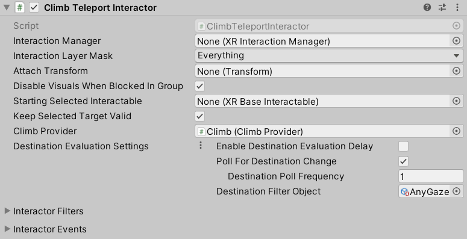

# Climb Teleport Interactor

Interactor that drives climb locomotion assistance via teleportation. This component is not designed to be attached to a controller (thus does not derive from `XRBaseControllerInteractor`, unlike `XRDirectInteractor` and `XRRayInteractor`) and instead performs interactions in response to climb locomotion.

This interactor responds to the user grabbing a [Climb Interactable](climb-interactable.md) that references the same [Climb Provider](climb-provider.md) as this interactor. If the Climb Interactable has a [Teleportation Multi-Anchor Volume](teleportation-multi-anchor-volume.md) assigned to its **Climb Assistance Teleport Volume**, the Climb Teleport Interactor will hover the Teleport Volume while the user is grabbing the Climb Interactable. If there is no **Climb Assistance Teleport Volume** assigned, the interactor will do nothing. The Teleport Volume will respond to hover as it normally does, by choosing one of its anchors as the teleport destination. By default the Teleport Volume will also periodically update its destination while hovered, due to the Climb Teleport Interactor overriding its **Destination Evaluation Settings**, so that the user can change their destination while climbing. When climb locomotion ends, the Climb Teleport Interactor triggers teleportation to the evaluated destination by starting and immediately ending either a select or activate interaction on the Teleport Volume, depending on the Teleport Volume's **Teleport Trigger**. The interactor also stops hovering the Teleport Volume the next frame after teleporting.

| **Property** | **Description** |
|---|---|
| **Interaction Manager** | The [XRInteractionManager](xr-interaction-manager.md) that this Interactor will communicate with (will find one if **None**). |
| **Interaction Layer Mask** | Allows interaction with Interactables whose [Interaction Layer Mask](interaction-layers.md) overlaps with any Layer in this Interaction Layer Mask. |
| **Attach Transform** | The `Transform` that is used as the attach point for Interactables. Automatically instantiated and set in `Awake` if **None**. Setting this will not automatically destroy the previous object. |
| **Disable Visuals When Blocked In Group** | Whether to disable visuals when this Interactor is part of an [Interaction Group](xr-interaction-group.md) and is incapable of interacting due to active interaction by another Interactor in the Group. |
| **Starting Selected Interactable** | The Interactable that this Interactor automatically selects at startup (optional, may be **None**). |
| **Keep Selected Target Valid** | Whether to keep selecting an Interactable after initially selecting it even when it is no longer a valid target. Enable to make the `XRInteractionManager` retain the selection even if the Interactable is not contained within the list of valid targets. Disable to make the Interaction Manager clear the selection if it isn't within the list of valid targets. A common use for disabling this is for Ray Interactors used for teleportation to make the teleportation Interactable no longer selected when not currently pointing at it. |
| **Climb Provider** | The climb locomotion provider to query for active locomotion and climbed interactable. |
| **Destination Evaluation Settings** | Optional settings for how the hovered teleport volume evaluates a destination anchor. Applies as an override to the teleport volume's settings if set to **Use Value** or if the asset reference is set. |
| &emsp;**Use Asset** | Enable to use a `TeleportVolumeDestinationSettings` object externally defined in a `TeleportVolumeDestinationSettingsDatum` asset that can be assigned using the accompanying field. |
| &emsp;**Use Value** | Enable to use a `TeleportVolumeDestinationSettings` object which comes with default values editable in the component editor. |
| &emsp;Enable Destination Evaluation Delay | Whether the volume delays evaluation of the destination anchor until the user has hovered over the volume for a certain amount of time. If the user doesn't hover long enough before triggering teleport, no anchor will be used and so no teleport will occur. |
| &emsp;Destination Evaluation Delay Time | The amount of time, in seconds, for which the user must hover over the volume before it designates a destination anchor. Only used and displayed when **Enable Destination Evaluation Delay** is enabled. |
| &emsp;Poll For Destination Change | Whether the volume periodically queries the filter for its calculated destination. If the determined anchor is not the current destination, the volume will initiate re-evaluation of the destination anchor. This is useful if you want the user to be able to change their destination while hovering over the volume. |
| &emsp;Destination Poll Frequency | The amount of time, in seconds, between queries to the filter for its calculated destination anchor. Only used and displayed when **Poll For Destination Change** is enabled. |
| &emsp;Destination Filter Object | The anchor filter used to evaluate a teleportation destination (must implement the `ITeleportationVolumeAnchorFilter` interface). If set to **None**, the volume will use the anchor furthest from the user as the destination. |
| **Interactor Filters** | See the [Interaction Filters](interaction-filters.md) page. |
| **Interactor Events** | See the [Interactor Events](interactor-events.md) page. |