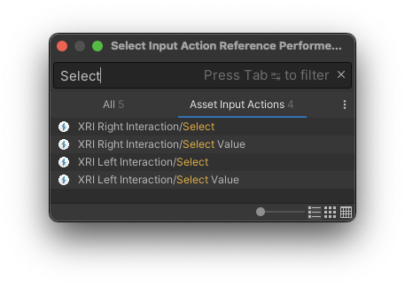
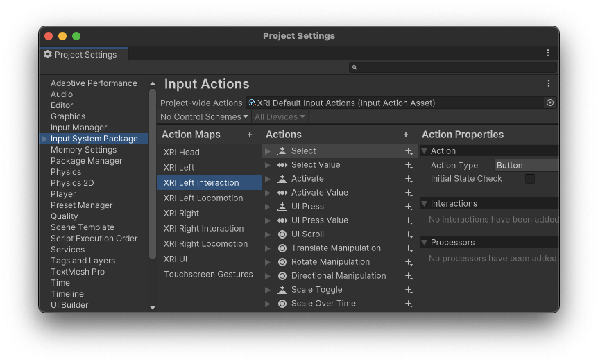

# Configure input

Every toolkit component that responds to input provides a set of [input reader](xref:xri-input-readers) properties that define the actions the component can take. These actions include things like selecting an object, scrolling a UI component, teleporting to a designated spot, and turning right or left. To allow a user to perform one of these actions, you must define which physical input, such as a button press, thumbstick deflection, or eye glance, triggers which actions.

The XR Interaction Toolkit provides several options for handling input:

* **Input Action assets**: you can bind the actions defined by the toolkit components to physical input in an Input Action asset. These assets collect actions, bindings, and maps in one place and allow you to reuse the same input configuration for multiple components.
* **Input Actions without an asset**: you can bind a physical input to an individual action directly on a component without referencing a separate asset.
* **Custom input**: you can provide custom input logic in two ways:

    * You can create an object that implements [IXRInputValueReader](xref:UnityEngine.XR.Interaction.Toolkit.Inputs.Readers.IXRInputValueReader`1) interface and reference that object from one of a component’s input properties.
    * You can assign a value to the relevant input property of a component from another script.

* **Mixed**: you can choose a different approach for each individual input on every component. For example, you could use Input Action assets for most inputs, but provide a custom implementation for those inputs that have special requirements in your project.

> [!TIP]
> The XR Interaction Toolkit provides an [XRI Default Input Actions asset](xref:xri-samples-starter-assets#input-actions-asset) that provides default bindings to common XR controllers and other input sources, such as eye gaze, and hand tracking. You can use this asset as-is or as a starting point for your own modifications.

When you use Input Action assets for input, you must make sure they are enabled at runtime. Refer to [Enable input actions used for input](#enable-input-actions) for more information.

## Set up input properties of a component

When you add an [Interactor](xref:xri-interactor-components) or [Locomotion Provider](xref:xri-locomotion-providers) component to a scene, you must configure any [input reader](xref:xri-input-readers) properties to identify which types of input the component responds to.

> [!TIP]
> The [Starter Assets](xref:xri-samples-starter-assets) include prefabs for most Interactor and Locomotion Provider components. These prefabs are already set up to use the [XRI Default Input Actions asset](xref:xri-samples-starter-assets#input-actions-asset).

To configure an input property:

1. If using the [XRI Default Input Actions asset](xref:xri-samples-starter-assets#input-actions-asset), import the [Starter Assets](xref:xri-samples-starter-assets) sample, if you haven't already.
2. Select the parent GameObject in the **Hierarchy** panel to view the component's properties in the Inspector.
3. For each input reader property (these will have names like, **Select Input** and **Left Hand Turn Input**):

   1. Choose an **Input Source Mode**.
   2. Depending on the mode chosen, set the property values. For example, if you use the **Input Action Reference** mode along with the default input action assets:

      1. Click the object picker icon in the property's input action reference field (which will be named according to the specific input property).
      2. Find the specific action that you want to use for this component's input. The names in the default input action asset correspond to the type of interaction or locomotion controlled by each property. You can use the search field in the object picker dialog to narrow the choices shown in the list.

      For example, when setting a **Select Input** property, search for the term "Select":

      

      3. Choose the desired input action (noting whether the correct right or left hand option is selected).

For more information about component input properties refer to [Input readers](xref:xri-input-readers).

## Enable input actions used for input

Actions must be enabled before they react to input. Refer to [Enabling actions](xref:input-system-actions#enabling-actions) in the Input System documentation for details about this process.

When you use Input Action assets, you must make sure that the actions they contain are enabled at runtime. You can do this in a couple of ways, depending on the complexity of your project:

* If you use a single Input Action asset, you can assign it as the [Project-wide Actions](xref:project-wide-actions#create-and-assign-a-project-wide-actions-asset) asset in the Input System Package settings of your project.

   

* If you use multiple Input Action assets, you can add them to one or more [Input Action Manager](xref:xri-input-action-manager) components.

   

Actions defined in a **Project-wide Actions** asset are always enabled. Actions defined in assets assigned to an **Input Action Manager** component can be enabled or disabled depending on context. Whenever an **Input Action Manager** component is enabled or disabled, it also enables or disables the actions defined in any associated Input Action assets.

> [!NOTE]
> Any actions you define directly in an input reader property of a component are automatically enabled and disabled by the component itself when the mode is set to **Input Action**.

> [!NOTE]
> For input actions to read from input devices correctly while running in the Unity Editor, the Game view may need to have focus depending on the current project settings. If you find that your input, such as button presses on the controllers, are not working in the Editor, ensure the Game view has focus by clicking it with your mouse. Refer to [Background and focus change behavior](xref:input-system-devices#background-and-focus-change-behavior) to learn how to adjust settings to not require focus in the Game view.
