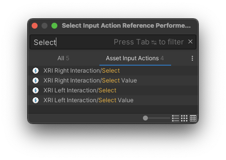
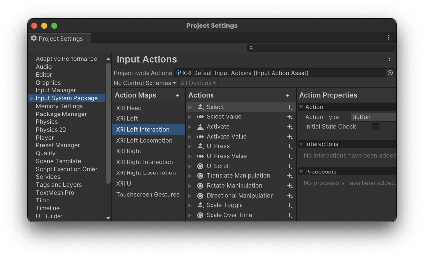
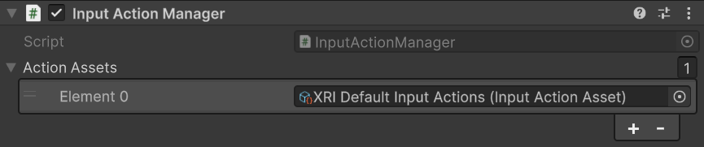

# Configure input

Define which physical inputs trigger specific actions, such as selecting an object, scrolling a UI component, or teleporting, by configuring the input properties on your components and enabling the actions.

Every toolkit component that responds to input has a set of [input reader properties](xref:xri-input-readers) to map hardware controls (like button presses, thumbstick deflections, or eye glances) to virtual behaviors.

The standard approach to configuring these properties is to use Input Action Assets. This allows you to define your bindings in one place and reuse them across multiple components. To configure input using this workflow, follow these steps:

1. [Set up input properties](#set-up-input-properties): Link your component's input reader properties to specific actions in your asset.

1. [Enable input actions](#enable-input-actions): Ensure the Input System is active and listening for those actions at runtime.

> [!NOTE]
> Other options: While this page uses Input Action Assets as an example, you can also bind inputs directly to components without an asset, inject logic via scripts or the `IXRInputValueReader` interface, or use a mixed approach for specific inputs on the same component. Refer to [Input readers](xref:xri-input-readers] for more information about these approaches.

## Set up input properties

Configure the [input reader](xref:xri-input-readers) properties of [Interactor](xref:xri-interactor-components) or [Locomotion Provider](xref:xri-locomotion-providers) components to identify which types of input each component responds to.

> [!TIP]
> The [Starter Assets](xref:xri-samples-starter-assets) include prefabs for most Interactor and Locomotion Provider components, which are already set up to use the [XRI Default Input Actions asset](xref:xri-samples-starter-assets#input-actions-asset). This asset provides default bindings to common XR controllers and other input sources, such as eye gaze and hand tracking. You can use this asset as-is or as a starting point for your own modifications.

To configure an input property:

1. If using the [XRI Default Input Actions asset](xref:xri-samples-starter-assets#input-actions-asset), import the [Starter Assets](xref:xri-samples-starter-assets) sample.
2. Select the parent GameObject in the **Hierarchy** panel to view the component's properties in the Inspector.
3. For each input reader property (these will have names like **Select Input** and **Left Hand Turn Input**):

   1. Choose an [**Input Source Mode**](xref:xri-input-readers#input-source-modes).
   2. Depending on the mode chosen, set the property values. For example, if you use the **Input Action Reference** mode along with the default input action assets:

      1. Click the object picker icon in the property's input action reference field (which will be named according to the specific input property).
      2. Find the specific action that you want to use for this component's input. The names in the default input action asset correspond to the type of interaction or locomotion controlled by each property. You can use the search field in the object picker dialog to narrow the choices shown in the list. For example, when setting a **Select Input** property, search for the term "Select":

      

      3. Choose the desired input action (noting whether the correct right or left hand option is selected).

For more information about component input properties refer to [Input readers](xref:xri-input-readers).

## Enable input actions used for input

When you use Input Action assets, you must make sure that the actions they contain are enabled at runtime. You can do this in a couple of ways, depending on the complexity of your project.

### Using a single Input Action asset project-wide

If you use a single Input Action asset, you can assign it as the [Project-wide Actions asset](xref:project-wide-actions#create-and-assign-a-project-wide-actions-asset) in the Input System Package settings of your project. Actions defined in a **Project-wide Actions** asset are initially enabled by default.

Refer to [Enabling actions](xref:input-system-actions#enabling-actions) in the Input System documentation for details about this approach.

   

### Using multiple Input Action assets in components

If you use multiple Input Action assets, you can add them to one or more [Input Action Manager](xref:xri-input-action-manager) components.

   

 Actions defined in assets assigned to an **Input Action Manager** component can be enabled or disabled depending on context. Whenever an **Input Action Manager** component is enabled or disabled, it also enables or disables the actions defined in any associated Input Action assets.

> [!NOTE]
> Any actions you define directly in an input reader property of a component are automatically enabled and disabled by the component itself when the mode is set to **Input Action**.

> [!NOTE]
> For input actions to read from input devices correctly while running in the Unity Editor, the Game view may need to have focus depending on the current project settings. If you find that your input, such as button presses on the controllers, are not working in the Editor, ensure the Game view has focus by clicking it with your mouse. Refer to [Background and focus change behavior](xref:input-system-devices#background-and-focus-change-behavior) to learn how to adjust settings to not require focus in the Game view.
