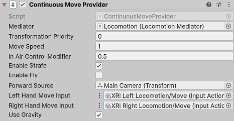

# Continuous Move Provider

Locomotion provider that allows the user to smoothly move their rig continuously over time using a specified 2D axis input.

| **Property** | **Description** |
|---|---|
|**Mediator**| The behavior that this provider communicates with for access to the mediator's XR Body Transformer. If one is not provided, this provider will attempt to locate one during its Awake call. |
|**Transformation Priority**| The queue order of this provider's transformations of the XR Origin. The lower the value, the earlier the transformations are applied. |
| **Move Speed** | The speed, in units per second, to move forward. |
| **In Air Control Modifier** | Determines how much control the player has while in the air (0 = no control, 1 = full control). |
| **Enable Strafe** | Controls whether to enable strafing (sideways movement). |
| **Enable Fly** | Controls whether to enable flying (unconstrained movement). This overrides **Use Gravity**. |
| **Forward Source** | The source `Transform` that defines the forward direction. |
| **Left Hand Move Input** | Reads input data from the left hand controller. Input Action must be a Value action type (Vector 2). |
| **Right Hand Move Input** | Reads input data from the right hand controller. Input Action must be a Value action type (Vector 2). |
| **Use Gravity** | Controls whether gravity affects this provider when a `CharacterController` is used. This only applies when **Enable Fly** is disabled. |
