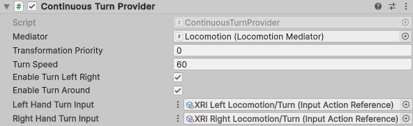

# Continuous Turn Provider

Locomotion provider that allows the user to smoothly rotate their rig continuously over time using a specified input action.

| **Property** | **Description** |
|---|---|
|**Mediator**| The behavior that this provider communicates with for access to the mediator's XR Body Transformer. If one is not provided, this provider will attempt to locate one during its Awake call. |
|**Transform Priority**| The queue order of this provider's transformations of the XR Origin. The lower the value, the earlier the transformations are applied. |
| **Turn Speed** | The number of degrees/second clockwise to rotate when turning clockwise. |
| **Left Hand Turn Input** | Reads input data from the left hand controller. Input Action must be a Value action type (Vector 2). |
| **Right Hand Turn Input** | Reads input data from the right hand controller. Input Action must be a Value action type (Vector 2). |
