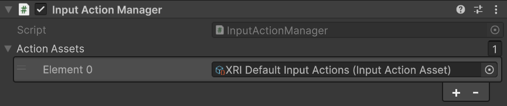
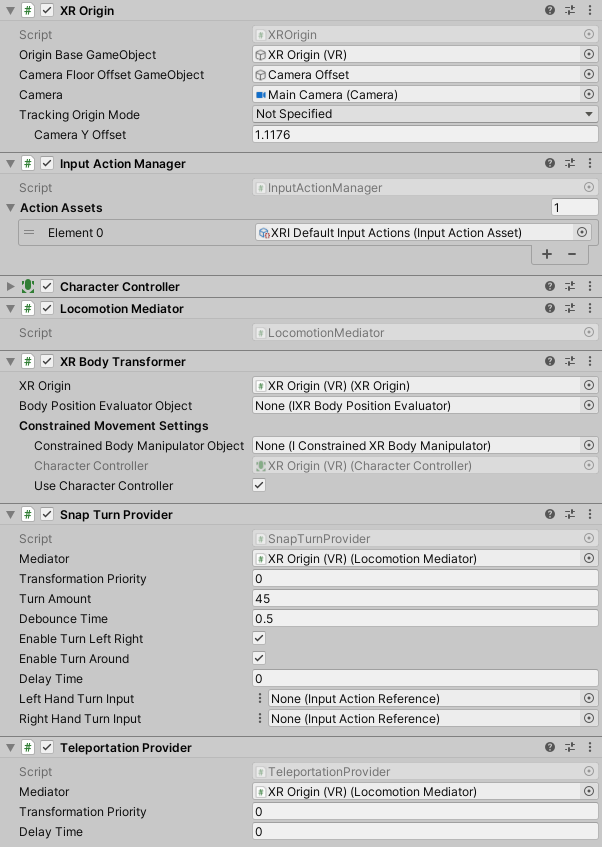

# Create a scene with locomotion

Create a scene with basic snap turn and teleportation locomotion.

## Set up a basic scene for snap turn and teleportation

Before you follow the steps below, to streamline setup of components, it is recommended that you install the [Starter Assets](samples-starter-assets.md) sample and follow the steps for [Configuring Preset Manager defaults](samples-starter-assets.md#configuring-preset-manager-defaults) to reduce the burden of configuring the input actions.

> [!TIP]
> The [`DemoScene`](samples-starter-assets.md#demo-scene) in the [Starter Assets](samples-starter-assets.md) sample contains a preconfigured XR Origin, teleportation area, and teleportation anchor prefabs.

If you prefer to set up the XR Origin yourself, follow these steps to create the necessary components.

### 1. Set up the XR Origin and input actions

Follow the steps in [Create a basic scene](xref:xri-create-basic-scene).

For setups that use input actions for input, make sure the **Input Action Manager** component is added to a GameObject (such as the XR Origin GameObject). This will enable all input actions in the referenced asset so that the inputs can be read correctly by the locomotion components.

If you installed the Starter Assets sample as recommended, you can add the **XRI Default Input Actions** from the Samples folder to the **Action Assets** field of Input Action Manager. Alternatively, you can create and use your customized Input Actions and controller bindings.

### 2. Add snap turn and teleportation capabilities

On the **XR Origin** GameObject, add a **Locomotion Mediator**, a **Snap Turn Provider**, and a **Teleportation Provider**.

To set up snap turn, you need to configure the [Snap Turn Provider](snap-turn-provider.md) in the Inspector.

Set **Left Hand Snap Turn Input** and/or **Right Hand Snap Turn Input** to Vector 2 Control Type Actions with bindings for your desired inputs. The Actions that you assign should use either the **XR Controller (LeftHand)** or **XR Controller (RightHand)** binding paths.

### 3. Create teleportation interactables

From Unity's main menu, click **GameObject &gt; XR &gt; Teleportation Area** or **GameObject &gt; XR &gt; Teleportation Anchor** to create a plane that can be teleported to. A Teleportation Area teleports users to their pointed location on its child collider, whereas a Teleportation Anchor specifies a pre-determined position and/or rotation in addition to the Teleportation Area.

If you followed steps 1-3, you should have a basic scene with the ability to perform snap turn and teleportation with your controllers. The following steps provide additional details on changing the visuals of the **XR Ray Interactor**.

### 4. Configure line type

The [XR Ray Interactor](xr-ray-interactor.md) can be used under the **Left Controller** and **Right Controller** GameObjects when creating the XR Origin to be used as a Teleport Interactor. Under its **Raycast Configuration** includes three default options of **Line Type** that can be used to select interactables:

* **Straight Line**
* **Projectile Curve**
* **Bezier Curve**

Set the Line Type to **Projectile Curve** for easy aiming of the teleport ray.

### 5. Set line visual

The [XR Interactor Line Visual](xr-interactor-line-visual.md) provides additional options to customize the appearance of the XR Ray Interactor for teleportation and other interactions. It requires the [Line Renderer](https://docs.unity3d.com/Manual/class-LineRenderer.html) component and uses line points from the XR Ray Interactor.
