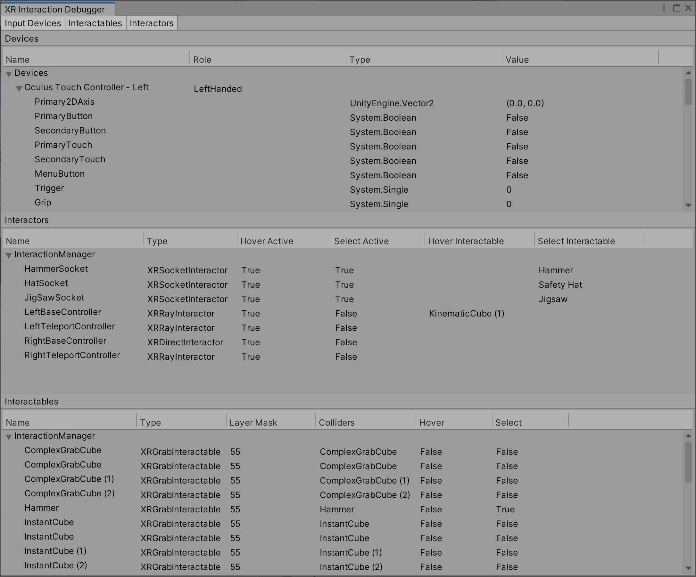
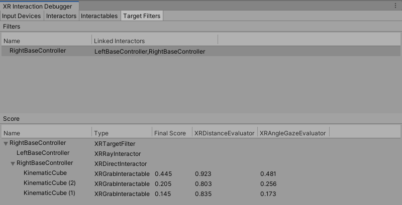

# Debugger window

The XR Interaction Toolkit Debugger window displays a top-down view of all the Input Devices, Interactables, and Interactors in the loaded scenes. It also displays their relationship to each other and their registered Interaction Managers. To open this window, go to **Window** &gt; **Analysis** &gt; **XR Interaction Debugger** from Unity's main menu.

You must be in Play mode to use this window.

## Input devices

The Input Devices tab displays all valid input devices that are registered through the [XR Module](https://docs.unity3d.com/Manual/com.unity.modules.xr.html) (that is, those created by an [`XRInputSubsystem`](https://docs.unity3d.com/ScriptReference/XR.XRInputSubsystem.html)). It currently doesn't display input devices that are only registered with the [Input System package](https://docs.unity3d.com/Packages/com.unity.inputsystem@latest/index.html), such as the simulated devices created by the [XR Interaction Simulator](xref:xri-xr-interaction-simulator-overview) or the [XR Device Simulator](xref:xri-xr-device-simulator-overview). Additionally, the tracked hand devices created by the [XR Hands package](https://docs.unity3d.com/Packages/com.unity.xr.hands@latest/index.html) are only registered with the Input System package and do not currently appear in this window.

To see a list of all input devices in the Unity Input System, including the values of their input controls and buttons, open the **Window** &gt; **Analysis** &gt; **Input Debugger** window from Unity's main menu and double-click any device under the **Devices** foldout. For more information about debugging Input System devices, see [Debugging](https://docs.unity3d.com/Packages/com.unity.inputsystem@latest?subfolder=/manual/Debugging.html) in the Unity Input System manual.

This tab can be used to verify that the input controls that are bound to the actions set in an Interactor's Inspector window under Input Configuration, such as the Select Input, are actuating to expected values. To verify that the Input Action you have assigned is enabled and actually resolving to an input control on an input device, open the **Window** &gt; **Analysis** &gt; **Input Debugger** window and expand the **Actions** foldout to search for your input action and its resolved control bindings. See [Debugging Actions](https://docs.unity3d.com/Packages/com.unity.inputsystem@latest?subfolder=/manual/Debugging.html#debugging-actions) in the Unity Input System manual for more information on these steps.

### Troubleshooting missing input devices

Simulated devices do not appear in this Input Devices tab. If you do not see any XR devices in either the Input Devices tab or within the Input Debugger window, your project may not be configured for XR. The first place you should check is in the **Edit** &gt; **Project Settings** window under **XR Plug-in Management** &gt; **Project Validation** for any warnings or errors that could be preventing expected behavior.

See [Configure your project](https://docs.unity3d.com/Packages/com.unity.xr.openxr@latest?subfolder=/manual/project-configuration.html) in the Unity OpenXR Plugin manual for steps to configure your project, which includes steps like enabling **Initialize XR on Startup** and enabling a Plug-in Provider within the **Edit** &gt; **Project Settings** window under **XR Plug-in Management**, and enabling an Interaction Profile under **OpenXR**. Note that Editor Play mode uses Desktop Platform Settings regardless of Active Build Target.

For AR projects that use AR Foundation, see [Provider project settings](https://docs.unity3d.com/Packages/com.unity.xr.arfoundation@latest?subfolder=/manual/project-setup/install-arfoundation.html#provider-project-settings) in the Unity AR Foundation manual for steps to configure your project.

## Interactors and interactables

The Interactors and Interactables tabs displays all active and enabled interactor and interactable components in the loaded scenes that are registered with an [XR Interaction Manager](xref:xri-xr-interaction-manager). Each row displays information about the component, grouped under the XR Interaction Manager that the component is registered with. The name of the interaction manager can be greyed out, which indicates that the manager component is not active and enabled.

The order of interactors and interactables indicates the order that the components are processed by the interaction manager. See [Processing interactables](xref:xri-architecture#processing-interactables) in the Interaction overview manual page for more information.

## Snap volumes

The Snap Volumes tab displays all active and enabled [XR Interactable Snap Volume](xref:xri-xr-interactable-snap-volume) components in the loaded scenes that are registered with an XR Interaction Manager. Each row displays information about the snap volume, including the interactable that the snap volume is associated with, grouped under the XR Interaction Manager that the snap volume is registered with. The name of the interaction manager and the associated interactable can be greyed out, which indicates that those components are not active and enabled.

## Target filters

The Target Filters tab displays all active and enabled [XR Target Filter](xref:xri-target-filters#xr-target-filter) components in the loaded scenes. It displays the names of the interactors that each XR Target Filter is linked with.

You can select an `XRTargetFilter` in the Target Filters tree to inspect its Evaluators' scores in the Score tree. The Score tree displays the final and weighted scores for each interactable in the interactor's Valid Target list. The interactors are shown as the parent of their respective Valid Target list.

