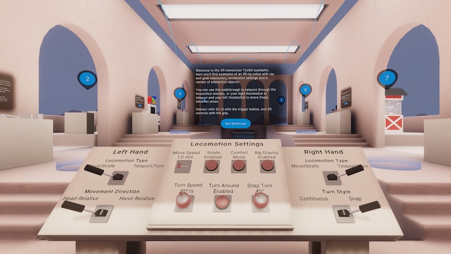

# XR Interaction Toolkit examples

For a more comprehensive example, you can download a larger example from the [XR Interaction Toolkit Examples](https://github.com/Unity-Technologies/XR-Interaction-Toolkit-Examples) repository on GitHub.

_The first station of the example scene_

> [!NOTE]
> The samples in this repository currently work with the 3.0 version of the XR Interaction Toolkit.

The example scene in this example project contains a Prefab based on the XR Origin with everything needed for input, 3D interaction, locomotion, and UI interaction with the toolkit. The scene also contains several stations that demonstrate different interaction setups.
