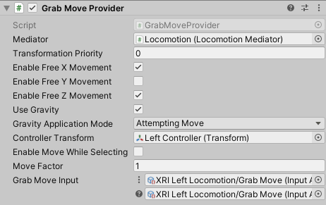

# Grab Move Provider

Locomotion provider that allows the user to move with one hand as if grabbing the whole world around them. When the controller moves, the XR Origin counter-moves in order to keep the controller fixed relative to the world.

| **Property** | **Description** |
|---|---|
|**Mediator**| The behavior that this provider communicates with for access to the mediator's XR Body Transformer. If one is not provided, this provider will attempt to locate one during its Awake call. |
|**Transform Priority**| The queue order of this provider's transformations of the XR Origin. The lower the value, the earlier the transformations are applied. |
| **Enable Free X Movement** | Controls whether to enable unconstrained movement along the x-axis. |
| **Enable Free Y Movement** | Controls whether to enable unconstrained movement along the y-axis. |
| **Enable Free Z Movement** | Controls whether to enable unconstrained movement along the z-axis. |
| **Use Gravity** | Controls whether gravity applies to constrained axes when a `CharacterController` is used. |
| **Controller Transform** | The controller Transform that will drive grab movement with its local position. Will use this GameObject's Transform if not set. |
| **Enable Move While Selecting** | Controls whether to allow grab movement while the controller is selecting an interactable. |
| **Move Factor** | The ratio of actual movement distance to controller movement distance. |
| **Grab Move Input** | Input data that will be used to perform grab movement while held. |
