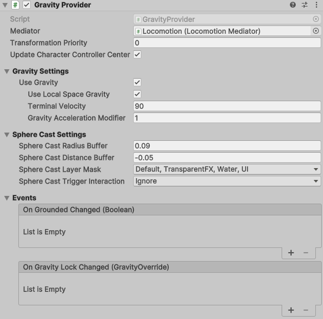

# Gravity Provider

Locomotion provider that provides gravity to the player. This provider will also check if the player is grounded using a sphere cast from the player's head in the direction gravity is being applied, typically downward or negative Y. Gravity will be applied to the player anytime `useGravity` is true and `isGrounded` is false. See [`IGravityController`](gravity-provider.md#igravitycontroller) for external control over gravity.

| **Property** | **Description** |
|---|---|
|**Mediator**| The behavior that this provider communicates with for access to the mediator's XR Body Transformer. If one is not provided, this provider will attempt to locate one during its Awake call. |
|**Transformation Priority**| The queue order of this provider's transformations of the XR Origin. The lower the value, the earlier the transformations are applied. |
| **Use Gravity** | Determines the usage of gravity.|
| **Use Local Space Gravity**| Apply gravity based on the current Up vector of the XR Origin. |
| **Terminal Velocity** | Determines the maximum fall speed based on units per second. |
| **Gravity Acceleration Modifier**| Determines the speed at which a player reaches `Terminal Velocity`. |
| **Update Character Controller Center Each Frame**| Sets the center of the character controller to match the local x and z positions of the player camera each frame. |
| **Sphere Cast Radius Buffer**| Buffer for the radius of the sphere cast used to check if the player is grounded. |
| **Sphere Cast Distance Buffer**| Buffer for the distance of the sphere cast used to check if the player is grounded. |
| **Sphere Cast Layer Mask**| The [physics-based](https://docs.unity3d.com/Documentation/Manual/layers-and-layermasks.html) `LayerMask` (not to be confused with the [Interaction Layer Mask](xref:xri-interaction-layers)) used for the sphere cast to check if the player is grounded. |
| **Sphere Cast Trigger Interaction**| The `QueryTriggerInteraction` used to determine trigger collisions for the grounded sphere cast. |
| **On Gravity Lock Changed**| A `Unity Event` that is called when gravity lock is changed. |
| **On Grounded Changed**| A `Unity Event` that is called when the value of `isGrounded` changes. |
| **Is Grounded**| If the player is on the ground. |
| **Gravity Controllers**| Reference to the `IGravityControllers` that share the same `LocomotionMediator`. |

## IGravityController

The IGravityController interface provides a contract for controlling the player's gravity behavior within the XR Interaction Toolkit's locomotion system. It includes properties to check if gravity can be processed or is paused, methods to lock/unlock gravity, and methods to respond to changes in gravity lock and grounded state changes. Implementing this interface allows for external control and interaction with the [Gravity Provider](gravity-provider.md).

For more details on implementation, please see the [`IGravityController`](xref:UnityEngine.XR.Interaction.Toolkit.Locomotion.Gravity.IGravityController) Scripting API documentation.

| **Property** | **Description** |
|---|---|
| **Can Process**| Whether the gravity can be processed. Gravity controllers that can process receive queries to `gravityPaused`, controllers that cannot process do not. |
| **Gravity Paused**| Whether gravity is currently paused. |
