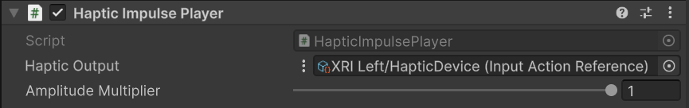

# Haptic Impulse Player

Component that allows for sending haptic impulses to a device.

| **Property** | **Description** |
|---|---|
| **Haptic Output** | Specifies the output haptic control or controller that haptic impulses will be sent to. |
| **Amplitude Multiplier** | Amplitude multiplier which can be used to dampen the haptic impulses sent by this component. |
