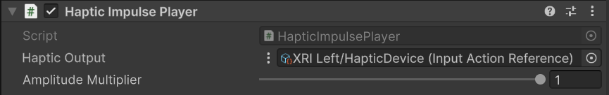

# Haptic Impulse Player

Send haptic impulses to a device.

Use this component to manage the connection to haptic hardware. It acts as a bridge, allowing other components, such as [Simple Haptic Feedback](xref:xri-simple-haptic-feedback), to trigger vibrations on a specific device.

The haptic impulse player component works in conjunction with one or more [Simple Haptic Feedback](xref:xri-simple-haptic-feedback) components. A haptic feedback component searches its current GameObject and parent hierarchy for an existing impulse player. If it can't find one, it creates one with default settings. You can create a single impulse player for use by multiple haptic feedback and interactor pairs, which lets you define the desired impulse player settings for all of them in one place.

## Haptic Impulse Player properties

The Haptic Impulse Player component contains the following properties:

| **Property** | **Description** |
| :--- | :--- |
| **Haptic Output** | The output haptic control or controller that haptic impulses are sent to. |
| **Amplitude Multiplier** | A multiplier that dampens all haptic impulses this component sends. A value of 1 maintains the current amplitude. |

## Additional resources

* [`HapticImpulsePlayer` class](xref:UnityEngine.XR.Interaction.Toolkit.Inputs.Haptics.HapticImpulsePlayer)
* [`IXRHapticImpulseProvider`](xref:UnityEngine.XR.Interaction.Toolkit.Inputs.Haptics.IXRHapticImpulseProvider)
* [Simple Haptic Feedback](xref:xri-simple-haptic-feedback)
* [Component index](xref:xri-components)
