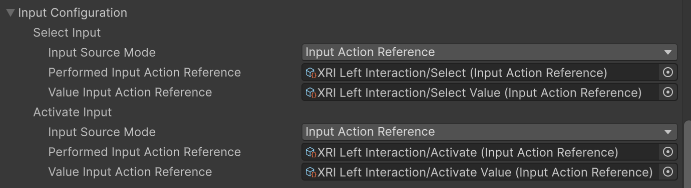
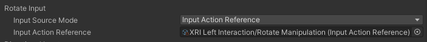
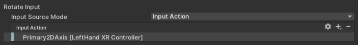
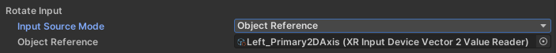
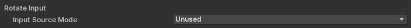
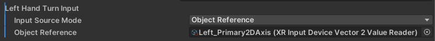

# Input readers

Input readers specify how a physical input, such as a button press on a controller, maps to an interaction, such as selecting or activating an interactable object.

**Interactor** and **Locomotion Provider** components typically have a few properties that define the input to use to trigger interactions. For example, most interactor components have **Select Input** and **Activate Input** properties in an **Input Configuration** section of their Inspectors:

These input properties derive from the [`XRInputButtonReader`](xref:UnityEngine.XR.Interaction.Toolkit.Inputs.Readers.XRInputButtonReader) or [`XRInputValueReader`](xref:UnityEngine.XR.Interaction.Toolkit.Inputs.Readers.XRInputValueReader) class, but differ in the type of input they support. For example, interactions like select, require a button-like input, while interactions like UI scroll require a 2-axis input, such as that from a thumbstick.

The following table shows typical interactor and locomotion provider input properties by type:

| Interactor and Locomotion input properties                 | Action type       | Input reader type               |
| :--------------------------------------------------------- | :---------------- | :------------------------------ |
| Select, Activate, UI Press, Scale Toggle, Grab Move, Teleport Mode Cancel | Button  | [`XRInputButtonReader`](xref:UnityEngine.XR.Interaction.Toolkit.Inputs.Readers.XRInputButtonReader)  |
| UI Scroll, Translate, Rotate, Directional, Scale Over Time, Teleport Mode, Turn, Snap Turn, Move | Value (2D vector) | [`XRInputValueReader<Vector2>`](xref:UnityEngine.XR.Interaction.Toolkit.Inputs.Readers.XRInputValueReader`1) |
| Scale Distance Delta                                       | Value (float)     | [`XRInputValueReader<float>`](xref:UnityEngine.XR.Interaction.Toolkit.Inputs.Readers.XRInputValueReader`1)   |

Refer to [Configure an input reader](#configure-an-input-reader) for information about setting an interactor's input properties.

> [!TIP]
> Previous versions of the XR Interaction Toolkit (prior to version 3) used separate **XR Controller** (Action- or Device-based) components to map user input to interactions. You now use input reader properties to map user input to interactions directly on the interactor components themselves.

## Configure an input reader

The input reader properties of interactor components all use similar settings in the Inspector. The primary difference between different properties is the type of input they accept, such as a button, a 2D thumbstick input, or a float value. This topic discusses the various ways you can configure input reader properties in general, but you must also take the specific characteristics of each particular interaction into account when setting up input bindings.

> [!TIP]
> The XR Interaction Toolkit settings provide an **[Input Reader Property Drawer Mode](xref:xri-settings#editor-settings)** setting, which changes how the input reader properties are displayed in the Inspector:
>
> * **Compact** takes up the smallest amount of space in the Inspector, but hides the current input source mode inside a **&vellip;** menu. This is the default mode.
> * **Multiline All** shows all possible subproperties no matter which mode you choose, which can make the Inspector harder to read but could be useful for comparing components or prefab overrides.
> * **Multiline Effective** shows an extra line for the **Input Source Mode**, but is otherwise the same as **Compact**. It only shows the subproperties relevant to the chosen mode. When you are actively editing the input reader properties while configuring your interactors, you might want to choose the **Multiline Effective** setting. The rest of the time, you might find the **Compact** setting improves the readability of the component in the Inspector as a whole.

The **Input Source Mode** of each input reader property determines what kind of input source you can assign to the property. The mode you choose also determines the subproperties for you to set in the Inspector. The modes include:

* **[Input Action Reference](#input-action-reference)**: a reference to an Input System [Action](xref:input-system-actions) defined in an [Input Action Asset](xref:input-system-action-assets).
* **[Input Action](#input-action)**: an [Action](xref:input-system-actions) that you set up and bind directly in an interactor's Inspector.
* **[Object Reference](#object-reference)**: a reference to an object that implements the [`IXRInputValueReader`](xref:UnityEngine.XR.Interaction.Toolkit.Inputs.Readers.IXRInputValueReader`1) interface. The object can be an [`XRInputDeviceValueReader`](xref:UnityEngine.XR.Interaction.Toolkit.Inputs.Readers.XRInputDeviceValueReader) ScriptableObject or a custom component on a GameObject in the scene.
* **[Manual Value](#manual-value)**: an explicit value assigned to the property. (At runtime, you can change a manual value through a script or in the Inspector during Play mode.)
* **[Unused](#unused)**: the input property is ignored.

### Input Action Reference

Specify a reference to an action in an Input Action asset that contains one or more bindings to physical input.

An Input Action reference can be used by more than one interactor. Thus, if you have more than one interactor that can perform a given interaction, you can use an Input Action asset as the single place to define the map rather than setting the control bindings up separately for each interactor component.

The number of references that you can set for a property depends on the action type of the input. Properties that support button-like behavior (using [`XRInputButtonReader`](xref:UnityEngine.XR.Interaction.Toolkit.Inputs.Readers.XRInputButtonReader)) let you specify two inputs. One input is for boolean, pressed or not pressed behavior. The other input is for buttons that report a number between 0 and 1 depending on how far they are depressed, like a trigger or XR controller grip button. All other types of input reader properties take a single reference.

Input Actions must be enabled at runtime. The [Input Manager](xref:xri-input-action-manager) component automatically enables the actions for all the Input Actions in the assets you add to its [Action Assets](xref:xri-input-action-manager) list. (The starter and example scenes are configured with the [XRI Default Input Actions](xref:xri-samples-starter-assets#input-actions-asset) asset in this list by default.)

### Input Action

Add one or more bindings to a specific Interactor component.

This association of input action and binding cannot be reused by other interactors. You can add more than one binding to provide alternate ways to perform an interaction.

* Gear icon: set Action Type, Processors, and Interactions properties
* +/- icons: add or remove bindings for the Action.
* Double-click a binding in the list to specify binding properties.

The standard **Interactor** and **Locomotion Provider** components automatically enable the input actions that you specify with this input source mode.

Refer to [Actions](xref:input-system-actions) for general information about Input System Actions and how to configure them. Refer to [Input Bindings](xref:input-system-action-bindings) for detailed information about configuring the bindings for an action.

### Object Reference

Specify an object that implements the [`IXRInputValueReader`](xref:UnityEngine.XR.Interaction.Toolkit.Inputs.Readers.IXRInputValueReader`1) interface.

You can implement such an object to provide custom or synthesized input.

> [!NOTE]
> The [Legacy XR Input Reader](#legacy-xr-input-readers) sample provides a set of assets that you can use with the **Object Reference** source mode get input directly from a specific hardware device control, such as the **X** button of the left-hand controller. These assets are designed to replace the **XR Controller (Device-based)** components used in earlier versions of the XR Interaction Toolkit.

### Manual Value

Manually specify the input.

You can specify a value in the Inspector to set a permanent value for the input. You can change the input value at runtime with a script or in the Inspector during Play mode.

The properties that you can set for a manual value depend on the action type of the input. For example, a button-type input, like **Select Input**, has both a binary, on-or-off value and a numerical value with a range of 0 to 1, because some controller buttons, like a trigger, support both a value for on and off and a value indicating how far it is depressed. In contrast, a **UI Scroll Input** has a 2D vector setting to correspond with the 2-axis thumbstick input needed to scroll vertically and horizontally.

### Unused

Ignore the property.

If an interactor is never used for a given type of input, then set the source mode to **Unused** to avoid the small performance costs associated with checking that input.

## Legacy XR input readers

The XR Interaction Toolkit provides a set of input value reader assets in the [Legacy XR Input Readers](xref:xri-samples-legacy-xr-input-readers) sample. These assets are ScriptableObjects that implement the [`IXRInputValueReader`](xref:UnityEngine.XR.Interaction.Toolkit.Inputs.Readers.IXRInputValueReader`1) interface and are configured with direct bindings to common XR controls. If you are updating a project that used the **XR Controller (Device-based)** component for input, you can use these assets to specify the input to use for each interaction or locomotion input:

1. Import the [Legacy XR Input Readers](xref:xri-samples-legacy-xr-input-readers#import) sample.
2. Locate the input reader property to change. The input reader properties that replace the **XR Controller** properties are now on the [Interactor](xref:xri-interactor-components) and [Locomotion Provider](xref:xri-locomotion-providers) components.
3. Set the **Input Source Mode** of the input reader property to **Object Reference**. The mode is set using a dropdown inside a **&vellip;** menu in the default Compact drawing setting.
4. Assign the appropriate Legacy XR Input Reader asset to the **Object Reference**. (You can drag the asset onto the field or click the **Object Picker** icon to open the **Select Object** dialog).
5. Repeat for each interactor and locomotion provider.

 _The **Left_Primary2DAxis** legacy input reader asset assigned to the **Left Hand Turn Input** property of a **Continuous Turn Provider** component_
