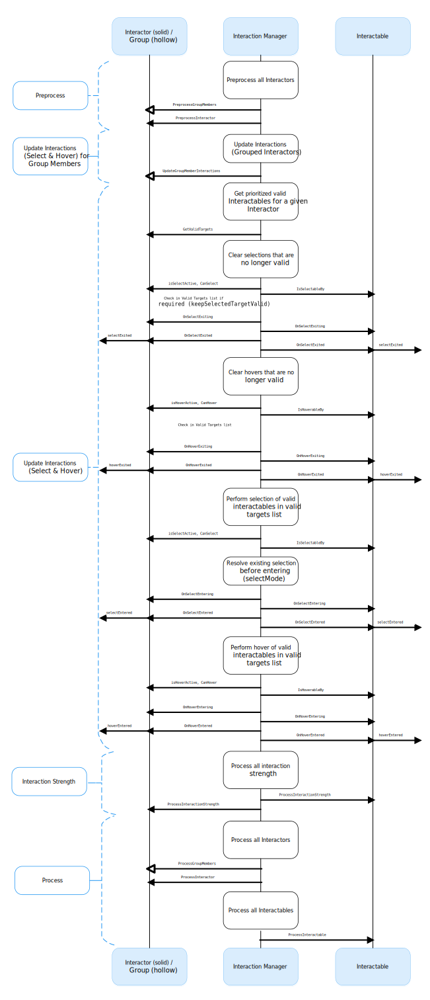

# Interaction update loop

The update loop of the [Interaction Manager][im] queries interactors and interactables, and handles the [hover, focus and selection states][se].

First, the manager asks interactors for a valid list of targets (used for both hover and selection). It then checks both interactors and interactables to see if their existing hover, focus and selection objects are still valid. After invalid previous states have been cleared (exited via [OnSelectExiting][] and [OnSelectExited][]/[OnHoverExiting][] and [OnHoverExited][]/[OnFocusExiting][]  and [OnFocusExited][]), it queries both objects for valid selection, focus and hover states, and the objects enter a new state via [OnSelectEntering][] and [OnSelectEntered][]/[OnHoverEntering][] and [OnHoverEntered][]/[OnFocusEntering][] and [OnFocusEntered][].

All registered interactables and interactors are updated before and after interaction state changes by the Interaction Manager explicitly using
[PreprocessInteractor][], [ProcessInteractor][], and [ProcessInteractable][]. Interactors are always notified before interactables for both processing and state changes, and interactors contained within Interaction Groups are always notified before interactors that are not contained within Groups. Interactables and interactors are not limited from using the normal [MonoBehaviour.Update][mup] call, but per-frame logic should typically be done in one of the process methods instead so that interactors are able to update before interactables. Using the [ProcessInteractable][] method also ensures that interactables process first if they are a virtual parent of another interactable. The XR Interaction Manager will maintain and dynamically sort the list of interactables based on registered dependencies when using virtual parenting.

## Processing interactables

Interactables register with the **XR Interaction Manager** during the component's own [OnEnable][] and unregister with the component's [OnDisable][] method. The XR Interaction Manager will process all registered interactables in the order they were most recently registered. Due to the nature of how Unity executes different script components and interactables sharing the same script execution order, the order cannot be relied upon if you have a dependency. Refer to [Script execution order][sxo] in the Unity manual for more information.

If you need an interactable component to be processed after another interactable component is processed, you can register this dependency relationship with the XR Interaction Manager using the [RegisterParentRelationship][reg-interactable] and [UnregisterParentRelationship][unreg-interactable] methods on the [XRInteractionManager][xrim]. Alternatively, you can assign the **Parent Interactable** property in the Inspector window of an interactable component to register the dependency relationship when the component is registered with the **XR Interaction Manager**.

A parent interactable will be processed, meaning [ProcessInteractable][] will be called by the **XR Interaction Manager**, before its child interactables are processed. This functions recursively, meaning if the parent interactable itself has its own parent interactable, that dependency will also be respected.

Interactors can also register a parent interactable to indirectly change the processing order of interactables that they select. Similarly to interactables, you can assign the **Parent Interactable** property in the Inspector window of an interactor component to register the dependency relationship that selected interactables will inherit from the interactor. You can also be register and unregister a parent interactable through scripting using the [RegisterParentRelationship][reg-interactor] and [UnregisterParentRelationship][unreg-interactor] methods.

> [!NOTE]
> The Parent Interactable property will only be read at the time when the component is registered with the manager. The `RegisterParentRelationship` method can be called at any time to set parent dependencies, including when selected.

This virtual parenting system can be useful in the case where you have a [XR Socket Interactor][] component which has a parent GameObject with an [XR Grab Interactable][] component. Setting the Parent Interactable property on the socket to the Grab Interactable will ensure that other interactables placed into the socket will process after the socket's parent interactable. This ordering allows the target pose of the grab interactable placed in the socket to be updated correctly without a frame delay that would occur if the processing order was done in reverse if left to chance.

## Interaction strength

Interactors and interactables can report an interaction strength value, which is a normalized `[0.0, 1.0]` amount of selection that the interactor is performing. For interactors that use motion controller input, this is typically the analog trigger or grip press amount. For interactables that can be poked, it can be based on the depth of a poke interactor.

Interaction strength values are updated after all interaction state changes have occurred by the Interaction Manager explicitly using [ProcessInteractionStrength][]. In this case, interactables are notified before interactors to allow a poke depth to be computed before gathering the overall interaction strength in the interactor.

[im]: xref:xri-xr-interaction-manager
[se]: xref:xri-state-events
[onselectexiting]: xref:UnityEngine.XR.Interaction.Toolkit.Interactables.IXRSelectInteractable.OnSelectExiting(UnityEngine.XR.Interaction.Toolkit.SelectExitEventArgs)
[onselectexited]: xref:UnityEngine.XR.Interaction.Toolkit.Interactables.IXRSelectInteractable.OnSelectExited(UnityEngine.XR.Interaction.Toolkit.SelectExitEventArgs)
[onhoverexiting]: xref:UnityEngine.XR.Interaction.Toolkit.Interactables.IXRHoverInteractable.OnHoverExiting(UnityEngine.XR.Interaction.Toolkit.HoverExitEventArgs)
[onhoverexited]: xref:UnityEngine.XR.Interaction.Toolkit.Interactables.IXRHoverInteractable.OnHoverExited(UnityEngine.XR.Interaction.Toolkit.HoverExitEventArgs)
[onfocusexiting]: xref:UnityEngine.XR.Interaction.Toolkit.Interactables.IXRFocusInteractable.OnFocusExiting(UnityEngine.XR.Interaction.Toolkit.FocusExitEventArgs)
[onfocusexited]: xref:UnityEngine.XR.Interaction.Toolkit.Interactables.IXRFocusInteractable.OnFocusExited(UnityEngine.XR.Interaction.Toolkit.FocusExitEventArgs)
[onselectentering]: xref:UnityEngine.XR.Interaction.Toolkit.Interactables.IXRSelectInteractable.OnSelectEntering(UnityEngine.XR.Interaction.Toolkit.SelectEnterEventArgs)
[onselectentered]: xref:UnityEngine.XR.Interaction.Toolkit.Interactables.IXRSelectInteractable.OnSelectEntered(UnityEngine.XR.Interaction.Toolkit.SelectEnterEventArgs)
[onhoverentering]: xref:UnityEngine.XR.Interaction.Toolkit.Interactables.IXRHoverInteractable.OnHoverEntering(UnityEngine.XR.Interaction.Toolkit.HoverEnterEventArgs)
[onhoverentered]: xref:UnityEngine.XR.Interaction.Toolkit.Interactables.IXRHoverInteractable.OnHoverEntered(UnityEngine.XR.Interaction.Toolkit.HoverEnterEventArgs)
[onfocusentering]: xref:UnityEngine.XR.Interaction.Toolkit.Interactables.IXRFocusInteractable.OnFocusEntering(UnityEngine.XR.Interaction.Toolkit.FocusEnterEventArgs)
[onfocusentered]: xref:UnityEngine.XR.Interaction.Toolkit.Interactables.IXRFocusInteractable.OnFocusEntered(UnityEngine.XR.Interaction.Toolkit.FocusEnterEventArgs)
[preprocessinteractor]: xref:UnityEngine.XR.Interaction.Toolkit.Interactors.XRBaseInteractor.PreprocessInteractor(UnityEngine.XR.Interaction.Toolkit.XRInteractionUpdateOrder.UpdatePhase)
[processinteractor]: xref:UnityEngine.XR.Interaction.Toolkit.Interactors.XRBaseInteractor.ProcessInteractor(UnityEngine.XR.Interaction.Toolkit.XRInteractionUpdateOrder.UpdatePhase)
[processinteractable]: xref:UnityEngine.XR.Interaction.Toolkit.Interactables.XRBaseInteractable.ProcessInteractable(UnityEngine.XR.Interaction.Toolkit.XRInteractionUpdateOrder.UpdatePhase)
[mup]: xref:MonoBehaviour.Update
[onenable]: xref:MonoBehaviour.OnEnable
[ondisable]: xref:MonoBehaviour.OnDisable
[sxo]: https://docs.unity3d.com/Manual/script-execution-order.html
[reg-interactable]: xref:UnityEngine.XR.Interaction.Toolkit.XRInteractionManager.RegisterParentRelationship(UnityEngine.XR.Interaction.Toolkit.Interactables.IXRInteractable,UnityEngine.XR.Interaction.Toolkit.Interactables.IXRInteractable)
[unreg-interactable]: xref:UnityEngine.XR.Interaction.Toolkit.XRInteractionManager.UnregisterParentRelationship(UnityEngine.XR.Interaction.Toolkit.Interactables.IXRInteractable,UnityEngine.XR.Interaction.Toolkit.Interactables.IXRInteractable)
[xrim]: xref:UnityEngine.XR.Interaction.Toolkit.XRInteractionManager
[reg-interactor]: xref:UnityEngine.XR.Interaction.Toolkit.XRInteractionManager.RegisterParentRelationship(UnityEngine.XR.Interaction.Toolkit.Interactors.IXRInteractor,UnityEngine.XR.Interaction.Toolkit.Interactables.IXRInteractable)
[unreg-interactor]: xref:UnityEngine.XR.Interaction.Toolkit.XRInteractionManager.UnregisterParentRelationship(UnityEngine.XR.Interaction.Toolkit.Interactors.IXRInteractor,UnityEngine.XR.Interaction.Toolkit.Interactables.IXRInteractable)
[xr socket interactor]: xref:xri-xr-socket-interactor
[xr grab interactable]: xref:xri-xr-grab-interactable
[processinteractionstrength]: xref:UnityEngine.XR.Interaction.Toolkit.XRInteractionManager.ProcessInteractionStrength(UnityEngine.XR.Interaction.Toolkit.XRInteractionUpdateOrder.UpdatePhase)
