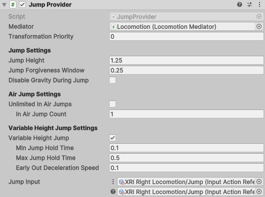

# Jump Provider
Jump Provider allows the player to jump in the scene. This uses a jump force to drive the value of the `Jump Height` over time to allow the player to control how floaty the jump feels. The player can hold down the jump button to increase the altitude of the jump. This provider uses a jump forgiveness window to allow jumping to feel more consistent and reliable.

| **Property** | **Description** |
|---|---|
|**Mediator**| The behavior that this provider communicates with for access to the mediator's XR Body Transformer. If one is not provided, this provider will attempt to locate one during its Awake call. |
|**Transformation Priority**| The queue order of this provider's transformations of the XR Origin. The lower the value, the earlier the transformations are applied. |
| **Jump Height**| The height (approximately in meters) the player will be when reaching the apex of the jump. |
| **Jump Forgiveness Window**| The time window after leaving the ground that a jump can still be performed. Sometimes known as coyote time. |
| **Disable Gravity During Jump**| Disable gravity during the jump. This will result in a more floaty jump.|
| **Unlimited Air Jumps**| When enabled, allows player to jump without being grounded infinitely. |
| **In Air Jump Count**| The number of times a player can jump before landing. |
| **Variable Jump Height**| Enable to allow the player to stop their jump early when input is released before reaching the maximum jump height. Disable to jump a fixed height. |
| **Min Jump Hold Time**| The minimum amount of time the jump will execute for. |
| **Max Jump Hold Time**| The maximum amount of time a player can hold down the jump button to increase altitude. |
| **Early Out Deceleration Speed**| The speed at which the jump will decelerate when the player releases the jump button early. |
| **Jump Input**| Input data that will be used to perform a jump. |
| **Is Jumping**| Returns whether the player is currently jumping. This is only true during jump ascent, it is not true during the descent. |
| **Is Grounded**| If the player is on the ground. |
