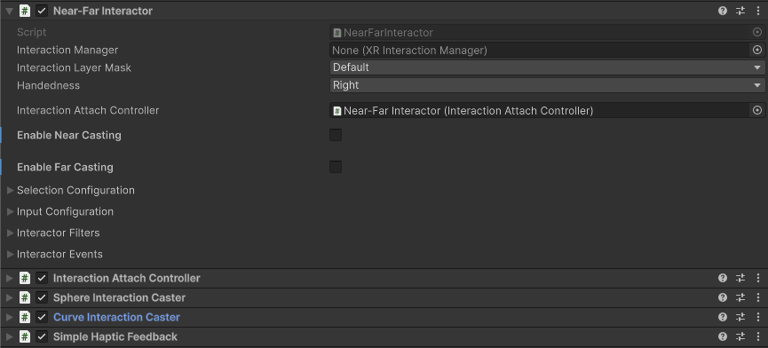
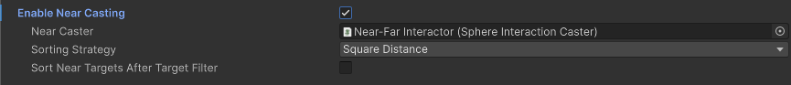
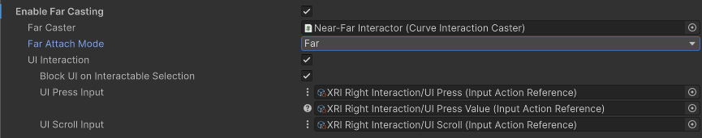

# Near-Far Interactor

Interactor used for interacting with interactables both within arms reach and at a distance. The near-far interactor allows the seamless transition from far to near interaction.

This interactor uses sphere casts to detect eligible nearby interactable targets and a configurable ray caster to detect eligible interactable targets at a distance. In the [starter assets](xref:xri-samples-starter-assets) and demo scene, a **Near-Far Interactor** component is used as the primary interactor for grabbing and manipulating interactable objects as part of the [Left and Right Interactor Prefabs](xref:xri-samples-starter-assets#prefabs).

You can configure the [far casting options](#far-casting) to support interaction with UI elements. (Use a separate [Poke Interactor](xref:xri-xr-poke-interactor) for direct interaction.)

> [!NOTE]
> The near-far interactor is designed to integrate the functionality of both [XR Direct Interactor](xref:xri-xr-direct-interactor) and [XR Ray Interactor](xref:xri-xr-ray-interactor), though there are two notable gaps to keep in mind.
> - For mobile AR devices, the ray interactor is still required for raycasting AR data, as this **Near-Far Interactor** does not support this use case.
> - The **Near-Far Interactor** does not support using the joystick to control the attach transform for scaling, as the [XR Ray Interactor](xref:xri-xr-ray-interactor) does.

## Supporting components

You can use the following additional components with a near-far interactor:

* [Interaction Attach Controller](xref:xri-interaction-attach-controller): Provides options for how the user can manipulate an object "grabbed" by the far-casting aspect of the interactor.
* [Curve Visual Controller](xref:xri-curve-visual-controller), [Line Renderer](xref:um-class-line-renderer), and [Sorting Group](xref:um-class-sorting-group): draw a visual line along the casting path.
* [Curve Interaction Caster](xref:UnityEngine.XR.Interaction.Toolkit.Interactors.Casters.CurveInteractionCaster): Provides options for specifying the far-casting behavior.
* [Sphere Interaction Caster](xref:UnityEngine.XR.Interaction.Toolkit.Interactors.Casters.SphereInteractionCaster): Provides options for specifying the near-casting behavior.
* [Simple Audio Feedback](xref:xri-simple-audio-feedback): Play audio clips when interactor events happen. (Replaces the **Audio Events** properties of the interactor.)
* [Simple Haptic Feedback](xref:xri-simple-haptic-feedback): Play haptic impulses when interactor events happen. (Replaces the **Haptic Events** properties of the interactor.)
* [XR Interaction Group](xref:xri-xr-interaction-group): Define groups of interactors to mediate which has priority for an interaction.

## Base properties

The near-far interactor has many properties that you can set to modify how the interactor behaves. Some of these properties are organized into sections and don't appear in the Inspector window until you enable another property or expand a section.

| **Property** | **Description** |
| :--- | :--- |
| **Interaction Manager** | The [XRInteractionManager](xr-interaction-manager.md) that this interactor will communicate with (will find one if **None**). |
| **Interaction Layer Mask** | Allows interaction with interactables whose [Interaction Layer Mask](interaction-layers.md) contains any Layer in this Interaction Layer Mask. |
| **Handedness** | Represents which hand or controller the interactor is associated with. This information is used by the interaction system when querying whether the right or the left hand is selecting an interactable.|
| **Interaction Attach Controller**         | Reference to the [attach controller](xref:xri-interaction-attach-controller) component used to control the attach transform. A component with default settings is added if you do not set this property value.|
| [Near Casting configuration](#near-casting) | Configure options for interacting with interactables that are close enough to touch. |
| [Far Casting configuration](#far-casting) | Configure options for interacting with interactables that are out of arm's reach. |
| [Selection Configuration](#selection-config) | Controls selection behavior. Click the triangle icon to expand the section. Note that you configure the input controls used for selection in the [Input Configuration](#input-config) section. |
| [Input Configuration](#input-config) | Specify input bindings for the select and activate actions. Click the triangle icon to expand the section.|
| [Interactor Filters](#interactor-filters) | Identifies any filters this interactor uses to winnow detected interactables. You can create  filter classes to provide custom logic to limit which interactables an interactor can interact with. Filtering occurs after the interactor has performed a raycast to detect eligible interactables. |
| [Interactor Events](#interactor-events) | The events dispatched by this interactor. You can add event handlers in other components in the scene or prefab and they are invoked when the event occurs.  |

## Near-casting configuration {#near-casting}

Check the **Enable Near Casting** option to configure the interactor to interact with nearby objects.

> [!NOTE]
> You can set the characteristics of the sphere cast used to detect eligible interactables for an interaction with a [Sphere Interaction Caster](xref:UnityEngine.XR.Interaction.Toolkit.Interactors.Casters.SphereInteractionCaster) component. You can also create a custom component that implements the [IInteractionCaster](xref:UnityEngine.XR.Interaction.Toolkit.Interactors.Casters.IInteractionCaster) interface.

| **Property** | **Description** |
| :--- | :--- |
| **Enable Near Casting**                   | Determines if the near interaction caster is activated to find valid nearby targets. Default is `true`.|
| **Near Caster**                           | Reference to the near interaction caster component used for near interactions. Must implement `IInteractionCaster`.  A component with default settings is added at runtime when you do not set this property value.|
| **Sorting Strategy**                      | Strategy for sorting targets detected by the near interaction caster. Options are **None**, **Square Distance**, **Interactable Based**, and **Closest Point On Collider**.|
| **Sort Near Targets After Target Filter** | Enable to sort near targets after any [interactor filters](xref:xri-interaction-filters) are applied. You should only enable this if the filters do not already sort targets. Ignored if no target filters are set. |

You can choose from the following strategies for sorting valid targets discovered by the near interaction caster.

- **None**: No sorting is performed.
- **Square Distance**: Sorting based on the square distance between the interactor and interactable attach transform world positions. Most efficient.
- **Interactable Based**: Sorting based on the interactable's defined sorting strategy, usually collider based.
- **Closest Point On Collider**: Sorting based on the square distance between the interactor's attach transform world position and the closest point on the interactable's collider. Used for high fidelity disambiguation.

## Far-casting configuration {#far-casting}

Check the **Enable Far Casting** option to configure the interactor to interact with far away objects.

> [!NOTE]
> You can set the characteristics of the caster used to detect eligible interactables for an interaction with a [Curve Interaction Caster](xref:UnityEngine.XR.Interaction.Toolkit.Interactors.Casters.CurveInteractionCaster) component. You can also create a custom component that implements the [ICurveInteractionCaster](xref:UnityEngine.XR.Interaction.Toolkit.Interactors.Casters.ICurveInteractionCaster) interface.

| **Property** | **Description** |
| :--- | :--- |
| **Enable Far Casting**                    | Determines if the far interaction caster is activated to find valid distant targets. Default is `true`.|
| **Far Caster**                            | Reference to the far interaction caster component used for far interactions. Must implement `ICurveInteractionCaster`. A component with default settings is added at runtime when you do not set this property value.|
| **Far Attach Mode**                       | Determines how the attachment point is adjusted on far select. This typically results in whether the interactable stays distant at the far hit point or moves to the near hand. |
| **UI Interaction**                        | Allows the interactor's far-casting behavior to interact with UI elements at a distance. Default is `true`.|
| **Block UI On Interactable Selection**    | Blocks UI interaction when an interactable is selected. Default is `true`.|
| **UI Press Input**                        | Defines the input used for pressing UI elements, functioning like a mouse button when pointing over UI. Implemented as an `XRInputButtonReader`.|
| **UI Scroll Input**                       | Defines the input used for scrolling UI elements, functioning like a mouse scroll wheel when pointing over UI. Implemented as an `XRInputValueReader<Vector2>`.|

## Selection Configuration {#selection-config}

[!INCLUDE [interactor-selection-config](snippets/interactor-selection-config.md)]

## Input Configuration {#input-config}

[!INCLUDE [interactor-input-config](snippets/interactor-input-config.md)]

## Interactor Filters {#interactor-filters}

[!INCLUDE [interactor-filters-config](snippets/interactor-filters-config.md)]

## Interactor Events {#interactor-events}

[!INCLUDE [interactor-events](snippets/interactor-events.md)]

## Extend the near-far interactor

The near-far interactor is designed with modularity and extensibility in mind. You can implement custom near and far casters that adhere to the [IInteractionCaster](xref:UnityEngine.XR.Interaction.Toolkit.Interactors.Casters.IInteractionCaster) and [ICurveInteractionCaster](xref:UnityEngine.XR.Interaction.Toolkit.Interactors.Casters.ICurveInteractionCaster) interfaces, respectively. The [Sphere Interaction Caster](xref:UnityEngine.XR.Interaction.Toolkit.Interactors.Casters.SphereInteractionCaster) and [Curve Interaction Caster](xref:UnityEngine.XR.Interaction.Toolkit.Interactors.Casters.CurveInteractionCaster) components provide the default implementations of these interfaces.

Implement the [IInteractionAttachController](xref:UnityEngine.XR.Interaction.Toolkit.Attachment.IInteractionAttachController) interface to create a custom controller for manipulating the attach transform.
The [Interaction Attach Controller](xref:xri-interaction-attach-controller) provides the default implementation for this interface and enables distance-based velocity scaling on motion to pull objects to the user from afar, with hand tracking and controller tracking support.
