# Poke interactions with 3D objects

This page provides an overview of the components, concepts, and steps needed to turn a 3D object into a poke interactable button. This example interactable can be hovered over and selected with a poke interactor that is associated with a tracked input method such as a hand, or a controller.

If you have created your project with any of the available [XR templates](https://docs.unity3d.com/Documentation/Manual/xr-create-projects.html), then you have everything you need to add and set up poke interactions in scenes for your project.

> [!NOTE]
> Alternatively, installing the **XR Interaction Toolkit**, along with the [Starter Assets](xref:xri-samples-starter-assets) and [Hands Interaction Demo](xref:xri-samples-hands-interaction-demo) samples from the package, provides the necessary components to get started.

## Poke interactable setup walkthrough

This walkthrough builds an example of a poke interactable from a 3D object. The walkthrough uses the `BasicScene` scene -- found within the `Scenes/` project assets folder -- which is available when you start up a new project from the VR template. However, you can use any scene which incorporates a fleshed-out XR rig, including controller or hands support with poke interactors already attached and configured. The [Starter Assets](xref:xri-samples-starter-assets) provide a prefab for the XR Origin rig, as well as a demo scene that includes both the rig and additional, required components like an **Interaction Manager** component.

This example uses a 3D game object constructed from the standard Unity primitives to serve as a foundation for demonstrating how to set up poke interactables. To follow along, you can set up the following game objects as a starting point:

1. Add an empty game object to serve as the root object of the button.
2. Add a cylinder game object to serve as the push button. This is the part the user touches to use the button.
3. Add a game object or two to serve as the base housing of the button. The example base includes a cylinder and cube, but you can use anything you like.

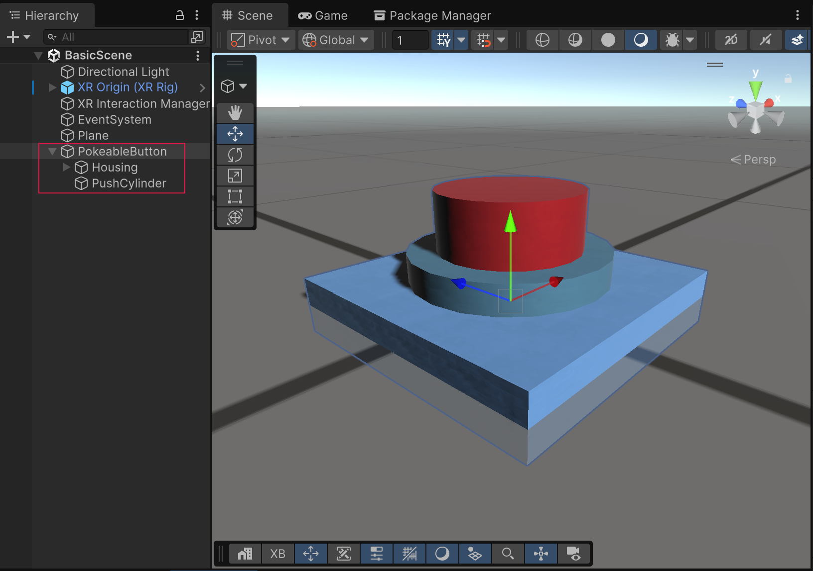  <i>The starting game object setup, before adding interaction components.</i>

> [!TIP]
> To test out the walkthrough steps presented here, you must either build to a supported XR device, or enter play mode within the Editor using the [XR Interaction Simulator](xref:xri-samples-xr-interaction-simulator), which can be found within the sample set for the **XR Interaction Toolkit** package. To use the simulator, import the **XR Interaction Simulator** sample, and drop the XR Interaction Simulator prefab into your scene prior to entering play mode.

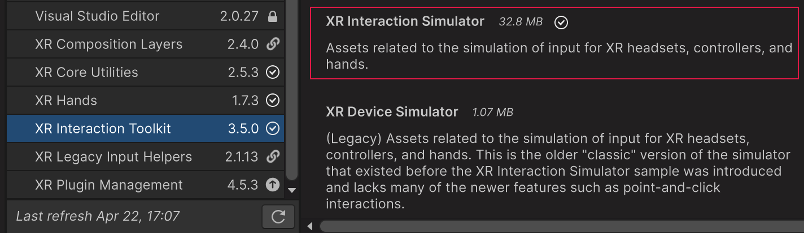

## Add interaction components

To make the push button into an interactable, add an [XR Simple Interactable](xref:xri-simple-interactable) and [XR Poke Filter](xref:xri-xr-poke-filter) to the root object and add an empty child game object that has a [Box Collider](xref:um-class-box-collider):

1. Place an [XR Simple Interactable](xref:xri-simple-interactable) component on the root game object.

   This component makes the game object interactable, which means that any interactor can hover and select it. For now, the default component values are sufficient. Later, this walkthrough uses the **Hover** and **Select** interactable states and events to control the button appearance. You can also use these events to trigger game logic when the button is selected (pressed).

   If desired, there are a few ways to restrict interaction with this game object to [Poke Interactors](xref:xri-xr-poke-interactor):

   * Use an [interaction layer](xref:xri-interaction-layers) for poke interactions and assign it to both the poke interactors and your poke interactables.
   * Create [interaction filters](xref:xri-interaction-filters) to prevent other interactors from hovering or selecting your poke interactable.
   * Use a separate [Interaction Manager](xref:xri-xr-interaction-manager) for poke interactors and interactables. Interactors can only interact with interactables registered with the same manager. You must modify the standard XR Rig to use this option.

2. Place an [XR Poke Filter](xref:xri-xr-poke-filter) on the root game object. The poke filter component looks for an interactable component on the same or a parent object. To keep things simple, you should put it on the same game object as the simple interactable component.

   The poke filter lets you specify how the user must physically touch the button for the poke to occur. For example, for this push button, the user must push down from the top of the red cylinder, not the side or the bottom. The [XR Poke Interactor](xref:xri-xr-poke-interactor) component has a **Require Poke Filter**, which you can enable to help make sure the interactor doesn't accidentally interact with interactables without a poke filter.

   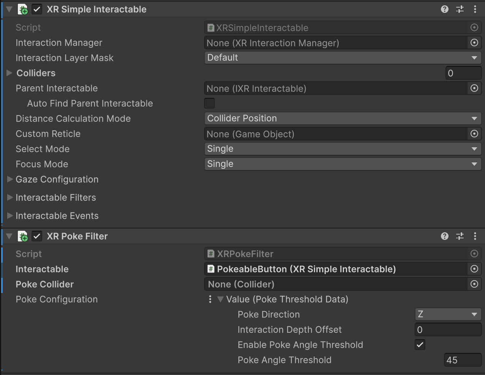  <i>The interaction components with default property settings.</i>

3. In the **Poke Configuration** section of the **XR Poke Filter**, set the **Poke Direction** option to **Negative Y**.

   The **Poke Direction** specifies the direction in which the user must move the interactor in order to initiate a poke interaction.

   > [!TIP]
   > You can create an asset to store the **Poke Configuration** values (menu: **Assets > Create > XR > Value Datums > Poke Threshold Datum**), which lets you share the same configuration with multiple poke interactables.

4. Create a new, empty game object as a direct child of the root interactable object.
5. Add a [Box Collider](xref:um-class-box-collider) component to this child game object.

   Putting the collider on a child game object is a good practice because the collider's local transform determines the bounds for which the poke interactable can be targeted by the poke interactor. The portion of the collider above the local pivot -- meaning away from the poke direction -- serves as the region where the poke interactable is placed in the **hover** state, whereas the portion of the collider below the local pivot serves as the region where the poke interactable is placed in the **select** state.

When the user pushes the button, the button becomes selected when the poke interactor crosses the plane formed by the collider's pivot origin and the axis set by the poke direction property of the **XR Poke Filter** component. In this example, the **Negative Y** direction is chosen for the **Poke Direction** so that the selection occurs when the user presses the button from above. If you wanted the poke to occur along a different axis, you could choose a different **Poke Direction**.

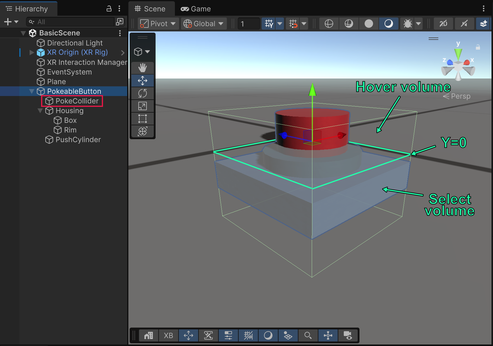  <i>The collider bounds with its local pivot point (y = 0) outlined to illustrate where the button transitions to the selected state.</i>

In the scene view shown above, the **hover** zone is a region of the box collider volume that is above the ground plane, where the local Y axis is positive. The **select** surface is at y = 0, and the select zone proceeds downward, where the Y axis is negative.

You can position the visual, renderable objects -- which comprise the poke interactable button object -- such that the top of the button is within the hover zone (local Y > 0 in this example) and the base is near the select surface (Y = 0). That way, the interactor makes contact with the button geometry before or at the same time it reaches the select surface. If you want the **select** to happen deeper within the visual geometry, then you could move the renderables away from the select surface.

## Fine-tune the interactable

The [XR Poke Filter](xref:xri-xr-poke-filter) exposes additional properties that allow you to tighten up the feel of the interactable. In the previous section, the basic example setup adjusted the transforms to determine the rough interactivity zones. You can use the **Interaction Depth Offset** on an interactable instance to further alter the depth of the select surface along the poke axis. A negative value means that the **select** state triggers later (poke interactor must push deeper past the surface). A positive value means that the **select** state triggers sooner (poke interactor doesn't need to reach the surface).

To reduce the incidence of unintentional poking, you can restrict the angle of entry for the poke interactor to a particular angle cone around the poke axis. The **Poke Angle Threshold**, if enabled with the **Enable Poke Angle Threshold** property, prevents select states from occurring unless the poke interactor's movement toward the poke surface lies within that angle threshold.

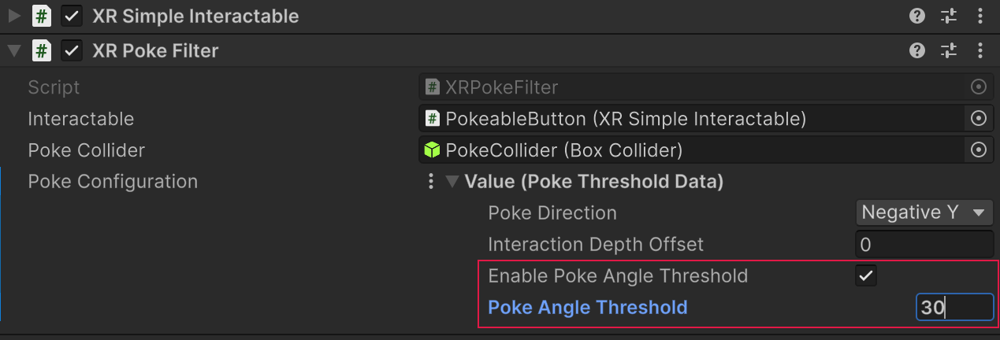

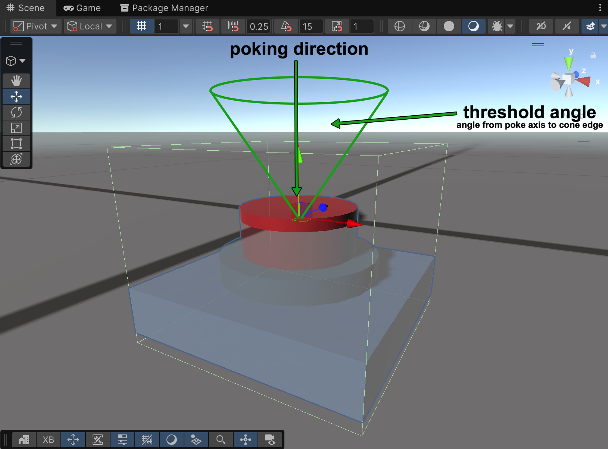

> [!NOTE]
> Once in the **hover** state, the movement of the poke interactor toward the select surface is used to determine the angle of incidence since the interactor itself is a point in space with a `Poke Hover Radius` and has no inherent directionality.

## Add Hover and Select state events

The [XR Simple Interactable](xref:xri-simple-interactable) added to the poke game object earlier exposes events for when the interactable enters and exits the **Hover** and **Select** states. These events are a good way to make visual changes to your interactable based on the current interaction state. You can put any game logic event handlers for hover and select here as well.

You can add handlers for these events in the **Interactable Events** section of the component.

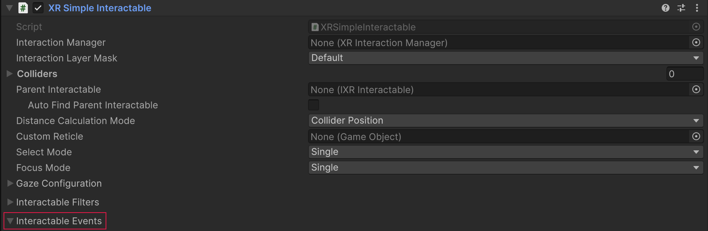 <i>Interactable Events section</i>

This example changes the material used to color the push button when one of the events occurs. The handler sets the `MeshRenderer.sharedMaterial` property to one of the following materials, which you can recreate if you want to follow along (menu: **Assets > Create > Material**):

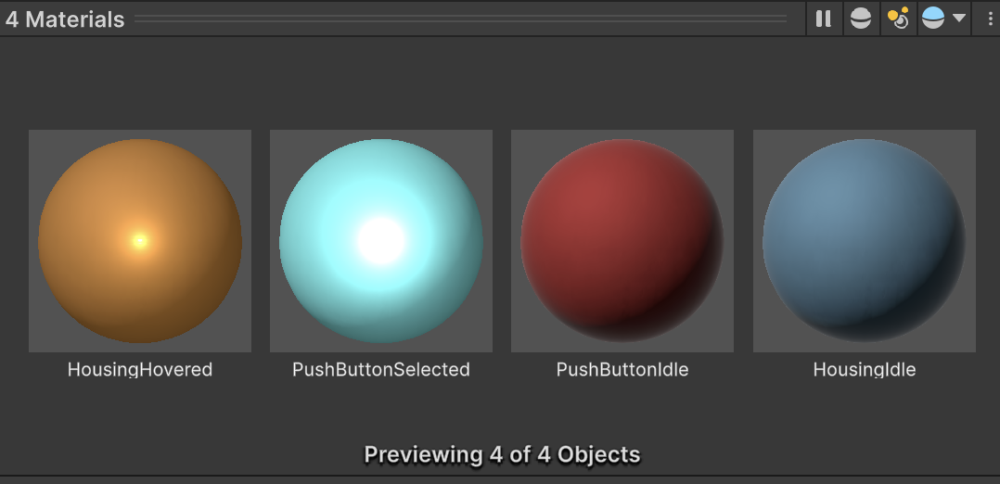 <i>Materials for idle (no interaction), hovered, and selected states</i>

> [!NOTE]
> Changing shared materials at runtime is not always desired in situations where simply changing a color is sufficient in order to optimize material resources. This example changes the materials directly for simplicity, but in a production context, you should use a more optimal technique. For example, you could write a custom script that changes the [Color](xref:UnityEngine.Material.color) property of the [Renderer.material](xref:UnityEngine.Renderer.material) object, instead of changing the material itself.

To add these event handlers:

1. Select the root game object of the button to view the **XR Simple Interactable** component in the Inspector.
2. Expand the **Interactable Events** section, if necessary.
3. For each event that you want to set:

   a. Click the Plus (+) button to add a new handler entry for the event.
   b. Drag the game object whose color you want to change to the handler's Object field.
   c. Open the function drop-down menu (which initially says, "No Function").
   d. In the list of objects, mouse over the **MeshRenderer** object to open its submenu of functions and properties.
   e. Choose the **Material sharedMaterial** property.

When finished, your setup should be the same as the following:

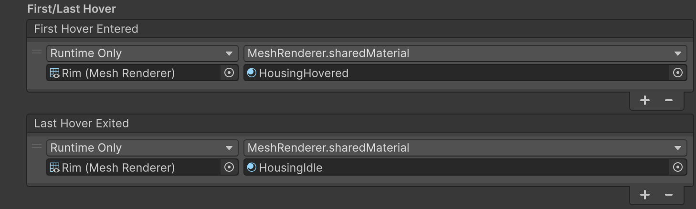 <i>Hover event handlers</i>

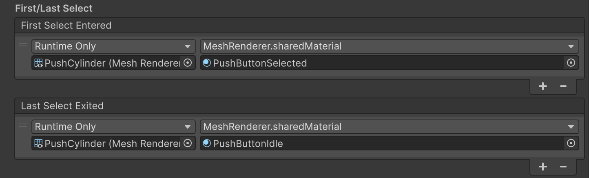 <i>Select event handlers</i>

## Animate the 3D button object

The core **XR Interaction Toolkit** package itself does not include components to animate a poke interactable. However, within the [Starter Assets](xref:xri-samples-starter-assets), you can find a behavior within the `Scripts/` folder -- named **XR Poke Follow Affordance** -- which mimics the tactile action of pushing a button inward through the poke surface. It does this by **tweening** a specific transform within your poke interactable.

If you decide to use the **XR Poke Follow Affordance** script, you should be aware of the following:

- Do not apply any local scale or rotation to the transform being moved. You can scale or rotate a parent game object.

- The position of the transform represents the start of the movement, and the movement ends when the interactor reaches the select surface. Alternatively, you can clamp the allowed movement to a maximum distance from its starting point with the **XR Poke Follow Affordance** properties, `Clamp to Max Distance` and `Max Distance`.

- The **XR Poke Follow Affordance** requires an **XR Poke Filter** component on the interactable. If you attempt to use the follow affordance without the presence of the poke filter you might encounter unexpected behavior.

You should place the renderable meshes that are going to follow the press motion under an empty parent transform. Since the poke surface should be where the follow movement ends when using the **XR Poke Follow Affordance**, move all of the contents under the poke interactable root upward along the Y axis until the local origin of the button assembly lies where the button is fully pushed in.

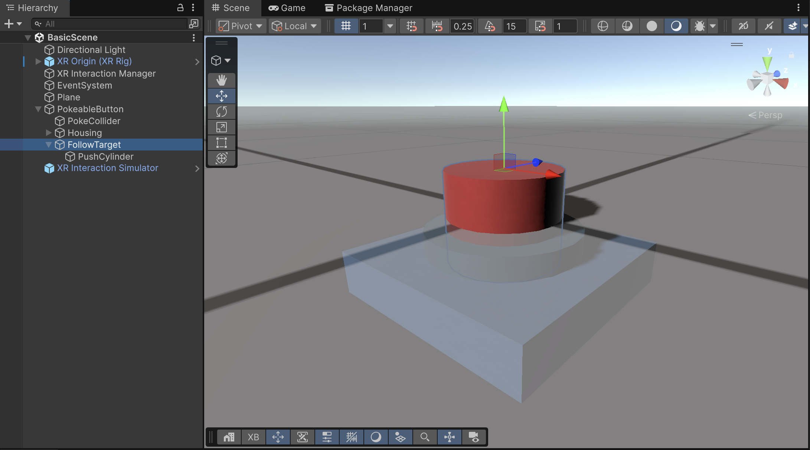

Position the empty push button parent transform -- which the **XR Poke Follow Affordance** component manipulates -- at the top of the push button.

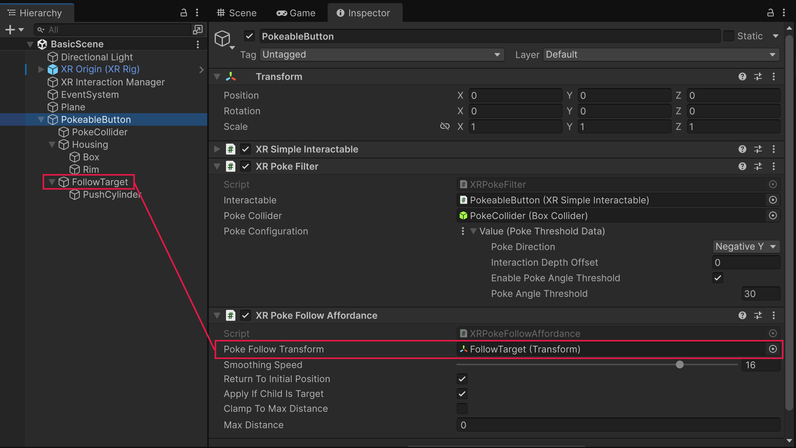

With the button object hierarchy now fully set up, the **XR Poke Follow Affordance** component is added to the poke interactable root object, alongside the [XR Poke Filter](xref:xri-xr-poke-filter) and [XR Simple Interactable](xref:xri-simple-interactable) components. The default values for the component should suffice. The `Poke Follow Transform` property is now assigned to the `Follow Target` push button parent game object created earlier.

> [!NOTE]
> Do not use the same game object for both the follow transform and the poke collider. Attempting to manipulate the poke collider with the **XR Poke Follow Affordance** is not supported, and leads to unexpected and undesirable poke behaviors.

## Testing the finished 3D poke interactable

The following animation shows the completed example poke interactable in action.

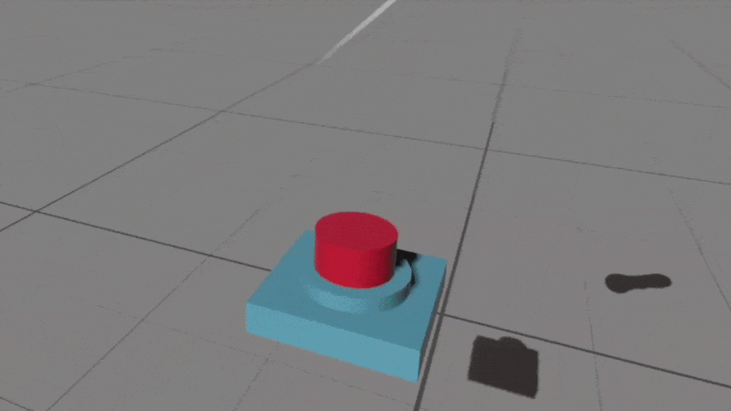

You can tune the **stickiness**, or button's adherence to the interactor, by modifying the placement of the poke collider within the prefab, along the poke direction -- in this case the Y axis. Since the poke collider box extends vertically a bit above the actual push button geometry in the example, the **hover** state is detected early, and the follow affordance moves the push button up to meet the poke interactor point at the position it enters the collider bounds.

## Further examples

The **HandsDemoScene** scene, included with the **XR Interaction Toolkit** sample called [Hands Interaction Demo](xref:xri-samples-hands-interaction-demo), has many examples of poke interactables, including a simple push button prefab instance named `PokeButton`, whose makeup is quite similar to what was demonstrated here. You can find this push button prefab within the `Hands Interaction Demo/HandsDemoSceneAssets/Prefabs/` folder.

## Additional resources

Use these links for deeper detail on poke components, interaction flow, and companion setup guidance.

- [XR Poke Interactor](xref:xri-xr-poke-interactor)
- [XR Poke Filter](xref:xri-xr-poke-filter)
- [XR Simple Interactable](xref:xri-simple-interactable)
- [Create a basic interaction](xref:xri-create-basic-interaction)
- [Interaction states](xref:xri-architecture#states)
- [Interaction events](xref:xri-interaction-events-landing)
- [Starter Assets sample](xref:xri-samples-starter-assets)
- [Hands Interaction Demo sample](xref:xri-samples-hands-interaction-demo)
