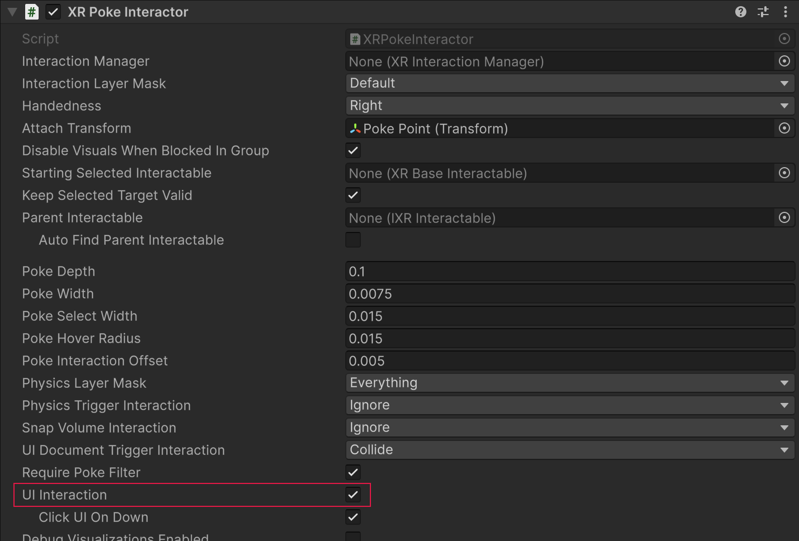
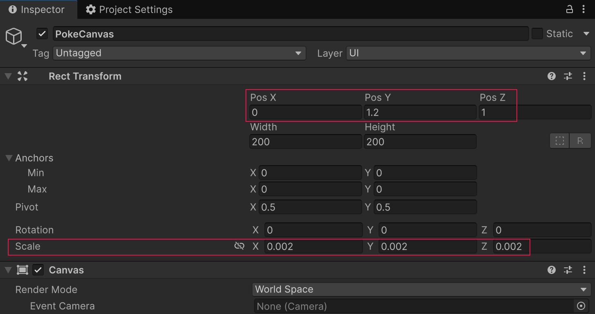
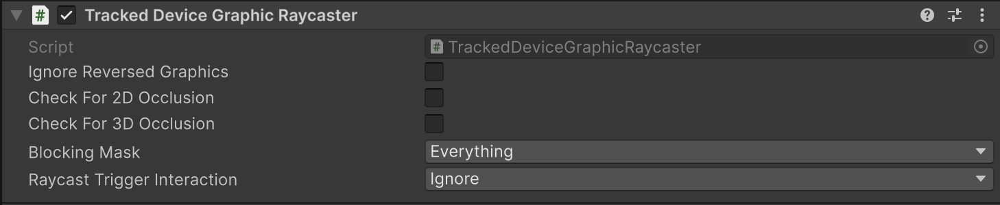
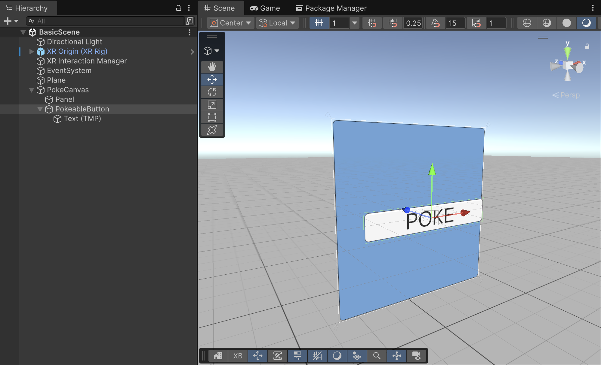
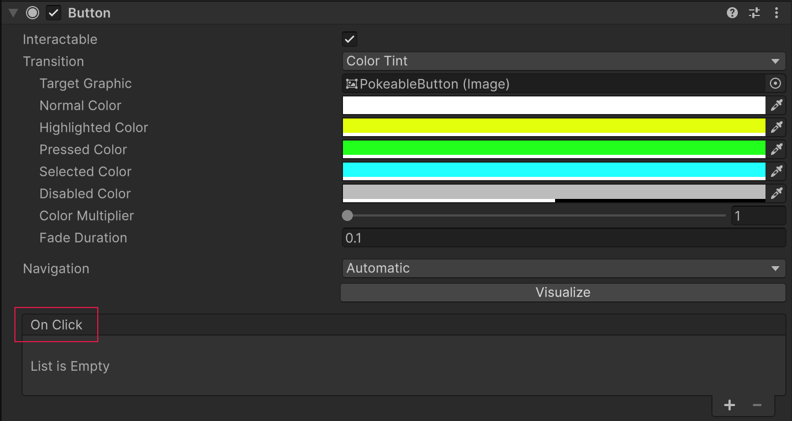
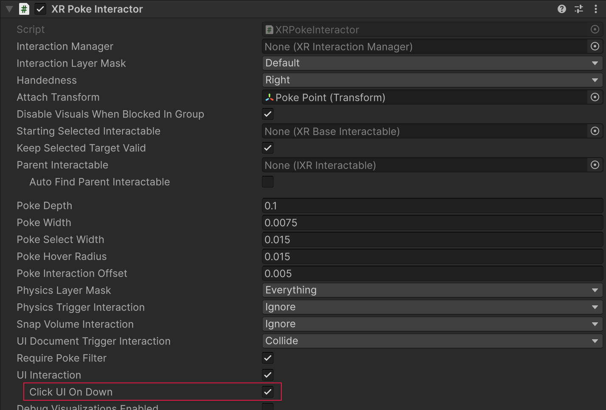
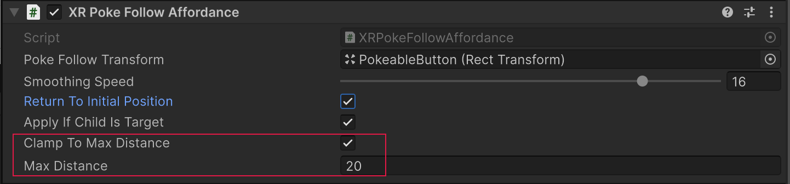
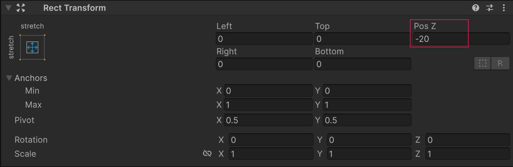
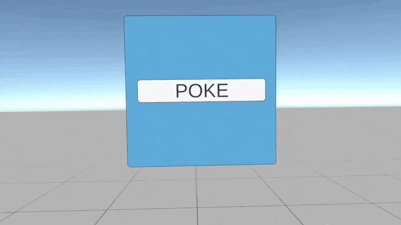

# Poke interactions with Unity UI components

This page walks you through configuring a world-space [Unity UI (uGUI)](https://docs.unity3d.com/Packages/com.unity.ugui@latest) canvas so a poke interactor can press standard uGUI buttons and controls.

Unlike [poking 3D objects](xref:xri-poke-3d), you don't need to add an [XR Simple Interactable](xref:xri-simple-interactable) or [XR Poke Filter](xref:xri-xr-poke-filter) to uGUI control game objects. Instead, add a [Tracked Device Graphic Raycaster](xref:xri-tracked-device-graphic-raycaster) to the `Canvas` and complete the [UI setup for XR interactions](xref:xri-ui-setup). With that setup, an [XR Poke Interactor](xref:xri-xr-poke-interactor) can hover and select controls in the canvas.

> [!NOTE]
> Installing the **XR Interaction Toolkit** package along with the [Starter Assets](xref:xri-samples-starter-assets) sample provides preconfigured prefabs and Event System setup to get started quickly.

## uGUI poke setup walkthrough

This walkthrough assumes your scene already has a working XR rig with poke interactors, such as the `Basic Scene` in the `Scenes/` folder of a new VR template project. You can also use the **XR Origin (XR Rig)** prefab from [Starter Assets](xref:xri-samples-starter-assets), or **XR Origin Hands (XR Rig)** from the [Hands Interaction Demo](xref:xri-samples-hands-interaction-demo), which supports both controller and hand poking.

> [!TIP]
> To test the steps on this page without a physical XR device, import the **XR Interaction Simulator** sample and add the XR Interaction Simulator prefab to your scene before entering Play mode. See [XR Interaction Simulator](xref:xri-samples-xr-interaction-simulator) for details.

### Enable UI Interaction on Poke Interactors

Before creating the canvas, confirm that the poke interactor on your XR rig is configured to interact with UI elements:

1. Expand the XR Origin hierarchy in the Hierarchy window to find the **Poke Interactor** child under **Left Controller** or **Right Controller** (or **Left Hand** / **Right Hand** for hand tracking).
2. Select the **Poke Interactor** game object and inspect the [XR Poke Interactor](xref:xri-xr-poke-interactor) component.
3. Confirm **UI Interaction** is enabled. If it is not, enable it.

> [!NOTE]
> The **XR Origin (XR Rig)** prefab from [Starter Assets](xref:xri-samples-starter-assets) ships with **UI Interaction** enabled on both controller and hand poke interactors by default. If you are using a custom rig, verify this setting before continuing.

### Create a World Space Canvas

The canvas must use World Space render mode. Screen Space canvases are not supported for XR poke interaction.

1. Use the **GameObject > XR > UI Canvas** menu command to create a preconfigured world-space canvas.

   This command also creates and configures an EventSystem if one is not already present in the scene. Alternatively, create a canvas manually via **GameObject > UI > Canvas** and set its **Render Mode** to **World Space** in the Inspector.
2. Position and scale the canvas in the scene view so it is reachable by the player.

   The default **Reference Pixels Per Unit** is 100, while XR units are meters. Scale the canvas uniformly so it matches an appropriate real-world size. Position the canvas in world units, not pixels.

The [World Space UI sample](xref:xri-samples-world-space-ui) provides a `DemoScene` that can serve as a reference for setting up your own world space uGUI canvases which contain pokeable UI controls within XR powered scenes. The scene also provides example game objects and data which demonstrate [UI Toolkit usage](xref:xri-ui-world-space-ui-toolkit-support).

> [!TIP]
> The **GameObject > XR > UI Canvas** menu command performs all of the canvas setup steps automatically, including creating a correctly configured EventSystem if one is not already present. Use this shortcut to avoid manual configuration errors.

### Add a Tracked Device Graphic Raycaster to the Canvas

The [Tracked Device Graphic Raycaster](xref:xri-tracked-device-graphic-raycaster) bridges the uGUI graphic raycasting system with XR tracked devices, including poke interactors. It must be on the same game object as the Canvas.

1. Select the Canvas game object in the Hierarchy.
2. Click **Add Component** in the Inspector.
3. Search for and add **Tracked Device Graphic Raycaster**.

If you used the **GameObject > XR > UI Canvas** menu shortcut, this component is already added for you. The default property values are appropriate for most use cases. The **Check For 3D Occlusion** and **Check For 2D Occlusion** properties are off by default; enable them only if non-UI colliders should physically block the user from reaching buttons.

> [!NOTE]
> The **Tracked Device Graphic Raycaster** is the raycaster used for XR interaction. Both it and the standard Unity **Graphic Raycaster** can coexist on a canvas, but the standard raycaster does not respond to XR poke or XR ray input. Refer to [Tracked Device Graphic Raycaster](xref:xri-tracked-device-graphic-raycaster) for property details.

### Add a uGUI Button

With the canvas and raycaster in place, you can add standard uGUI controls that respond to poke interactor input.

1. Right-click the Canvas game object in the Hierarchy and choose **UI > Button - TextMeshPro** (or **UI > Legacy > Button** for non-TMP projects).

   Unity adds a Button game object with an Image component and a Text child.

2. The Image component on the Button game object has **Raycast Target** enabled by default.

   Do not disable it; this is required for the **Tracked Device Graphic Raycaster** to detect the button.

3. Position and size the Button within the canvas using its Rect Transform.

> [!NOTE]
> Disable the **Raycast Target** of any child Image or Text (TMP) components, such as the label text inside a button. When a **Raycast Target** is enabled on a child, it can intercept the raycast meant for the parent button and prevent poke detection from working correctly.

## UI Poke behavior and events

Unlike 3D poke interactables, uGUI does not expose per-canvas or per-button settings for poke axis, depth threshold, or angle. These values are fixed by the **Tracked Device Graphic Raycaster** implementation:

- Poke axis: always **Z** (the canvas normal)
- Interaction depth offset: always `0`
- Poke angle threshold: always `89.9` degrees (nearly hemispherical)

The **hover** state is active when the poke interactor is within the poke depth threshold in front of the canvas. At that point, uGUI fires `PointerEnter`. A **click** occurs when the interactor crosses the canvas plane. uGUI then fires `PointerDown`, `PointerClick`, and `PointerUp`, which triggers the Button `onClick` event.

- For **select** handling, navigate to the **On Click** event list at the bottom of the **Button** component. This is a standard `UnityEvent` and works the same as in screen-space UI. Add a listener by clicking **+**, dragging in a game object, choosing a function, and setting a value.
- For hover feedback (pointer enter and exit), add an **Event Trigger** component to the uGUI Button game object and add **Pointer Enter** and **Pointer Exit** entries. These fire when the poke interactor enters and exits the proximity zone in front of the canvas.

> [!NOTE]
> XRI's own hover and select state events, accessible on the **XR Simple Interactable** component, are not used with uGUI poke interactions. The uGUI event system dispatches its own `PointerEnter`, `PointerExit`, `PointerDown`, `PointerUp`, and `PointerClick` events through the **XR UI Input Module**. Hook into these standard uGUI events for game logic rather than XRI interactable events.

## Tuning the click timing

The **Click UI On Down** property on the [XR Poke Interactor](xref:xri-xr-poke-interactor) is the primary control for tuning uGUI poke responsiveness. Click timing is **not** tunable on a per UI control basis.

1. Select the **Poke Interactor** game object under the XR rig that you wish to tune.
2. In the **XR Poke Interactor** component, locate the **Click UI On Down** checkbox.
3. If **Click UI On Down** is enabled (default), the click event fires as soon as the poke interactor reaches the canvas plane. This feels more responsive and immediate.
4. If **Click UI On Down** is disabled, the click event fires when the poke interactor withdraws past the canvas plane. This feels more deliberate and can reduce accidental activations.

> [!NOTE]
> **Click UI On Down** has no effect on uGUI **Scroll Rect** elements. Scrolling always uses pointer drag events regardless of this setting.

## Animate the uGUI button

The [Starter Assets](xref:xri-samples-starter-assets) sample includes a script called **XR Poke Follow Affordance** that can animate a uGUI button's transform to physically depress when poked, giving it the feel of a real button press.

1. Select the Button game object in the Hierarchy.
2. Click **Add Component** and add **XR Poke Follow Affordance** (found in the `Scripts/` folder of the Starter Assets sample).
3. Assign the **Poke Follow Transform** property to the transform that should move when the button is poked.

   This transform should be a child of the `Button` game object's transform if **Apply if Child is Target** is set.

4. Enable **Clamp to Max Distance** and set the **Max Distance** to the maximum inward displacement you want (in reference pixel units).

   The **Clamp to Max Distance** property is **required** for the motion of poked uGUI elements.

To have the poke follow affordance motion animate the button back to the canvas surface itself, be sure to offset the `RectTransform` of the game object being moved, in the **Negative Z** direction, by the amount of the **Max Distance**.

If the moving `RectTransform` **is** a child of the Button game object (which has the poke follow affordance component), ensure the Button still has a graphic (for example, a transparent `Image`) with **Raycast Target** enabled. Disable **Raycast Target** on child graphics.

> [!IMPORTANT]
> When using **XR Poke Follow Affordance** on a uGUI element, the script moves a `RectTransform` only along local Z. Local X and Y movement is suppressed to keep the button aligned within the canvas layout. Do not apply local rotation or non-uniform scale to the animated transform. Scale or rotate a parent game object instead.

## Test the uGUI poke button

Enter Play mode with the XR Interaction Simulator active in the scene, or build to a device. Approach the canvas with the poke interactor's tip. The button should highlight (uGUI normal-to-highlighted state transition) as the poke interactor enters the front face region of the canvas. Poking into the button surface fires the **On Click** event.

> [!TIP]
> If the button does not respond to the poke interactor, verify the following:
>
> - **UI Interaction** is enabled on the **XR Poke Interactor**.
> - The EventSystem has an **XR UI Input Module** (not a Standalone or Input System module).
> - The Canvas **Render Mode** is **World Space**.
> - The Canvas has a **Tracked Device Graphic Raycaster** component.
> - Child elements, such as label text or icons, are not interfering with the raycasts.

## Further examples

The **World Space UI** sample includes a scene named `DemoScene` with UI poke examples for both uGUI and UI Toolkit. The **Hands Interaction Demo** sample includes `HandsDemoScene`, which also contains several pokeable UI examples, including buttons that use **XR Poke Follow Affordance**.

Individual UI control prefabs can be found in the Starter Assets sample under `DemoAssets/Prefabs/UI/`, including **Dropdown**, **Icon Button**, **Icon Toggle**, **TextButton**, and others. Inspect these for reference on how to structure a pokeable uGUI button hierarchy.

## Additional resources

- [XR Poke Interactor](xref:xri-xr-poke-interactor)
- [Tracked Device Graphic Raycaster](xref:xri-tracked-device-graphic-raycaster)
- [Set up UI Canvases for XR](xref:xri-ui-setup)
- [Poke interactions with 3D objects](xref:xri-poke-3d)
- [Starter Assets sample](xref:xri-samples-starter-assets)
- [Hands Interaction Demo sample](xref:xri-samples-hands-interaction-demo)
- [World Space UI sample](xref:xri-samples-world-space-ui)
