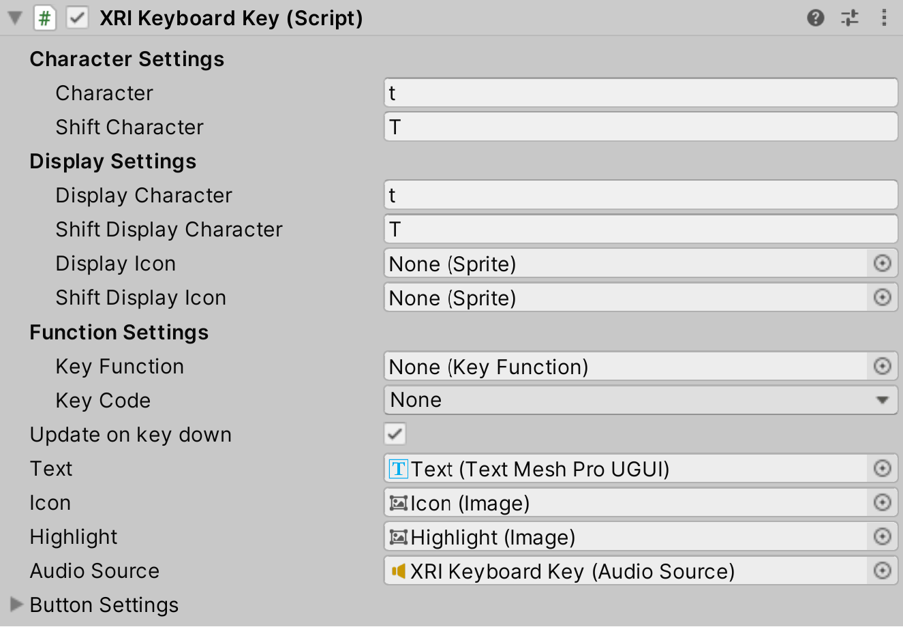

# Spatial Keyboard

The Spatial Keyboard sample provides base prefabs and scripts to add and customize a virtual keyboard. Currently the keyboard is built to work with input fields as the main use case, but can be expanded or customized to support use cases like buttons or a script based workflow. 

This sample is installed into the default location for package samples, in the `Assets\Samples\XR Interaction Toolkit\[version]\Spatial Keyboard` folder. You can move these Assets to a different location.

|**Asset**|**Description**|
|---|---|
|**`Affordances\`**|Contains affordance themes for the keyboard prefabs.|
|**`Audio\`**|Audio files for the keyboard prefabs.|
|**`Editor\`**|Custom editor scripts for the keyboard scripts.|
|**`Key Functions\`**|Asset folder containing scriptable object instances for specific key functionality.|
|**`Layouts\`**|Scriptable object instances defining keyboard layouts and key mappings.|
|**`Materials\`**|Materials used for the keyboard prefabs.|
|**`Models\`**|Models used for the keyboard prefabs.|
|**`Prefabs\`**|Keyboard prefabs and variants.|
|**`Scripts\`**|Contains scripts for the keyboard prefabs.|
|**`Sprites\`**|Contains keyboard icon sprites.|
|**`KeyboardDemo`**|Scene that demonstrates use of the keyboard prefabs.<br />See [Demo scene](#demo-scene) below.|

## Demo scene

The `KeyboardDemo` demo scene contains some demonstrations of global keyboard and world space keyboard use cases in conjunction with a few different configurations of the `XRKeyboardDisplay` and input fields.

### Global Keyboard Example

This example demonstrates input fields which are configured to spawn a global keyboard instance in rig space. This includes a standard input field with no limitations, an input field that imposes a character limit on the keyboard, an input field that only updates when the keyboard submits text, an input field that clears text when it opens the keyboard, and one that always observe the global keyboard.

### World Space Keyboard Example

This example demonstrates input fields which are configured to listen to the world space keyboard stationed in front of them. There is one input standard input field with no limitations, an input field that imposes a character limit on the keyboard, one that clears the text on keyboard submit, and one that always observes the world keyboard.

## Prefabs

|**Prefab**|**Description**|
|---|---|
|**`Input Field Global Keyboard`**|Prefab of an input field with a `XRKeyboardDisplay` component that is configured to utilize the global keyboard.|
|**`Input Field World Keyboard`**|Prefab of an input field with a `XRKeyboardDisplay` component that is configured to utilize a world space keyboard. This prefab requires a connection to the world space keyboard to function properly.|
|**`XRI Global Keyboard Manager`**|`GlobalNonNativeKeyboard` prefab configured to spawn a `XRI Spatial Keyboard` as the global keyboard. Requires connection to the `XR Rig` in the scene in order to spawn the virtual keyboard in rig space.|
|**`XRI Keyboard Key`**|Virtual keyboard key prefab.|
|**`XRI Keyboard`**|Base virtual keyboard prefab.|
|**`XRI Spatial Keyboard`**|Prefab variant with `XRGrabInteractable` handles to support positioning and scaling of the keyboard.|

## Scripts

The following scripts are included to support the prefabs and `KeyboardDemo`.

|**Script**|**Description**|
|---|---|
|**`GlobalNonNativeKeyboard`**|Singleton which manages spawning, opening, and positioning of the global keyboard.|
|**`KeyFunction`**|Abstract class defining callbacks for key functionality. Allows users to extend custom functionality of keys and keyboard. Derived classes are defined within the `KeyFunctions\` folder.|
|**`XRKeyboard`**|Keyboard implementation of the virtual keyboard.|
|**`XRKeyboardConfig`**|Scriptable object that defines key mappings to support swapping keyboard layouts.|
|**`XRKeyboardDisplay`**|Class used to display keyboard text and help facilitate input field relationship with the virtual keyboard.|
|**`XRKeyboardEvents`**|`UnityEvent` types and associated event arg classes for events raised by the keyboard components.|
|**`XRKeyboardKey`**|Key base class that sends key commands to the virtual keyboard.|
|**`XRKeyboardLayout`**|Manages the the layouts for the keyboard. Updates each keyboard key that is a child object with the key mapping data from the `XRKeyboardConfig.keyMappings`.|

## Global keyboard

The `GlobalNonNativeKeyboard` should be added to your scene to support a global keyboard instance. The global keyboard can be opened by calling `GlobalNonNativeKeyboard.instance.ShowKeyboard` and closed by calling `GlobalNonNativeKeyboard.instance.HideKeyboard`.

|**Script**|**Description**|
|---|---|
|**`Keyboard Prefab`**|Keyboard prefab for to spawn for the global keyboard instance.|
|**`Player Root`**|XR Origin of the player to spawn the keyboard in rig space. If this is left empty the keyboard will spawn in world space.|
|**`Keyboard Offset`**|Offset from the camera transform where the keyboard is placed upon opening.|
|**`Camera Transform`**|Transform of the camera. If left empty this will default to `Camera.main`.|
|**`Reposition Out Of View Keyboard On Open`**|If true, the global keyboard will be repositioned to its opening position if out of view when opened.|
|**`Facing Keyboard Threshold`**|Threshold for the dot product used to determine if the keyboard is out of view.|

## Keyboard

The `XRKeyboard` is the base implementation of the virtual keyboard. It is used in conjunction with the key implementation of `XRKeyboardKey`. The keyboard defines the functionality for commands it receives from the keys. Currently, the following commands are supported:

- Character values (updating keyboard text)
- Shift
- Caps Lock
- Backspace
- Delete
- Clear
- Enter or Return
- Layout change
- Hide

By overriding `ProcessKeyCode`, `TryProcessKeyPress`, or adding custom `KeyFunctions` used by `XRKeyboardKeys`, you can extend the functionality the base keyboard.

|**Property**|**Description**|
|---|---|
|**`Submit on Enter`**|If true, the `OnTextSubmitted` event will be invoked when the keyboard receives an enter or return command. Otherwise this enter or return will be process as a newline.|
|**`Close on Submit`**|If true, the keyboard will close on when firing the submit event.|
|**`Double Click Interval`**|Time (in seconds) which this keyboard considers a double click.|
|**`Subset Layout`**|List of keyboard key configurations supported by this keyboard. Each item in the list consists of the string command to toggle the layout, the root `XRKeyboardLayout` to apply the configuration to, and the configurations themselves. to  For more info see [Keyboard layout](#keyboard-layout).|

> [!NOTE]
> Currently the keyboard tracks its own caret position and does not support updating caret position or selecting text from the input field.

### Updating subset layouts

The keyboard contains a list of sets of `XRKeyboardLayout`, `XRKeyboardConfig`, and string which act as keys to toggle between keyboard layouts.  

|**Property**|**Description**|
|---|---|
|**`Layout String`**|The string which acts as the key for the layout.|
|**`Layout Root`**|The `XRKeyboardLayout` at the root of the set of keys to update.|
|**`Toggle On Config`**|The `XRKeyboardConfig` to set as the active key mapping on the `Layout Root` when the `Layout String` is received by the keyboard.|
|**`Toggle On Config`**|The `XRKeyboardConfig` to set as the active key mapping on the `Layout Root` when the `Layout String` is received by the keyboard, but the `Toggle On Config` is already set as the active key mapping. Typically this will be the default key mapping.|


In the image above, when a key sends the string `\sym` to update the layout, the keyboard will set the `Toggle On Config`, `LayoutSymbol`, as the active config on the `Layout Root` if it is not already active. If it is active, it will revert to the `Toggle Off Config`, `LayoutAlphaNumeric`.


In the second image above, when a key sends the string `\sym` to update the layout, two different keyboard layouts will be updated. The GameObject Keyboard Layout will be updated to `LayoutSymbols` and the GameObject Keyboard Layout Numpad will be updated with `LayoutSymbols_Keypad`. 

These patterns can be reused with any number of layouts as long as the configuration and the layout is registered with the keyboard here.

## Keyboard keys

Keyboard keys interface with the keyboard sending strings, commands, and calling different function on the keyboard. Instead of authoring each key individually, `XRKeyboardConfig` and `XRKeyboardLayout` help populate the keys with their appropriate data based predefined configurations. See the [Keyboard config](#keyboard-config) and [Keyboard layout](#keyboard-layout) sections for more info.

The [keyboard](#keyboard) has default implementations for certain commands coming from the keys, but [`KeyFunctions`](#key-functions) enable keys to more easily interact with custom keyboard functionality and define functionality for an individual key.

> [!NOTE]
> `XRKeyboardKey` extends `Button` to utilize `OnPointerDown` and `OnPointerClick`

|**Property**|**Description**|
|---|---|
|**`Character`**|The character that will be processed by the keyboard when this key is pressed. Primarily used to update the text string of the keyboard, but can also be used to trigger keyboard functionality like updating layouts.|
|**`Shift Character`**|The character that will be processed by the keyboard in the shifted state when this key is pressed. Primarily used to update the text string of the keyboard, but can also be used to trigger keyboard functionality like updating layouts.|
|**`Display Character`**|(Optional) The character that will be displayed on the key label. If empty, the key will use the `character` property as the display character.|
|**`Shift Display Character`**|(Optional) The character that will be displayed on the key label when in the shifted state. If empty, the key will use the `Shift Character` property as the display character.|
|**`Display Icon`**|(Optional) Icon that will be displayed on the key. If set, this will sprite will be displayed instead of the `Display Character`. If left empty, `Display Character` or `Character` will be used as display text.|
|**`Shift Display Icon`**|(Optional) Icon that will be displayed on the key in the shifted state. If set, this will sprite will be displayed instead of the `Shift Display Character`. If empty, `Shift Display Character` or `Shift Character` will be used as display text.|
|**`Key Function`**|(Optional) Scriptable object instance of `KeyFunction` that defines functionality of the key. If left blank, the key will `TryProcessKeyPress` that will attempt to process the `Key Code` or the `Character` to determine the functionality of the key.|
|**`Key Code`**|(Optional) Key code that defines the functionality of the key. Used in `Key Code Function` or as a fallback for the key when the `Key Function` field is left empty.|
|**`Update on Key Down`**|If true, the key will fire key pressed events on button down. If false, the key will fire key pressed events on button release.|
|**`Text`**|Text field that is used to display the display characters.|
|**`Icon`**|(Optional) Image used to display icons for key.|
|**`Highlight`**|(Optional) Image used to highlight key indicating an active state.|
|**`Audio Source`**|(Optional) Audio source that is fired when the key is pressed.|



### Key functions

The keyboard keys utilize some `KeyFunction` scripts which allow users to implement their own key functionality with key specific overrides for keyboard API calls, pre and post processing functionality when the key is pressed, and the ability to override the key display based on the context of the key and the keyboard. The base functions of `PreprocessKey` and `PostprocessKey` call into 

These `KeyFunctions` can be updated dynamically based on layout using `XRKeyboardConfig` (See [Keyboard layout](#keyboard-layout) and [Keyboard config](#keyboard-config) for more info) allowing the ability change a key's functionality based on the current keyboard configuration and layout.

This pattern is optional, but provides flexibility for custom keyboard implementations.

|**Key Function**|**Description**|
|---|---|
|**`Hide Function`**|Calls the `XRKeyboard.Close` function to hide the keyboard.|
|**`Key Code Function`**|Passes a `KeyCode` for the keyboard to process. This `KeyFunction` expects a valid `KeyCode` populated on the `XRKeyboardKey`.|
|**`Layout Function`**|Updates the layout of the keyboard.|
|**`Shift Function`**|Sends shift and caps lock commands to keyboard. Overrides key icon based on shifted, non-shifted, or caps lock state. |
|**`Value Function`**|Updates keyboard with a new text character. Base key function for most keys which update the keyboard text string.|

The following `KeyFunction` base methods can be overridden to provide additional key functionality. 

|**Method**|**Description**|
|---|---|
|**`PreprocessKey`**|Called before the the key press is processed and sent to keyboard.|
|**`ProcessKey`**|Primary function callback when a key is pressed. Use this function to interface directly with a keyboard and process logic based on the current keyboard and key context.|
|**`PostprocessKey`**|Called after the the key press is processed and sent to keyboard.|
|**`OverrideDisplayIcon`**|Determines if the icon should be overridden by the key function. Used to support special icon cases like caps lock.|
|**`GetDisplayIcon`**|Returns an icon for the key. Used in conjunction with `OverrideDisplayIcon`.|
|**`ProcessRefreshDisplay`**|Called when the key is refreshing it's display (shift change, caps lock, layout change, etc). Allows the key function to process any display logic necessary when refreshing display.|

For example if you wanted to implement a custom `Alt` key, you could do the following: 

```
public class AltFunction : KeyFunction
{
    public override void PreprocessKey(XRKeyboard keyboardContext, XRKeyboardKey key){
        base.PreprocessKey(keyboardContext, key);
        var customKeyboard = keyboardContext as CustomKeyboard;
        /*
        Check state of key and keyboard and perform some other logic before the key is pressed.
        */
    }

    public override void ProcessKey(XRKeyboard keyboardContext, XRKeyboardKey key)
    {
        var customKeyboard = keyboardContext as CustomKeyboard;
        /*
        Check state of key and keyboard and perform some other logic while the key is being pressed.
        */
        
        // Call into keyboard to process the key
        customKeyboard.ProcessAltKey();
    }

    public override void PostprocessKey(XRKeyboard keyboardContext, XRKeyboardKey key){
        base.PostprocessKey(keyboardContext, key);
        var customKeyboard = keyboardContext as CustomKeyboard;
        /*
        Check state of key and keyboard and perform some other logic after the key is pressed.
        */
    }
}
```

## Layouts and config

The keyboard uses a list of `XRKeyboardConfig` objects and the configured `XRKeyboardConfig.KeyMapping` to manage keyboard layouts. 


### Keyboard layout

A `XRKeyboardLayout` manages a subset of keys and updates the keys with the data from the active configs `XRKeyboardConfig.KeyMapping`. 

|**Property**|**Description**|
|---|---|
|**`Default Key Mapping`**|The default configuration when the keyboard resets.|
|**`Active Key Mapping`**|The active configuration for the keyboard layout. When updated, the keyboard layout will automatically attempt to update the subset of keys.|

Keyboard can support multiple layouts. For example if there is a standard keyboard and keypad, each set of keys can have a `XRKeyboardLayout` at the root to manage the layouts. This allows the data of each layout to change individually or together. 

### Keyboard config

The `XRKeyboardConfig` is scriptable object which contains the definition for key mappings. It also contains a default `KeyFunction` which can be applied to most of the keys. Typically this is the `Value Key Function` which updates the keyboard text. 

The `XRKeyboardConfig.KeyMappings` define the characters, display properties, and the key functionality of the keys for the layout. The number of items in the key mappings list should match the number of keys under a `XRKeyboardLayout`. Currently, the `XRKeyboardLayout` simply iterates through key mappings list and assigns them to the keys in sequential order.

|**Property**|**Description**|
|---|---|
|**`Default Key Function`**|The default key function that will be assigned to the keys in the key mapping. </br> To override the default key function, check `KeyMappings.overrideDefaultKeyFunction` and set the `KeyMappings.keyFunction` property on that key mapping item.|
|**`Key Mappings`**|List of key mapping data that will be applied to a set of keys when this config is set as active.|

There should be a `XRKeyboardConfig` instance for each layout. For example, if there is a keyboard that defaults to a set of alpha-numeric keys, and two keys that change the keyboard to a symbols layout and an emoji layout, there should be one config for each layout for a total of three.

## Keyboard display

The `XRKeyboardDisplay` listens to the keyboard and updates accordingly. 

When this display gains focus via the input field, it opens the keyboard. When the keyboard is opened with an input field reference, it in turn observes the keyboard to support mouse and keyboard and entry and stay in sync with display options like `XRDisplay.ClearTextOnSubmit` and `XRDisplay.ClearTextOnOpen`. 

|**Property**|**Description**|
|---|---|
|**`Input Field`**|The input input field connected to this display that will trigger the opening of the keyboard and be updated to display the keyboard text.|
|**`Use Scene Keyboard`**|If true, this will enable the keyboard field below to allow connection to a keyboard that is placed in the scene.|
|**`Keyboard`**|The keyboard this display is listening to. If left empty, the display will default to the `GlobalNonNativeKeyboard` keyboard.|
|**`Update on Key Press`**|If true, the display will update the input field each time a key is pressed and the keyboard text is updated. If false, it will update when the keyboard submits text (typically on the enter or return key).|
|**`Always Observe Keyboard`**|If true, this display will never stop listening to the keyboard when the keyboard closes, changes focus, or is opened by a different display field.|
|**`Monitor Input Field Character Limit`**|If true, this display will use the character limit of the input field as the character limit for the keyboard.|
|**`Clear Text on Submit`**|If true, the display will clear after receiving a the text submit event from the keyboard.|
|**`Clear Text on Open`**|If true, this display will clear when it gains focus and opens the keyboard.|

There are several events this display invokes regarding its state and relationship with the keyboard.

|**Property**|**Description**|
|---|---|
|**`On Text Submitted`**|The event fired when this keyboard receives a submit text event from the keyboard.|
|**`On Keyboard Opened`**|The event fired when this display opens the keyboard.|
|**`On Keyboard Closed`**|The event fired when the keyboard this display is observing closes.|
|**`On Keyboard Focus Changed`**|The event fired when the keyboard this display is observing changes focus to a different `XRKeyboardDisplay`.|


## Known limitations

- Highlighting text and dragging cursor position is not currently supported.
