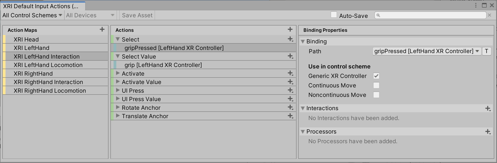
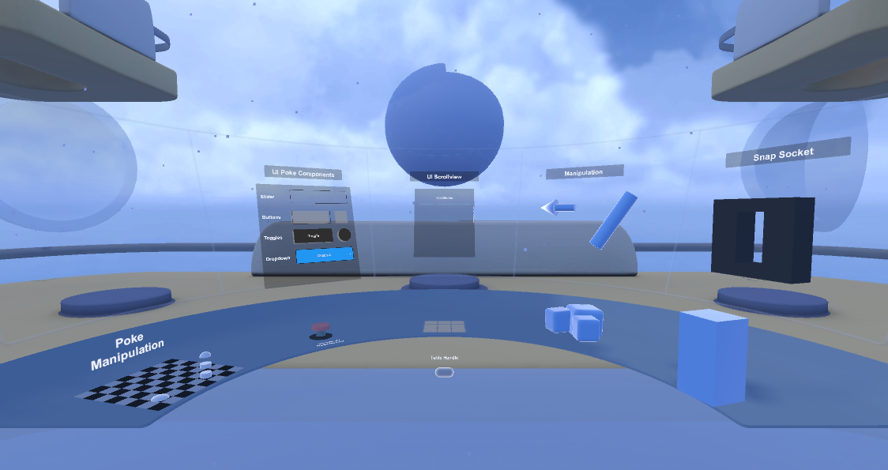

# Samples

To install samples included with this package, follow the instructions for [Installing samples](installation.md#installing-samples) using the Package Manager.

| **Sample** | **Description** |
|---|---|
| **[Starter Assets](#starter-assets)** | Assets to streamline setup of behaviors, including a default set of input actions, presets for use with XR Interaction Toolkit behaviors that use the Input System, and prefabs for getting started. |
| **[XR Device Simulator](#xr-device-simulator)** | Assets related to the simulation of XR HMD and controllers. |
| **[Tunneling Vignette](#tunneling-vignette)** | Assets to let users set up and configure tunneling vignette effects as a comfort mode option. |
| **[Meta Gaze Adapter](#meta-gaze-adapter)** | This sample provides an example to get eye tracking working with the Meta Quest Pro and the XRI Gaze Interactor. |
| **[Hands Interaction Demo](#hands-interaction-demo)** | Sample scene and other assets for hand-tracking integration with the XR Interaction Toolkit. |

## Starter Assets

This sample is installed into the default location for package samples, in the `Assets\Samples\XR Interaction Toolkit\[version]\Starter Assets` folder. You can move these Assets to a different location.

This sample contains an [Input Action Asset](https://docs.unity3d.com/Packages/com.unity.inputsystem@1.4/manual/ActionAssets.html) that contains [Actions](https://docs.unity3d.com/Packages/com.unity.inputsystem@1.4/manual/Actions.html) with typical [Input Bindings](https://docs.unity3d.com/Packages/com.unity.inputsystem@1.4/manual/ActionBindings.html) for use with behaviors in the XR Interaction Toolkit that read input. This sample also includes XR Origin, teleport, and interactable sample prefabs.

This sample also contains [Presets](https://docs.unity3d.com/Manual/Presets.html) for behaviors that use actions to streamline their configuration.

|**Asset**|**Description**|
|---|---|
|**`AffordanceThemes\`**|Asset folder containing Affordance Theme Datums used by [Affordance receivers](affordance-system.md#affordance-receivers) in the scene.|
|**`Audio\`**|Asset folder containing audio clips for the `DemoScene`.|
|**`Models\`**|Asset folder containing models for the `DemoScene`.|
|**`Prefabs\`**|Asset folder containing prefabs to streamline adding an XR Origin camera rig and interactable prefabs showcased in the `DemoScene`.|
|**`Scripts\`**|Asset folder containing sample scripts, some of which are used by the XR Origin camera rig prefab.|
|**`DemoScene`**|Scene that illustrates a basic setup using the package.|
|**`XRI Default Continuous Move.preset`**|Preset for [Continuous Move Provider](locomotion.md#continuous-move-provider).|
|**`XRI Default Continuous Turn.preset`**|Preset for [Continuous Turn Provider](locomotion.md#continuous-turn-provider).|
|**`XRI Default Gaze Controller.preset`**|Preset for [XR Controller (Action-based)](xr-controller-action-based.md) associated with the [Gaze Interactor](xr-gaze-interactor.md).|
|**`XRI Default Input Actions.inputactions`**|Asset that contains actions with typical bindings and several [Control Schemes](https://docs.unity3d.com/Packages/com.unity.inputsystem@1.4/manual/ActionBindings.html#control-schemes) for use in XR experiences.|
|**`XRI Default Left Controller.preset`**|Preset for left hand [Controllers](architecture.md#controllers).|
|**`XRI Default Left Grab Move.preset`**|Preset for left hand [Grab Move Provider](locomotion.md#grab-move-providers).|
|**`XRI Default Right Controller.preset`**|Preset for right hand [Controllers](architecture.md#controllers).|
|**`XRI Default Right Grab Move.preset`**|Preset for right hand [Grab Move Provider](locomotion.md#grab-move-providers).|
|**`XRI Default Snap Turn.preset`**|Preset for [Snap Turn Provider](locomotion.md#snap-turn-provider).|
|**`XRI Default XR UI Input Module.preset`**|Preset for [XR UI Input Module](ui-setup.md#xr-ui-input-module).|

### Input Actions Asset

The following image shows the [Action editor](https://docs.unity3d.com/Packages/com.unity.inputsystem@1.4/manual/ActionAssets.html#editing-input-action-assets) of the Asset included in the sample, while editing one of the bindings of an action in one of the maps.

The Asset contains several Action Maps, separated based on the bound device. Having different sets of actions based on the controller handedness, rather than one set of actions with input bindings for multiple controllers, allows for easier fine-grained management of the allowed actions per-hand. For example, the `XRI RightHand Locomotion/Turn` action can be disabled while the right hand has picked something up, while turning is still allowed by having the `XRI LeftHand Locomotion/Turn` action enabled.

|**Action Map**|**Description**|
|---|---|
|**XRI Head**|Actions with input bindings to a head-mounted display (that is, `<XRHMD>`) or eye gaze (that is, [`<EyeGaze>`](https://docs.unity3d.com/Packages/com.unity.xr.openxr@latest/index.html?subfolder=/manual/features/eyegazeinteraction.html)).|
|**XRI LeftHand**|Actions with input bindings to a left hand controller (that is, `<XRController>{LeftHand}`) related to tracking and haptic feedback.|
|**XRI LeftHand Interaction**|Actions with input bindings to a left hand controller related to interaction state.|
|**XRI LeftHand Locomotion**|Actions with input bindings to a left hand controller related to locomotion and interaction state for a teleportation interactor.|
|**XRI RightHand**|Actions with input bindings to a right hand controller (that is, `<XRController>{RightHand}`) related to tracking and haptic feedback.|
|**XRI RightHand Interaction**|Actions with input bindings to a right hand controller related to interaction state.|
|**XRI RightHand Locomotion**|Actions with input bindings to a right hand controller related to locomotion and interaction state for a teleportation interactor.|
|**XRI UI**|Actions with input bindings to drive UI input and navigation used in the XR UI Input Module component.|

There are also several Input Control Schemes to group different input controls. You can use these to selectively enable or disable some of the bindings based on the locomotion movement control scheme in use.

|**Control Scheme**|**Description**|
|---|---|
|**Generic XR Controller**|Bindings that should remain enabled when applying any movement control scheme.|
|**Continuous Move**|Bindings that should remain enabled when applying the continuous movement control scheme.|
|**Noncontinuous Move**|Bindings that should remain enabled when applying the noncontinuous movement control scheme.|

For a complete example of configuring input actions for each controller, and using control schemes, see the [XR Interaction Toolkit Examples](https://github.com/Unity-Technologies/XR-Interaction-Toolkit-Examples) project.

### Configuring Preset Manager defaults

After importing the sample into your Project, if you want to use the Assets, it is recommended to use the [Preset Manager](https://docs.unity3d.com/Manual/class-PresetManager.html) to change the default Presets to those included in this sample. This will allow the objects you create from the **GameObject &gt; XR** menu to automatically populate the action properties of the behavior, as configured in each preset.

To easily set a preset as the default for its associated behavior, select the Asset in the Project window, then click the **Add to [behavior] default** button in the Inspector.

Access the Preset Manager from Unity's main menu (go to **Edit &gt; Project Settings**, then select **Preset Manager**).

The following image shows the Preset Manager with the included presets set as default for their associated behavior. For the presets which depend on the hand of the controller, a Filter value of **Left** and **Right** is set for XRI Default Left Controller and XRI Default Right Controller to allow the appropriate preset to be chosen based on the name of the GameObject.

### Prefabs

|**Prefab**|**Description**|
|---|---|
|**`Complete Teleport Area Set Up`**|Teleportation prefab which includes the `Teleportation Area` and `Teleportation Anchor` prefabs. Configured to the `Teleport Interactor` in the `Complete XR Origin Setup` prefab included in these starter assets.|
|**`Complete XR Origin Set Up`**|XR Origin prefab configured for smooth locomotion, grab locomotion, teleportation locomotion, as well as smooth and snap turn. Each hand also contains a `Poke Interactor`, `Direct Interactor` and a `Ray Interactor`, as well as an [Interaction Group](xr-interaction-group.md) that first prioritizes the Poke Interactor then the Direct Interactor and lastly the Ray Interactor. Additionally, there is an [XRGazeInteractor](xr-gaze-interactor.md) that is configured with the `XRI Default Gaze Controller` and the `GazeInputManager`.|
|**`Interactables Sample`**|Prefab containing preconfigured `XR Grab Interactables`.|
|**`UI Sample`**|Prefab containing interactable UI elements.|

### Scripts

The following scripts are included to support the prefabs.

|**Script**|**Description**|
|---|---|
|**`ActionBasedControllerManager`**|Script used to mediate the controllers and their associated interactors and input actions under different interaction states.|
|**`DynamicMoveProvider`**|A version of action-based continuous movement that automatically controls the frame of reference that determines the forward direction of movement based on user preference for each hand.|
|**`GazeInputManager`**|Script used to manage input fallback for an [XRGazeInteractor](xr-gaze-interactor.md) when eye tracking is not available.|

## XR Device Simulator

This sample is installed into the default location for package samples, in the `Assets\Samples\XR Interaction Toolkit\[version]\XR Device Simulator` folder. You can move these Assets to a different location.

The XR Interaction Toolkit package provides an example implementation of an XR Device Simulator to allow for manipulating an HMD and a pair of controllers using mouse and keyboard input. This sample contains example bindings for use with that simulator, and a Prefab which you can add to your scene to quickly start using the simulator.

|**Asset**|**Description**|
|---|---|
|**`Scripts\`**|Asset folder containing scripts for the runtime UI for the simulator.|
|**`UI\`**|Asset folder containing prefabs and textures for the runtime UI for the simulator.|
|**`XR Device Controller Controls.inputactions`**|Asset that contains actions with default bindings for use with the XR Device Simulator focused on controls for the simulated controllers.|
|**`XR Device Simulator Controls.inputactions`**|Asset that contains actions with default bindings for use with the XR Device Simulator focused on controls for the simulator itself.|
|**`XR Device Simulator.prefab`**|Prefab with the XR Device Simulator component with references to actions configured.|

## Tunneling Vignette

This sample is installed into the default location for package samples, in the `Assets\Samples\XR Interaction Toolkit\[version]\Tunneling Vignette` folder. You can move these Assets to a different location.

|**Asset**|**Description**|
|---|---|
|**`TunnelingVignette.mat`**|Material used to display the tunnelling vignette with configurable properties, including aperture size, feathering effect, and vignette color.|
|**`TunnelingVignette.prefab`**|Prefab that contains a complete setup with necessary components for configuring and controlling the tunneling vignette. This Prefab is intended to be a child GameObject of the Main Camera.|
|**`TunnelingVignette.shader`**|Default shader used by the material and Prefab to compute the vignette effect. Works with the built-in rendering pipeline and Scriptable Render Pipeline (SRP).|
|**`TunnelingVignetteHemisphere.fbx`**|Hemisphere model with the mesh for showing the tunneling vignette on its inner surface.|
|**`TunnelingVignetteSG.shadergraph`**|Shader Graph asset primarily used as reference material to demonstrate the computation of the default shader. Notes in the asset explain the math involved and the steps needed to generate a SRP shader that achieves the same function as the default shader. This is not used by the material or Prefab, however this can be used as an alternative starting point to create a modified shader.|

## Meta Gaze Adapter

This sample is installed into the default location for package samples, in the `Assets\Samples\XR Interaction Toolkit\[version]\Meta Gaze Adapter` folder. It provides a script to assist with eye tracking with the Meta Quest Pro and the [XR Gaze Interactor](xr-gaze-interactor.md).
Currently the `XRGazeInteractor` uses the [OpenXR bindings](https://docs.unity3d.com/Packages/com.unity.xr.openxr@latest/index.html?subfolder=/manual/features/eyegazeinteraction.html) for eye gaze position, tracking, and rotation. This binding is not currently supported for Quest Pro. When the OpenXR bindings are supported, this sample and adapter will be unnecessary.

|**Asset**| **Description**|
|---|---|
|**`OculusEyeGazeInputAdapter`**|Script which creates an Eye Gaze input device and updates the device's state based on data from the Oculus `OVRPlugin` API. This script can be placed in a scene with an [XR Gaze Interactor](xr-gaze-interactor.md) to enable the gaze interactor to work with the Meta Quest Pro eye tracking.|
|**`GazeAdapterSampleProjectValidation`**|Unity Editor script which adds Project Validation rules for the sample. Not necessary for the actual adapter.|

### Requirements

The [Oculus XR Plugin](https://docs.unity3d.com/Manual/com.unity.xr.oculus.html) package version `3.2.2` or newer is required for Meta Quest Pro support, and thus this sample requires at least the Unity Editor 2021.3.4f1 or newer.

Additionally, this sample requires the `OVRPlugin` found in the `VR` folder of the [Oculus Integration asset](https://developer.oculus.com/downloads/package/unity-integration/), 
`v47.0` or newer, and the [OpenXR Plugin](https://docs.unity3d.com/Packages/com.unity.xr.openxr@latest/) package version `1.6.0` or newer. The OpenXR `EyeGazeDevice` is used to update the pose of the `Gaze Interactor`.

### Setup

1. Download `v47.0` or newer of the [Oculus Integration asset](https://assetstore.unity.com/packages/tools/integration/oculus-integration-82022)
2. Import the Oculus Integration asset by using **Window** &gt; **Package Manager** &gt; **Packages: My Assets** &gt; **Oculus Integration** &gt; **Import** or by using **Assets** &gt; **Import Package** &gt; **Custom Package** to import the downloaded `.unitypackage` file. At a minimum, select the following assets to import:
    - `Oculus\OculusProjectConfig.asset`
    - `Oculus\VR\`
3. Click **Yes** to accept the Update Oculus Utilities Plugin prompt to update OVRPlugin
4. Click **Use OpenXR** to accept the OpenXR Backend prompt. If you canceled, enable it later using **Oculus** &gt; **Tools** &gt; **OVR Utilities Plugin** &gt; **Set OVRPlugin to OpenXR**.
5. Import Meta Gaze Adapter sample from **Window** &gt; **Package Manager** &gt; **XR Interaction Toolkit**
6. Install or update [OpenXR Plugin (com.unity.xr.openxr)](https://docs.unity3d.com/Manual/com.unity.xr.openxr.html) to version `1.6.0` or newer and install or update [Oculus XR Plugin (com.unity.xr.oculus)](https://docs.unity3d.com/Manual/com.unity.xr.oculus.html) to version `3.2.2` or newer by clicking **Fix** in **Edit** &gt; **Project Settings** &gt; **XR Plug-in Management** &gt; **Project Validation** or by using **Window** &gt; **Package Manager**
7. Add **`USE_INPUT_SYSTEM_POSE_CONTROL`** to Scripting Defines Symbols (**Edit** &gt; **Project Settings** &gt; **Player** &gt; **Other Settings** &gt; **Scripting Compilation** &gt; **Scripting Defines Symbols**) and click **Apply**. Do this for both the PC and Android tabs in the Player settings. This resolves the error "ArgumentException: Expected control 'pose' to be of type 'PoseControl' but is of type 'PoseControl' instead!"
8. Enable **Oculus** plug-in provider in **Edit** &gt; **Project Settings** &gt; **XR Plug-in Management**. Do this for both the PC and Android tabs in the XR Plug-in Management settings.
9. Add the Oculus Eye Gaze Input Adapter component to a GameObject in the scene
10. (Android platform only) Enable **Eye Tracking Support** in the Inspector window of the `Assets\Oculus\OculusProjectConfig` asset under section **Quest Features** &gt; **General** by setting it to **Supported** or **Required**

> [!TIP]
> To enable eye tracking support while using Oculus Link, open the Oculus desktop application and go to **Settings** &gt; **Beta**. Click to enable **Developer Runtime Features** and **Eye tracking over Oculus Link**. Then click **Restart Oculus**, then unplug and plug in the USB cable. Finally, restart the Unity Editor.

#### Optional

- Enable **Quest Pro** under Target Devices in the Oculus settings Android tab in **Edit** &gt; **Project Settings** &gt; **XR Plug-in Management** &gt; **Oculus**
- Generate custom Android manifest file (**Oculus** &gt; **Tools** &gt; **Create store-compatible AndroidManifest.xml** to update `Assets\Plugins\Android\AndroidManifest.xml`, which also automatically updates **Edit** &gt; **Project Settings** &gt; **Player** &gt; **Android tab** &gt; **Publishing Settings** to enable **Custom Main Manifest**

## Hands Interaction Demo

This sample demonstrates hand tracking interactions with the XR Interaction Toolkit, containing a sample scene and other assets used by the scene.

This sample is installed into the default location for package samples, in the `Assets\Samples\XR Interaction Toolkit\[version]\Hands Interaction Demo` folder. You can move these Assets to a different location.

|**Asset**|**Description**|
|---|---|
|**`Editor\Scripts\`**|Asset folder containing Unity Editor scripts which adds Project Validation rules for the sample.|
|**`Runtime\AffordanceThemes\`**|Asset folder containing Affordance Theme Datums used by [Affordance receivers](affordance-system.md#affordance-receivers) in the scene.|
|**`Runtime\Materials\`**|Asset folder containing materials for the `HandsDemoScene`.|
|**`Runtime\Models\`**|Asset folder containing models for the `HandsDemoScene`.|
|**`Runtime\Prefabs\`**|Asset folder containing prefabs showcased in the `HandsDemoScene`.|
|**`Runtime\Scripts\`**|Asset folder containing sample scripts.|
|**`Runtime\Sprites\`**|Asset folder containing sprite textures for the `HandsDemoScene`.|
|**`Runtime\HandsDemoScene`**|Scene that illustrates a basic rig setup that supports hand tracking and controllers along with example interactable objects and UI.|

### Prerequisites and setup

In order for this sample to function properly, a few additional packages are required. Install these by clicking **Fix** in **Edit** &gt; **Project Settings** &gt; **XR Plug-in Management** &gt; **Project Validation** or by using the **Window** &gt; **Package Manager** window. See [Install XR Hands](https://docs.unity3d.com/Packages/com.unity.xr.hands@latest/index.html?subfolder=/manual/project-setup/install-xrhands.html) for installation steps for that package when using the Package Manager window.
  * [Starter Assets](#starter-assets) - [version] - imported from Package Manager under XR Interaction Toolkit in the Samples area 
  * [XR Plug-in Management (com.unity.xr.management)](https://docs.unity3d.com/Manual/com.unity.xr.management.html) - 4.3.1 or newer
  * [OpenXR Plugin (com.unity.xr.openxr)](https://docs.unity3d.com/Manual/com.unity.xr.openxr.html) - 1.6.0 or newer
  * [XR Hands (com.unity.xr.hands)](https://docs.unity3d.com/Packages/com.unity.xr.hands@latest) - 1.1.0-pre.3 or newer
    * HandVisualizer - imported from Package Manager under XR Hands in the Samples area
  * [Universal RP](https://docs.unity3d.com/Manual/com.unity.render-pipelines.universal.html) - Universal Render Pipeline v10.10.1+

To enable hand tracking support with an OpenXR project, enable the **OpenXR** plug-in provider in **Edit** &gt; **Project Settings** &gt; **XR Plug-in Management**. Then open **Edit** &gt; **Project Settings** &gt; **XR Plug-in Management** &gt; **OpenXR** and enable [Hand Tracking Subsystem](https://docs.unity3d.com/Packages/com.unity.xr.hands@latest/index.html?subfolder=/manual/features/handtracking.html) under OpenXR Feature Groups.

### Meta Quest support via OpenXR

If building for Quest, Quest 2, or Quest Pro, you will also need to enable [Meta Quest Support](https://docs.unity3d.com/Packages/com.unity.xr.openxr@1.6/manual/features/oculusquest.html) (only available in the Android tab) and [Meta Hand Tracking Aim](https://docs.unity3d.com/Packages/com.unity.xr.hands@latest/index.html?subfolder=/manual/features/metahandtrackingaim.html). Then add an Interaction Profile in that same window, such as [Oculus Touch Controller Profile](https://docs.unity3d.com/Packages/com.unity.xr.openxr@latest/index.html?subfolder=/manual/features/oculustouchcontrollerprofile.html), for controller support.

The main Hands Interaction Demo scene can be opened from the location `Assets\Samples\XR Interaction Toolkit\[version]\Hands Interaction Demo\Runtime\HandsDemoScene`. This scene uses the assets in the list below. The prefabs are designed as a starting point for your own XR hand interaction based projects.

### Demo scene layout

In the `HandsDemoScene` there are multiple interaction areas. On the right side you will find objects to interact with. The floating touch will highlight upon hover and poking but cannot be picked up. The objects next to them can be manipulated. You will need to use a pinch gesture to pick up and move them around the table. When pinching with two hands, the floating objects can be scaled and rotated.

On the left half of the scene you will find the UI interactions. The UI elements can be interacted with in 2 ways:
  * Ray & Pinch: UI can be clicked by pointing the hand Ray Interactor and then bringing your index finger and thumb together in a pinch gesture to activate selection.
  * Poke: UI can also be clicked by pressing into the UI with your index finger. Some UI buttons have included the Poke Follow Affordance sample script which uses the finger depth to depress the UI buttons.

### Hierarchy configuration

A Hands And Controllers Manager component is on the XR Origin GameObject which manages automatically swapping between sets of interactors used for hand tracking (Left Hand and Right Hand GameObjects) and for motion controllers (Left Controller and Right Controller GameObjects) by activating or deactivating those GameObjects.

A Poke Gesture Detector component and System Gesture Detector component are on the hand tracking GameObjects which manages automatically toggling interactors to disable them and their visuals by activating or deactivating those child GameObjects when the hand is making certain gestures.

### Troubleshooting

If you find yourself in an error state when trying to import the packages, it can be helpful to use the below images to identify the issue and take the appropriate steps to correct them:

The above error will happen if you have not imported the **Starter Assets** from the XR Interaction Toolkit Samples first. Once imported, these errors should be cleared. You can navigate to **Project Validation** in XR Plug-in Management to see this error as well (see image below). Clicking **Fix** will import the Starter Assets for you.

If you are unable to run the sample scene correctly, you may not have imported the **XR Hands** package correctly. Checking the **Project Validation** in XR Plug-in Management will reveal what might be missing. Clicking **Fix** will import the main package. 

Note: if the XR Hands package has not been imported, you will also need to import the **HandVisualizer** sample package by clicking **Fix** as shown in the image below:

## Document revision history

|Date|Reason|
|---|---|
|**January 24, 2023**|Updated documentation for Hands Interaction Demo to include installation steps and troubleshooting.|
|**January 18, 2023**|Added documentation for Meta Gaze Adapter and Hands Interaction Demo samples. Matches package version 2.3.0.|
|**December 14, 2022**|Added documentation for new prefabs, eye gaze, and simulator UI. Matches package version 2.3.0.|
|**April 29, 2022**|Added documentation for the Tunneling Vignette sample. Updated Starter Assets with XRI UI action map. Updated preset images with new XR UI Input Module preset to match 2.1.0.|
|**March 4, 2022**|Updated Starter Assets for reorganized actions into new action maps. Matches package version 2.0.1.|
|**February 15, 2022**|Renamed the Default Input Actions sample to Starter Assets. Matches package version 2.0.0.|
|**October 20, 2020**|Document created. Matches package version 0.10.0.|