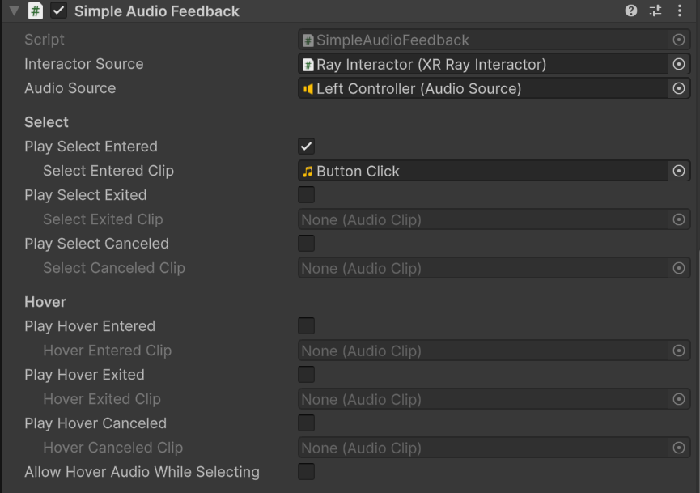

# Simple Audio Feedback

Component that responds to select and hover events by playing audio clips.

| **Property** | **Description** |
|---|---|
| **Interactor Source** | The interactor component to listen to for its interaction events. |
| **Audio Source** | The Audio Source component to use to play audio clips. |
| **Play Select Entered** | Whether to play a sound when the interactor starts selecting an interactable. |
| &emsp;**Select Entered Clip** | The audio clip to play when the interactor starts selecting an interactable. |
| **Play Select Exited** | Whether to play a sound when the interactor stops selecting an interactable without being canceled. |
| &emsp;**Select Exited Clip** | The audio clip to play when the interactor stops selecting an interactable without being canceled. |
| **Play Select Canceled** | Whether to play a sound when the interactor stops selecting an interactable due to being canceled. |
| &emsp;**Select Canceled Clip** | The audio clip to play when the interactor stops selecting an interactable due to being canceled. |
| **Play Hover Entered** | Whether to play a sound when the interactor starts hovering an interactable. |
| &emsp;**Hover Entered Clip** | The audio clip to play when the interactor starts hovering an interactable. |
| **Play Hover Exited** | Whether to play a sound when the interactor stops hovering an interactable without being canceled. |
| &emsp;**Hover Exited Clip** | The audio clip to play when the interactor stops hovering an interactable without being canceled. |
| **Play Hover Canceled** | Whether to play a sound when the interactor stops hovering an interactable due to being canceled. |
| &emsp;**Hover Canceled Clip** | The audio clip to play when the interactor stops hovering an interactable due to being canceled. |
| **Allow Hover Audio While Selecting** | Whether to allow hover audio to play while the interactor is selecting an interactable. |
