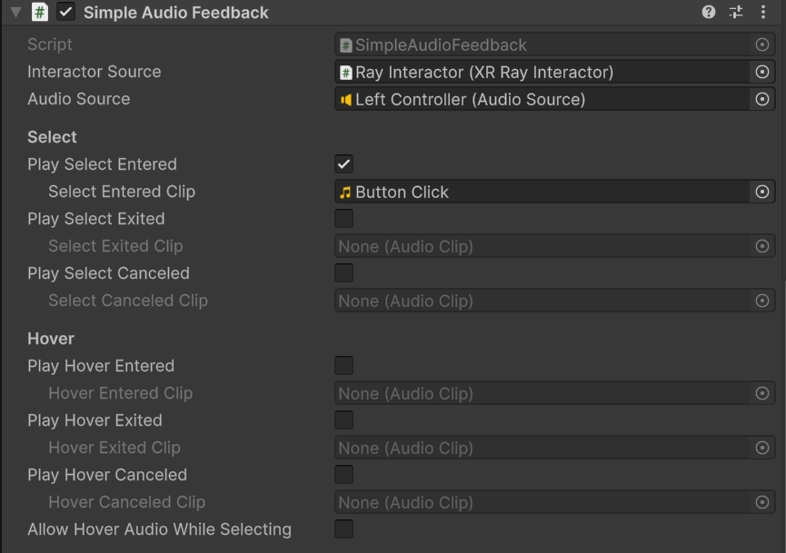

# Simple Audio Feedback

Customize audio feedback settings to play sound effects during interaction events.

Use this component with an interactor to provide audio feedback when a user selects or hovers over an object.

 *The Simple Audio Feedback component showing all properties.*

## Simple Audio Feedback properties

The Simple Audio Feedback component contains the following properties:

| **Property** | **Description** |
| :--- | :--- |
| **Interactor Source** | The interactor component to listen to for interaction events. |
| **Audio Source** | The [Audio Source](xref:um-class-audio-source) component used to play audio clips. This component creates an audio source if you don't assign one. |

### Select

The **Select** section contains the following properties:

| **Property** | **Description** |
| :--- | :--- |
| **Play Select Entered** | Play an audio clip when the interactor starts selecting an interactable. |
| **Select Entered Clip** | The audio clip to play when the interactor starts selecting an interactable. This property is available only when **Play Select Entered** is enabled. |
| **Play Select Exited** | Play an audio clip when the interactor stops selecting an interactable. |
| **Select Exited Clip** | The audio clip to play when the interactor stops selecting an interactable. This property is available only when **Play Select Exited** is enabled. |
| **Play Select Canceled** | Play an audio clip when the interactor stops selecting an interactable because the interaction is canceled. |
| **Select Canceled Clip** | The audio clip to play when the interaction is canceled. This property is available only when **Play Select Canceled** is enabled. |

### Hover

The **Hover** section contains the following properties:

| **Property** | **Description** |
| :--- | :--- |
| **Play Hover Entered** | Play an audio clip when the interactor starts hovering over an interactable. |
| **Hover Entered Clip** | The audio clip to play when the interactor starts hovering over an interactable. This property is available only when **Play Hover Entered** is enabled. |
| **Play Hover Exited** | Play an audio clip when the interactor stops hovering over an interactable. |
| **Hover Exited Clip** | The audio clip to play when the interactor stops hovering over an interactable. This property is available only when **Play Hover Exited** is enabled. |
| **Play Hover Canceled** | Play an audio clip when the interactor stops hovering over an interactable because the interaction is canceled. |
| **Hover Canceled Clip** | The audio clip to play when the interaction is canceled. This property is available only when **Play Hover Canceled** is enabled. |
| **Allow Hover Audio While Selecting** | Allow hover audio to play while the interactor is already selecting an interactable. |

## Additional resources

* [`SimpleAudioFeedback` class](xref:UnityEngine.XR.Interaction.Toolkit.Feedback.SimpleAudioFeedback)
* [Component index](xref:xri-components)
* [Audio Source](xref:um-class-audio-source)
