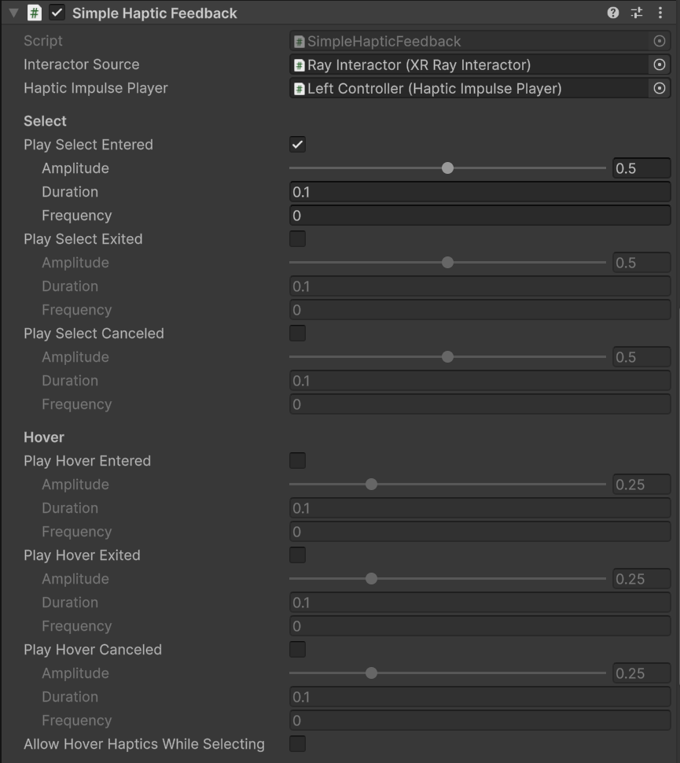

# Simple Haptic Feedback

Component that responds to select and hover events by playing haptic impulses (in other words, vibrating the controller).

| **Property** | **Description** |
|---|---|
| **Interactor Source** | The interactor component to listen to for its interaction events. |
| **Haptic Impulse Player** | The [Haptic Impulse Player](haptic-impulse-player.md) component to use to play haptic impulses. |
| **Play Select Entered** | Whether to play a haptic impulse when the interactor starts selecting an interactable. |
| &emsp;**Amplitude** | The desired motor amplitude. |
| &emsp;**Duration** | The desired duration of the impulse in seconds. |
| &emsp;**Frequency** | The desired frequency of the impulse in Hz. The default value of 0 means to use the default frequency of the device. |
| **Play Select Exited** | Whether to play a haptic impulse when the interactor stops selecting an interactable without being canceled. |
| **Play Select Canceled** | Whether to play a haptic impulse when the interactor stops selecting an interactable due to being canceled. |
| **Play Hover Entered** | Whether to play a haptic impulse when the interactor starts hovering over an interactable. |
| **Play Hover Exited** | Whether to play a haptic impulse when the interactor stops hovering over an interactable without being canceled. |
| **Play Hover Canceled** | Whether to play a haptic impulse when the interactor stops hovering over an interactable due to being canceled. |
| **Allow Hover Haptics While Selecting** | Whether to allow hover haptics to play while the interactor is selecting an interactable. |
