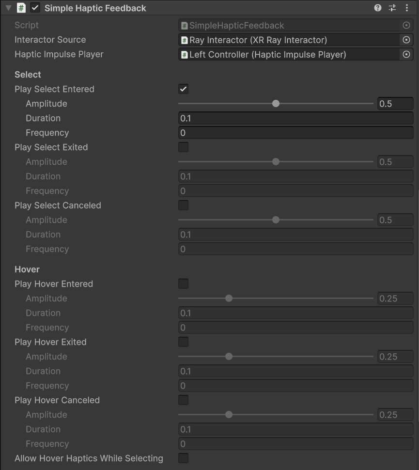

# Simple Haptic Feedback

Play haptic impulses (vibrations) on the controller in response to specific interaction events.

Use this component to provide tactile feedback when a user selects or hovers over an object.

 *The Simple Haptic Feedback component showing all properties.*

## Simple Haptic Feedback properties

The Simple Haptic Feedback component contains the following properties:

| **Property** | **Description** |
|---|---|
| **Interactor Source** | Sets the interactor component to listen to for its interaction events. |
| **Haptic Impulse Player** | Sets the [Haptic Impulse Player](haptic-impulse-player.md) component used to play haptic impulses. |

### Haptic impulse settings

Each haptic event in the **Select** and **Hover** sections uses the following properties to define its vibration effect.

|**Property**| **Description** |
|---|---|
| **Amplitude** | Defines the strength of the vibration. |
| **Duration** | Defines the length of the vibration in seconds. |
| **Frequency** | Defines the frequency (speed) of the vibration in Hz. The default value of 0 uses the default frequency of the device. |

### Select

The **Select** section contains the following properties:

|**Property**| **Description** |
|---|---|
| **Play Select Entered** | Plays a haptic impulse when the interactor starts selecting an interactable. |
| **Play Select Exited** | Plays a haptic impulse when the interactor stops selecting an interactable. |
| **Play Select Canceled** | Plays a haptic impulse when the interactor stops selecting an interactable because the interaction is canceled. |

### Hover

The **Hover** section contains the following properties:

|**Property**| **Description** |
|---|---|
| **Play Hover Entered** | Plays a haptic impulse when the interactor starts hovering over an interactable. |
| **Play Hover Exited** | Plays a haptic impulse when the interactor stops hovering over an interactable. |
| **Play Hover Canceled** | Plays a haptic impulse when the interactor stops hovering over an interactable because the interaction is canceled. |
| **Allow Hover Haptics While Selecting** | Allows hover haptics to play while the interactor is already selecting an interactable. |

## Additional resources

* [`SimpleHapticFeedback` class](xref:UnityEngine.XR.Interaction.Toolkit.Feedback.SimpleHapticFeedback)
* [Component index](xref:xri-components)
