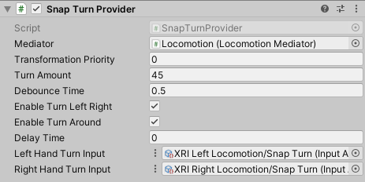

# Snap Turn Provider

A locomotion provider that allows the user to rotate their rig using a 2D axis input from an input system action.

| **Property** | **Description** |
|---|---|
|**Mediator**| The behavior that this provider communicates with for access to the mediator's XR Body Transformer. If one is not provided, this provider will attempt to locate one during its Awake call. |
|**Transform Priority**| The queue order of this provider's transformations of the XR Origin. The lower the value, the earlier the transformations are applied. |
| **Turn Amount** | The number of degrees clockwise Unity rotates the rig when snap turning clockwise. |
| **Debounce Time** | The amount of time that Unity waits before starting another snap turn. |
| **Enable Turn Left Right** | Controls whether to enable left and right snap turning. |
| **Enable Turn Around** | Controls whether to enable 180° snap turning. |
| **Delay Time** | The time (in seconds) to delay the first turn after receiving initial input for the turn. Subsequent turns while holding down input are delayed by the **Debounce Time**, not the delay time. This delay can be used, for example, as time to set a tunneling vignette effect as a VR comfort option. |
| **Left Hand Snap Turn Input** | Reads input data from the left hand controller. Input Action must be a Value action type (Vector 2). |
| **Right Hand Snap Turn Input** | Reads input data from the right hand controller. Input Action must be a Value action type (Vector 2). |
