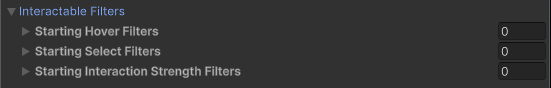

<!--All interactables (Simple, Grab)

To include this file (adjust heading level and include file path as needed):

## Interactable Filters {#interactable-filters}

[!INCLUDE [interactable-filters-config](snippets/interactable-filters-config.md)]
-->

Configure the starting set of filters that an interactable uses to determine whether it should be eligible for interaction.

All of these filter properties are optional. If you do not assign them, the interactable uses default behavior. Refer to [Interaction filters](xref:xri-interaction-filters) for more information about implementing filters.

| **Property** | **Description** |
|---|---|
| **Starting Hover Filters** list | Validates hover interactions with this interactable. |
| **Starting Select Filters** list | Validates select interactions with this interactable. |
| **Starting Interaction Strength Filters** list | Modify the interaction strength value during an interaction. |
