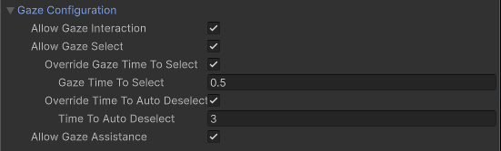

<!--
Gaze configuration options for Simple and Grab Interactables

To include this file (adjust heading level and include file path as needed):

## Gaze configuration {#gaze-config}

[!INCLUDE [interactable-gaze](snippets/interactable-gaze-configuration.md)]
-->
Gaze can affect interactions in two distinct ways:

* [Direct selection by gaze](#gaze-select): the interactable becomes selected if the user looks at it long enough.
* [Gaze assistance](#gaze-assist): looking at the interactable helps other interactors target and select it.

Enable **Allow Gaze Interaction** to allow either type of gaze interaction and then enable **Allow Gaze Select**, **Allow Gaze Assistance**, or both.

> [!TIP]
> Gaze interaction requires an active [XR Gaze Interactor](xref:xri-xr-gaze-interactor) component in the scene. The gaze interactor and the interactable must be registered with the same [XR Interaction Manager](xref:xri-xr-interaction-manager). Refer to [Scene management considerations](xref:xri-scene-management#scene-management-considerations) for more information about how interactions are managed.

### Gaze select options {#gaze-select}

Enable **Allow Gaze Select** to let the user select an interactable by looking at it.

> [!NOTE]
> You must also enable the **Hover To Select** property of the [XR Gaze Interactor](xref:xri-xr-gaze-interactor) component.

By default, the [XR Gaze Interactor](xref:xri-xr-gaze-interactor) properties are used to determine how long the user must hold their gaze on an interactable to select it and how long after the user looks away that the interactable will be deselected.

You can override these properties for specific objects using the settings in this section.

| **Property** | **Description** |
|---|---|
| **Override Gaze Time To Select** | Enables this interactable to override the **Hover To Select** time on the [XR Gaze Interactor](xref:xri-xr-gaze-interactor). |
| **Gaze Time To Select** | Number of seconds an [XR Gaze Interactor](xref:xri-xr-gaze-interactor) must hover this interactable to select it if **Hover To Select** is enabled on the [XR Gaze Interactor](xref:xri-xr-gaze-interactor). |
| **Override Time To Auto Deselect** | Enables this interactable to override the auto deselect time on the [XR Gaze Interactor](xref:xri-xr-gaze-interactor). |
| **Time To Auto Deselect** | Number of seconds this interactable will be selected by an [XR Gaze Interactor](xref:xri-xr-gaze-interactor) before being automatically deselected if **Auto Deselect** is enabled on the [XR Gaze Interactor](xref:xri-xr-gaze-interactor). |

### Gaze assistance {#gaze-assist}

You can enable gaze assistance to make it easier for the user to select the interactable they are looking at. In this case, the selection is made with a different interactor rather than the gaze interactor itself.

When you enable **Allow Gaze Assistance**, an [XR Gaze Interactor](xref:xri-xr-gaze-interactor) will place an [XR Interactable Snap Volume](xr-interactable-snap-volume.md) at this interactable to allow a properly configured [XR Ray Interactor](xr-ray-interactor.md) to snap to this interactable. See the [XR Interactable Snap Volume](xr-interactable-snap-volume.md) or [XR Ray Interactor](xr-ray-interactor.md) pages for further information about correctly configuring an `XRRayInteractor` to support an `XRInteractableSnapVolume`.
