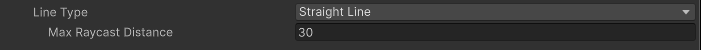
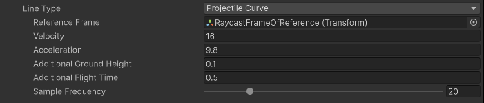
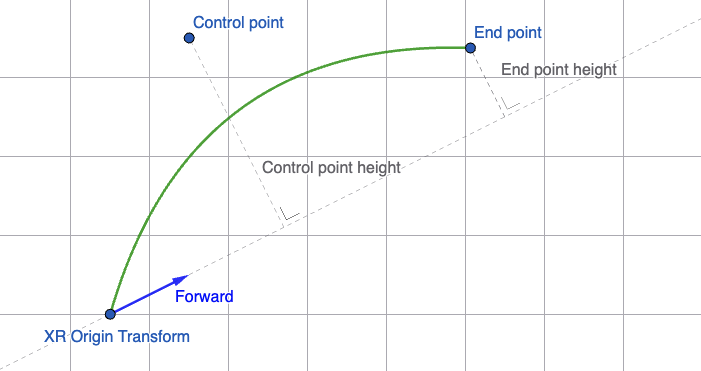
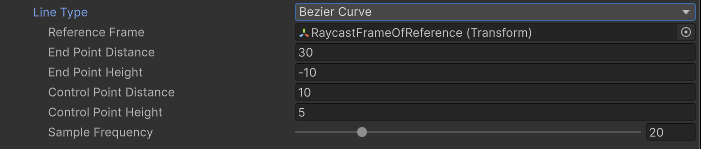
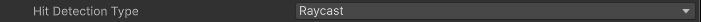
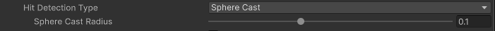
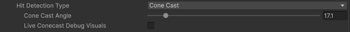

<!-- ray interactor, gaze interactor

## Raycast configuration {#raycast-config}

[!INCLUDE [interactor-raycast-config](snippets/interactor-raycast-config.md)]
-->

Use the options in the **Raycast Configuration** section to specify how the ray casts used to detect eligible interactables should behave. For example, you can specify whether the ray cast follows a straight or a curved path with these properties.

Interactors that operate at a distance, like Ray and Gaze interactors, use raycasts to detect valid interactable targets.

The raycast options include:

| **Properties** | **Description** |
| :--- | :--- |
| [Line Type](#line-type) | The type of line used for the ray cast. |
| **Raycast Mask** | The layer mask used for limiting ray cast targets. The interactor can interact with interactables included in any of the layers in the mask. A mask setting of **Everything** includes all interactables. A mask setting of **Nothing** includes no interactables. |
| **Raycast Trigger Interaction** | The type of interaction with trigger colliders via ray cast. |
| **Raycast Snap Volume Interaction** | Whether ray cast should include or ignore hits on trigger colliders that are snap volume colliders, even if the ray cast is set to ignore triggers. If you are not using gaze assistance or XR Interactable Snap Volume components, you should set this property to Ignore to avoid the performance cost. |
| **Raycast UI Document Trigger Interaction** | Whether ray cast should include or ignore hits on trigger colliders that are UI Toolkit UI Document colliders, even if the ray cast is set to ignore triggers. |
| [Hit Detection Type](#hit-detection) | Which type of hit detection to use for the ray cast. |
| **Hit Closest Only** | Whether Unity considers only the closest interactable as a valid target for interaction. Enable this to make only the closest interactable receive hover events. Otherwise, all hit interactables will be considered valid and this interactor will multi-hover. |
| **Blend Visual Line Points** | Blend the line sample points Unity uses for ray casting with the current pose of the controller. Use this to make the line visual stay connected with the controller instead of lagging behind. When the controller is configured to sample tracking input directly before rendering to reduce input latency, the controller may be in a new position or rotation relative to the starting point of the sample curve used for ray casting. A value of `false` will make the line visual stay at a fixed reference frame rather than bending or curving towards the end of the ray cast line. |

### Line types {#line-type}

Set the **Line Type** to specify the shape of ray cast used to identify interactable targets.

| **Option** | **Description** |
| :--- | :--- |
| [Straight Line](#straight-lines) | Set **Line Type** to **Straight Line** to perform a single ray cast into the scene with a set ray length. |
| [Projectile Curve](#projectile-curve) | Set **Line Type** to **Projectile Curve** to sample the trajectory of a projectile to generate a projectile curve. |
| [Bezier Curve](#bezier-curve) | Set **Line Type** to **Bezier Curve** to use a control point and an end point to create a quadratic Bezier curve. |

#### Straight lines {#straight-lines}

A straight ray cast projects from the position of the **Ray Origin Transform** in the direction of that transform's forward vector.

The straight line type provides one option, **Max Raycast Distance**, which specifies how far the ray cast extends. Increase this value to allow the ray cast to reach farther.

#### Projectile curves {#projectile-curve}

A projectile curve ray cast follows the simulated path of a projectile launched from the ray origin. The particle launches along the forward vector of the **Ray Origin Transform** with the specified initial **Velocity**. The path terminates when the particle reaches the ground (x-z) plane determined by the **Reference Frame** transform, taking into account any adjustments you add with the **Additional Ground Height** property. The **Acceleration** property determines how fast the simulated particle falls. You can alter the flight time by setting the **Additional Flight Time** property.

| **Property** | **Description** |
| :--- | :--- |
| **Reference Frame** | The frame of reference for the curve that determines the ground (x-z) plane and the Up direction vector.  If you do not set this property, the component uses the transform of the GameObject containing the **XR Origin** component, if it can find one. Otherwise, it uses the global (identity) transform. |
| **Velocity** | Initial velocity of the projectile. Increase this value to make the curve reach further. |
| **Acceleration** | Specifies the downward acceleration (gravity) of the projectile. The **Reference Frame** property determines which direction is considered down. |
| **Additional Ground Height** | Additional height below ground level that the projectile will continue to. Set a positive value to place the end point below the ground plane. Set a negative value to place the end point above the ground plane. |
| **Additional Flight Time** | Adjusts the simulated flight time of the projectile. Set a positive value to extend the path beyond the end point. Set a negative value to terminate the path before it reaches the end point. |
| **Sample Frequency** | The number of sample points Unity uses to approximate curved paths. Larger values produce a path that follows the curve better, but also increases the number of ray casts that must be performed. A value of n results in n&minus;1 ray cast line segments. |

#### Quadratic Bezier curve {#bezier-curve}

A quadratic Bezier curve ray cast projects from the **Ray Origin Transform** to the endpoint based on a control point.

  <i>The relationship of the control and end points to the **XR Transform Origin** Forward vector</i>

The curve and the control point are placed in the plane that intersects both the origin and end points and which is perpendicular to the ground (x-z) plane determined by the **Reference Frame** transform.

| **Property** | **Description** |
| :--- | :--- |
| **Reference Frame** | The frame of reference for the curve that determines the ground (x-z) plane and the Up direction vector.  If you do not set this property, the component uses the transform of the `XROrigin.Origin` GameObject, if it can find it. Otherwise, it uses the global (identity) transform. |
| **End Point Distance** | Increase this value distance to make the end of the curve further from the start point. |
| **End Point Height** | The height of the end point relative to a line projected along the **Ray Origin Transform** Forward vector. Decrease this value to make the end of the curve drop lower relative to the start point. |
| **Control Point Distance** | Increase this value to make the peak of the curve further from the start point. |
| **Control Point Height** | The height of the control point relative to the line projected along the **Ray Origin Transform** Forward vector. Increase this value to make the peak of the curve higher relative to the start point. |
| **Sample Frequency** | The number of sample points Unity uses to approximate curved paths. Larger values produce a path that follows the curve better, but also increases the number of ray casts that must be performed. A value of n results in n&minus;1 ray cast line segments. |

### Hit detection type {#hit-detection}

Set the **Hit detection type** to specify whether to use a point, sphere, or cone shape when casting the ray used to detect interactable objects. At least one cast is performed for each line segment in the line or curve, with cone casts potentially performing multiple casts per segment.

| **Property** | **Description** |
| :--- | :--- |
| **Ray cast** | Use [Physics.Raycast](xref:UnityEngine.Physics.Raycast(UnityEngine.Ray,System.Single,System.Int32,UnityEngine.QueryTriggerInteraction)), which projects a thin, straight ray to detect collisions with interactables. |
| [Sphere Cast](#sphere-cast-hit-detection) | Use [Physics.Spherecast](xref:UnityEngine.Physics.SphereCast(UnityEngine.Ray,System.Single,System.Single,System.Int32,UnityEngine.QueryTriggerInteraction)), which sweeps a sphere along a ray to detect collisions with interactables. |
| [Cone Cast](#cone-cast-hit-detection) | Use cone casting to detect collisions with interactables. |

#### Sphere cast hit detection {#sphere-cast-hit-detection}

Uses a [Physics.Spherecast](xref:UnityEngine.Physics.SphereCast(UnityEngine.Ray,System.Single,System.Single,System.Int32,UnityEngine.QueryTriggerInteraction)).

Specify the size of the sphere with the **Sphere Cast Radius** property.

#### Cone cast hit detection {#cone-cast-hit-detection}

A cone cast uses a series of [Physics.Spherecast](xref:UnityEngine.Physics.SphereCast(UnityEngine.Ray,System.Single,System.Single,System.Int32,UnityEngine.QueryTriggerInteraction)). The radius of each successive sphere cast increases with distance to sweep a cone-shaped area.

| **Property** | **Description** |
| :--- | :--- |
| **Cone Cast Angle** | The angle between opposite sides of the cone. |
| **Live Conecast Debug Visuals** | Draws a wire frame for each sphere used in the cone cast using [Gizmos.DrawSphere](xref:UnityEngine.Gizmos.DrawSphere(UnityEngine.Vector3,System.Single)). The Unity Editor draws [Gizmos](xref:UnityEngine.Gizmos) to the Scene View. |

> [!NOTE]
> To sweep a cone shaped area, multiple sphere casts of increasing size must be performed. Depending on the **Sample Frequency**, **Cone Cast Angle**, and distance of the cast, cone casting might impact performance.
