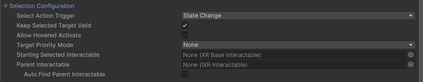

<!-- near-far interactor, direct interactor, ray interactor, gaze interactor

## Selection Configuration {#selection-config}

[!INCLUDE [interactor-selection-config](snippets/interactor-selection-config.md)]
-->

Use the options in the **Selection Configuration** section to configure selection-related behavior. For example, you can specify whether the user must hold a button continuously to maintain selection or just press a button to toggle selection on and off.

> [!NOTE]
> Configure the input for selection with the **Select Input** property in the [Input Configuration](#input-config) section of the Inspector.

| **Property** | **Description** |
| :--- | :--- |
| [Select Action Trigger](#select-action-trigger) | Choose how the configured **Select Input** control triggers the selection of an interactable object. |
| **Keep Selected Target Valid** | Whether to keep selecting an interactable after initially selecting it even when it is no longer a valid target. Enable to make the `XRInteractionManager` retain the selection even if the interactable is not contained within the list of valid targets. Disable to make the Interaction Manager clear the selection if it isn't within the list of valid targets. A common use for disabling this is for ray interactors used for teleportation to make the teleportation interactable no longer selected when not currently pointing at it. |
| **Allow Hovered Activate** | Controls whether to send activate and deactivate events to interactables that this interactor is hovered over but not selected when there is no current selection. By default, the interactor will only send activate and deactivate events to interactables that it has selected. |
| [Target Priority Mode](#target-priority-mode) | Specifies whether interactables are tracked in the interactor's valid target list. Set to **None** if your application doesn't use this list. |
| **Hover To Select** | Enable to have interactor automatically select an interactable after hovering over it for a period of time. Will also select UI if **UI Interaction** is also enabled. |
| **Starting Selected Interactable** | The interactable that this interactor automatically selects at startup (optional, may be **None**). |
| **Parent Interactable** | An optional reference to a parent interactable dependency for determining processing order of interactables. Refer to [Processing interactables](xref:xri-update-loop#processing-interactables) for more information. |
| **Auto Find Parent Interactable** | Automatically find a parent interactable up the GameObject hierarchy when registered with the interaction manager. Disable to manually set the object reference for improved startup performance. |

### Select Action Trigger {#select-action-trigger}

Use the **Select Action Trigger** to choose different styles for how the configured **Select Input** control triggers the selection of an interactable object. **State Change** is the default option and provides the most intuitive selection behavior for typical interactions.

The **Select Action Trigger** options are:

| Select Action Trigger option | Description |
| :--------------------------- | :---------- |
| **State** | A selection can be triggered as long as the user keeps **Select Input** control activated. For example, if a user holds down a button configured as the **Select Input** before hovering on an interactable, the first interactable hovered while the button remains down will become selected. |
| **State Change** | A selection can be triggered only during the frame in which the user activates the **Select Input** control. The interactable remains selected until the **Select Input** is released.  |
| **Toggle** | Like **State Change** except the selection persists until the second time the **Select Input** control is activated. |
| **Sticky** | Like **Toggle**, except the selection persists until the second time the **Select Input** control is released. |

> [!NOTE]
> When **Select Action Trigger** is set to `State` and the user selects an interactable set to `InteractableSelectMode.Single` with more than one interactor at the same time, then the selection of the interactable can be passed back and forth between the interactors each frame. This can also cause the select interaction events to fire each frame. To avoid this behavior, set **Select Action Trigger** to `State Change`, which is the default and recommended option.

### Target Priority Mode {#target-priority-mode}

The **Target Priority Mode** option determines whether the interactor creates a list of priority targets every frame and how many objects are included in the list. The list of targets is available from the interactor's [GetValidTargets<IXRInteractable>](xref:UnityEngine.XR.Interaction.Toolkit.Interactors.IXRInteractor.GetValidTargets(System.Collections.Generic.List{UnityEngine.XR.Interaction.Toolkit.Interactables.IXRInteractable})) method. The target list is not used by the default toolkit setup, but you can list of targets for such purposes as providing visual feedback to the user. **None** is the default value and avoids the cost of building the list.

The **Target Priority Mode** options are:

| Target Priority Mode option | Description |
| :--------------------------- | :---------- |
| **None** | This interactor does not maintain a target list. |
| **Highest Priority Only** | The target list contains only the highest priority interactable that is eligible for selection in the scene during the current frame. |
| **All** | The target list contains all of the interactables eligible for selection in the scene during the current frame. |

> [!TIP]
> You should leave the **Target Priority Mode** set to **None**, its default value, unless your application code uses the target list.
