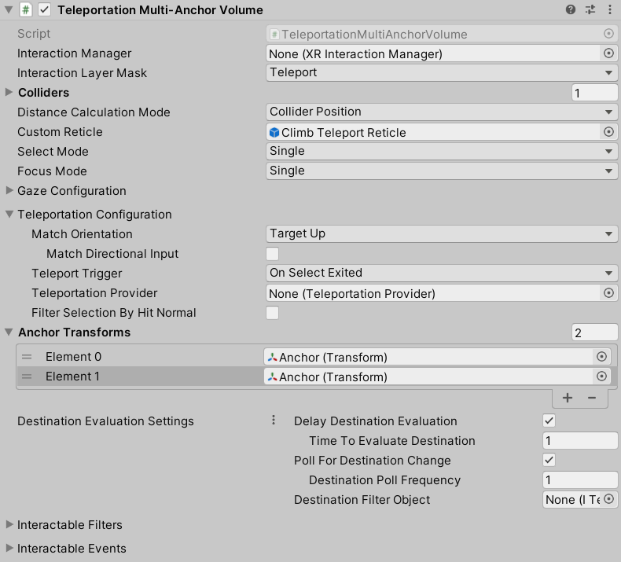

# Teleportation Multi-Anchor Volume

An interactable that teleports the user to a specific position and/or rotation defined by one of several anchors. The volume designates a destination anchor upon first hover based on an implementation of `ITeleportationVolumeAnchorFilter`.

| **Property** | **Description** |
|---|---|
| **Interaction Manager** | The [XRInteractionManager](xr-interaction-manager.md) that this Interactable will communicate with (will find one if **None**). |
| **Interaction Layer Mask** | Allows interaction with Interactors whose [Interaction Layer Mask](interaction-layers.md) overlaps with any Layer in this Interaction Layer Mask. |
| **Colliders** | Colliders to use for interaction with this Interactable (if empty, will use any child Colliders). |
| **Custom Reticle** | The reticle that appears at the end of the line when valid. |
| **Select Mode** | Indicates the selection policy of an Interactable. This controls how many Interactors can select this Interactable. The value is only read by the Interaction Manager when a selection attempt is made, so changing this value from **Multiple** to **Single** will not cause selections to be exited. |
| &emsp;Single | Set **Select Mode** to **Single** to prevent additional simultaneous selections from more than one Interactor at a time. |
| &emsp;Multiple | Set **Select Mode** to **Multiple** to allow simultaneous selections on the Interactable from multiple Interactors. |
| **Allow Gaze Interaction** | Enable for basic interaction events from an [XRGazeInteractor](xr-gaze-interactor.md) and other gaze features. |
| **Allow Gaze Select** | Enable selection from an [XRGazeInteractor](xr-gaze-interactor.md). |
| **Override Gaze Time To Select** | Enables this Interactable to override the hover to select time on an [XRGazeInteractor](xr-gaze-interactor.md). |
| **Gaze Time To Select** | Number of seconds an [XRGazeInteractor](xr-gaze-interactor.md) must hover this interactable to select it if **Hover To Select** is enabled on the gaze Interactor. |
| **Override Time To Auto Deselect** | Enables this Interactable to override the auto deselect time on an [XRGazeInteractor](xr-gaze-interactor.md). |
| **Time To Auto Deselect** | Number of seconds this Interactable will be selected by an [XRGazeInteractor](xr-gaze-interactor.md) before being automatically deselected if **Auto Deselect** is enabled on the gaze Interactor. |
| **Allow Gaze Assistance** | If enabled, an [XR Gaze Interactor](xr-gaze-interactor.md) will place an [XR Interactable Snap Volume](xr-interactable-snap-volume.md) at this interactable to allow a properly configured [XR Ray Interactor](xr-ray-interactor.md) to snap to this interactable. See the [XR Interactable Snap Volume](xr-interactable-snap-volume.md) or [XR Ray Interactor](xr-ray-interactor.md) pages for further information about correctly configuring an `XRRayInteractor` to support an `XRInteractableSnapVolume`. |
| **Match Orientation** | How to orient the rig after teleportation. |
| &emsp;WorldSpaceUp | Set **Match Orientation** to **WorldSpaceUp** to stay oriented according to the world space up vector. |
| &emsp;TargetUp | Set **Match Orientation** to **TargetUp** to orient according to the target `TeleportAnchor` Transform's up vector. |
| &emsp;TargetUpAndForward | Set **Match Orientation** to **TargetUpAndForward** to orient according to the target `BaseTeleportationInteractable` Transform's rotation. |
| &emsp;None | Set **Match Orientation** to **None** to maintain the same orientation before and after teleporting. |
|**Match Directional Input**|Specifies whether or not to rotate the rig to match the forward direction of the attach transform of the selecting interactor. This option is only available when **Match Orientation** is set to **World Space Up** or **Target Up**.|
| **Teleport Trigger** | Specifies when the teleportation triggers. |
| &emsp;OnSelectEntered | Set **Teleport Trigger** to **OnSelectEntered** to teleport when the Interactable is selected. |
| &emsp;OnSelectExited | Set **Teleport Trigger** to **OnSelectEntered** to teleport when the Interactable is no longer selected after having been selected. |
| &emsp;OnActivated | Set **Teleport Trigger** to **OnActivated** to teleport when the Interactable is activated. Not to be confused with the active state of a GameObject, an activate event in this context refers to a contextual command action, such as toggling a flashlight on and off. |
| &emsp;OnDeactivated | Set **Teleport Trigger** to **OnActivated** to teleport when the Interactable is deactivated. Not to be confused with the active state of a GameObject, an activate event in this context refers to a contextual command action, such as toggling a flashlight on and off. |
| **Teleportation Provider** | The teleportation provider that this teleportation interactable communicates teleport requests to. If no teleportation provider is configured, will attempt to find a teleportation provider. |
| **Filter Selection By Hit Normal** | When enabled, this teleportation interactable will only be selectable by a ray interactor if its current hit normal is aligned with this object's up vector. |
| **Up Normal Tolerance Degrees** | Sets the tolerance in degrees from this object's up vector for a hit normal to be considered aligned with the up vector. Only used and displayed when **Filter Selection By Hit Normal** is enabled. |
| **Anchor Transforms**| The transforms that represent the possible teleportation destinations. The volume uses both the position and the rotation of each anchor, depending on which **Match Orientation** is selected. |
| **Destination Evaluation Settings** | Settings for how this volume evaluates a destination anchor. |
| &emsp;**Use Asset** | Enable to use a `TeleportVolumeDestinationSettings` object externally defined in a `TeleportVolumeDestinationSettingsDatum` asset that can be assigned using the accompanying field. |
| &emsp;**Use Value** | Enable to use a `TeleportVolumeDestinationSettings` object which comes with default values editable in the component editor. |
| &emsp;Enable Destination Evaluation Delay | Whether the volume delays evaluation of the destination anchor until the user has hovered over the volume for a certain amount of time. If the user doesn't hover long enough before triggering teleport, no anchor will be used and so no teleport will occur. |
| &emsp;Destination Evaluation Delay Time | The amount of time, in seconds, for which the user must hover over the volume before it designates a destination anchor. Only used and displayed when **Enable Destination Evaluation Delay** is enabled. |
| &emsp;Poll For Destination Change | Whether the volume periodically queries the filter for its calculated destination. If the determined anchor is not the current destination, the volume will initiate re-evaluation of the destination anchor. This is useful if you want the user to be able to change their destination while hovering over the volume. |
| &emsp;Destination Poll Frequency | The amount of time, in seconds, between queries to the filter for its calculated destination anchor. Only used and displayed when **Poll For Destination Change** is enabled. |
| &emsp;Destination Filter Object | The anchor filter used to evaluate a teleportation destination (must implement the `ITeleportationVolumeAnchorFilter` interface). If set to **None**, the volume will use the anchor furthest from the user as the destination. |
| **Interactable Events** | For other events, see the [Interactable Events](interactable-events.md) page. |
| **Teleporting** | Gets or sets the event that Unity calls when queuing to teleport via `TeleportationProvider`. The `TeleportingEventArgs` passed to each listener is only valid while the event is invoked, do not hold a reference to it. |
