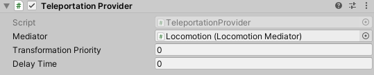

# Teleportation Provider

The `TeleportationProvider` is responsible for moving the XR Origin to the desired location on the user's request.

| **Property** | **Description** |
|---|---|
|**Mediator**| The behavior that this provider communicates with for access to the mediator's XR Body Transformer. If one is not provided, this provider will attempt to locate one during its Awake call. |
|**Transform Priority**| The queue order of this provider's transformations of the XR Origin. The lower the value, the earlier the transformations are applied. |
| **Delay Time** | The time (in seconds) to delay the teleportation once it is activated. This delay can be used, for example, as time to set a tunneling vignette effect as a VR comfort option. |
