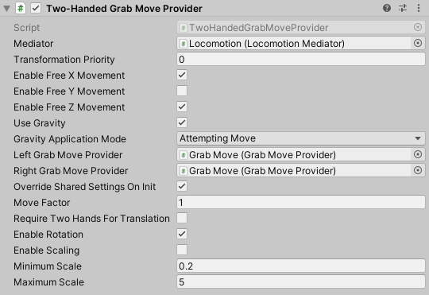

# Two Handed Grab Move Provider

A Two-Handed Grab Move Provider allows for grab movement with both hands by using two [Grab Move Provider](grab-move-provider.md) components. In addition to performing translation, this provider is able to rotate and scale the Origin counter to hand movements. It uses the vector from the left hand to the right hand to determine yaw rotation and uniform scale.

When a Two-Handed Grab Move Provider is used, either of its Grab Move Providers will only perform locomotion by itself if the other single-handed provider is not trying to perform locomotion. This means that when both grab move inputs are held, the Two Handed Grab Move Provider is the Locomotion Provider performing translation of the Origin.

| **Property** | **Description** |
|---|---|
|**Mediator**| The behavior that this provider communicates with for access to the mediator's XR Body Transformer. If one is not provided, this provider will attempt to locate one during its Awake call. |
|**Transform Priority**| The queue order of this provider's transformations of the XR Origin. The lower the value, the earlier the transformations are applied. |
| **Enable Free X Movement** | Controls whether to enable unconstrained movement along the x-axis. |
| **Enable Free Y Movement** | Controls whether to enable unconstrained movement along the y-axis. |
| **Enable Free Z Movement** | Controls whether to enable unconstrained movement along the z-axis. |
| **Use Gravity** | Controls whether gravity applies to constrained axes when a `CharacterController` is used. |
| **Gravity Application Mode** | Controls when gravity begins to take effect. |
| &emsp;Attempting Move | Use this style when you don't want gravity to apply when the player physically walks away and off a ground surface. Gravity will only begin to move the player back down to the ground when they try to use input to move. |
| &emsp;Immediately | Applies gravity and locomotion every frame, even without move input. Use this style when you want gravity to apply when the player physically walks away and off a ground surface, even when there is no input to move. |
| **Left Grab Move Provider** |The left hand grab move instance which will be used as one half of two-handed locomotion. |
| **Right Grab Move Provider** |The right hand grab move instance which will be used as one half of two-handed locomotion. |
| **Override Shared Settings On Init** |Controls whether to override the settings for individual handed providers with this provider's settings on initialization. |
| **Move Factor** |The ratio of actual movement distance to controller movement distance. |
| **Require Two Hands For Translation** |Controls whether translation requires both grab move inputs to be active. |
| **Enable Rotation** |Controls whether to enable yaw rotation of the user. |
| **Enable Scaling** |Controls whether to enable uniform scaling of the user. |
| **Minimum Scale** |The minimum user scale allowed. |
| **Maximum Scale** |The maximum user scale allowed. |
