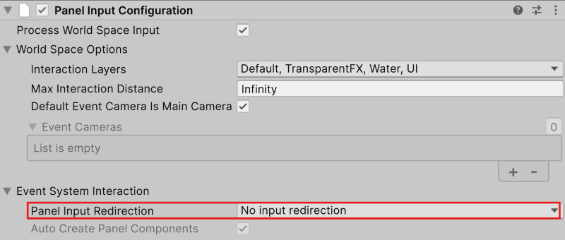
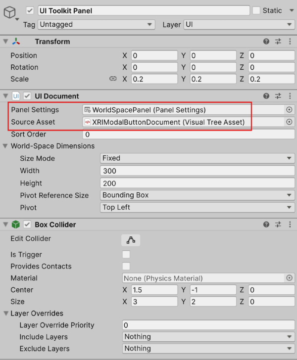
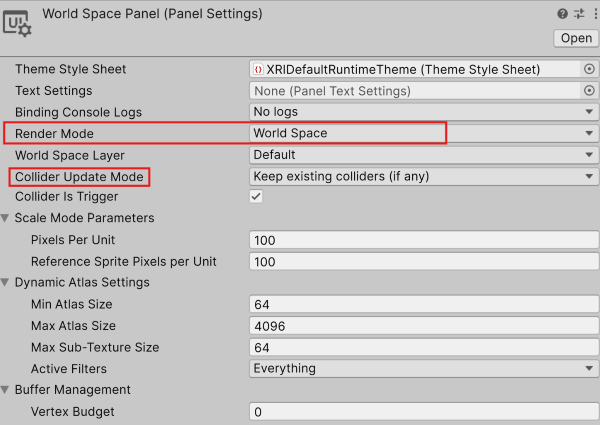
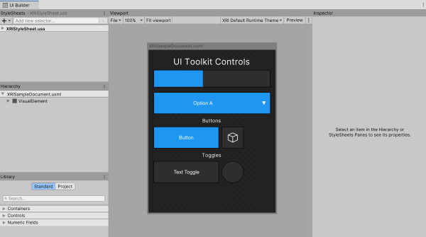
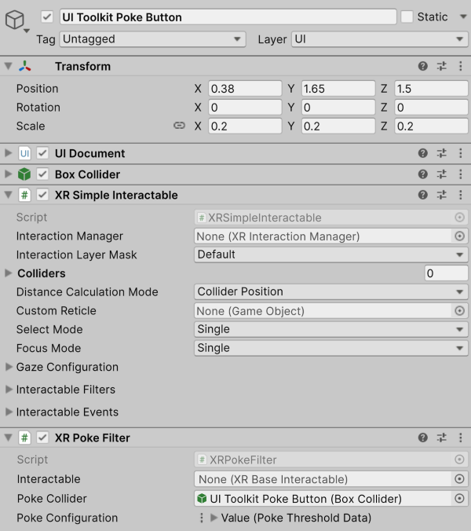
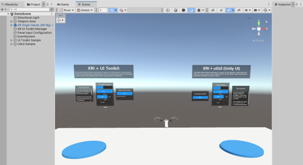

# XR Interaction Toolkit + UI Toolkit

XR Interaction Toolkit has world space UI support using [UI Toolkit](https://docs.unity3d.com/6000.2/Documentation/Manual/UIElements.html) in addition to the existing uGUI support, see [UI Toolkit + uGUI](#ui-toolkit--ugui).

### Minimum Required Versions

| **Package/Editor** | **Minimum Version** |
|---|---|
| **Unity** | `6.2` |
| **XR Interaction Toolkit** | `3.2.0` |

## Getting Started

### Scene Configuration

There some scene configuration steps necessary to enable world space UI Toolkit support in conjunction with XR Interaction Toolkit.

> [!NOTE]
> This configuration is already complete in the XRI [World Space UI sample](xref:xri-samples-world-space-ui) demo scene which can be imported into projects through the Package Manager window. Open Package Manager by navigating to **Window** &gt; **Package Manager**, then select **XR Interaction Toolkit** package in the left side bar, and select the **Samples** tab. Scroll and locate the `World Space UI` sample and click **Import**.

#### Panel Input Configuration

The event system can interfere with UI Toolkit input, so a properly configured `Panel Input Configuration` component is required in the scene.

To properly configure this component, set the **Panel Input Redirection** field to **No input redirection**. This configuration is pictured below.

#### Enable UI Toolkit Support

To enable UI Toolkit support for XRI, add an XR UI Toolkit Manager component to the scene. `XRUIToolkitManager` is a component that globally enables or disables UI Toolkit support with XR Interaction Toolkit components. When the `XRUIToolkitManager` component is enabled, the `uiToolkitSupportEnabled` property in the `XRUIToolkitHandler` is automatically enabled. When the `XRUIToolkitManager` is disabled, the `uiToolkitSupportEnabled` property in the `XRUIToolkitHandler` is automatically disabled.

By adding a `XRUIToolkitManager` to the scene, this support will be enabled or disabled automatically with the enabled state of the component.

#### UI Toolkit + uGUI

When using both uGUI and UI Toolkit together, `bypassUIToolkitEvents` property on the `XRUIInputModule` should be **disabled**. In the demo scene, the [XR UI Input Module](xref:xri-ui-input-module) component can be found on the **Event System** GameObject.

## Creating World Space UI Toolkit Panel

Basic world space UI panels using UI Toolkit require a `Collider` and a `UI Document`. The `UI Document` defines the panel settings, contains the UI source asset, and additional settings like dimensions for the UI panel.

See the image below for an example of a base world space UI configuration.

### Panel Settings

An example of panel settings exists in the XRI World Space UI sample, or a new one can be created. To create a new Panel Settings asset, right click in the project Asset folder and select **Create** &gt; **UI Toolkit** &gt; **Panel Settings Assets**. This will generate a new asset in your project. To modify it, select it and use the inspector.

Update the **Render Mode** property in the panel settings asset to **World Space**.

Additionally, the **Collider Update Mode** defines if the UI Document will create colliders or use any existing colliders. When set to **Match 2-D document rect**, a collider will be generated on the `UI Document` GameObject. This can result in duplicate colliders if the `UI Document` already has a collider (as displayed in the previous image). When set to **Keep existing colliders (if any)**, the UI Document will use existing colliders. In this case, it is important that the size of the existing collider matches the document size.

**Collider Update Mode** is an optional configuration, but will have implications how the GameObjects are configured and how XRI is used. In XRI, if no colliders are assigned to an interactable at runtime that interactable will search for colliders on the GameObject and its children. This can result in interactables incorrectly using UI Document colliders for interactable interaction. To avoid this, manually assign interactable colliders if there will be a UI Document nested as a child. Alternatively, enabling **Is Trigger** on the existing UI Document collider or setting **Collider Is Trigger** in the panel settings when using **Collider Update Mode** to **Match 2-D document rect** will result in the trigger colliders not being added to the interactable collider list.

> [!NOTE]
> An example of a nested interactable using UI Documents can be found in the UI Toolkit Grab Interactable prefab in the XRI World Space UI sample demo scene.

### Source Asset

The source asset is the uxml file that defines the layout and styling of the UI to be displayed in the panel. To create a new document, navigate to the top menu bar and select **GameObject** &gt; **UI Toolkit** &gt; **UI Document**. It can also be created by right clicking the project Asset folder and selecting **Create** &gt; **UI Toolkit** &gt; **UI Document**.

To edit the file, double click it or open it in the UI Builder (**Window** &gt; **UI Toolkit** &gt; **UI Builder**).

> [!NOTE]
> For more information on building UI with the UI Builder, please refer to [UI Builder manual page](https://docs.unity3d.com/6000.2/Documentation/Manual/UIBuilder.html)

With the [scene configuration](#scene-configuration) complete, the `UI Document` configured, and the `Collider` added, the UI Toolkit panel is ready for base ray interaction with XRI.

### Poke Interaction Support

To enable poke support that works with the `XRPokeInteractor`, additional components are required on the UI Toolkit panel.

Adding an `XRSimpleInteractable` component and an `XRPokeFilter` component in addition to the `Collider` and `UI Document` enables poke support on that world space UI panel.

> [!Note]
> Poke is supported with both hands and controllers.

## Examples

The **World Space UI** sample found in the XR Interaction Toolkit samples in Package Manager provides a demo scene that shows how to configure world space UI in both UI Toolkit as well as uGUI. To import, open the Package Manager by going to **Window** &gt; **Package Manager**, then select XR Interaction Toolkit package in the left side bar, and select the Samples tab. Scroll and locate the World Space UI sample and click Import.

## Known limitations

- The scrollview in the in UI Toolkit station currently supports scrolling only using the horizontal and vertical handles. Support to grab the text area of the scrollview and scroll using the thumbstick is planned to be added in the future.
