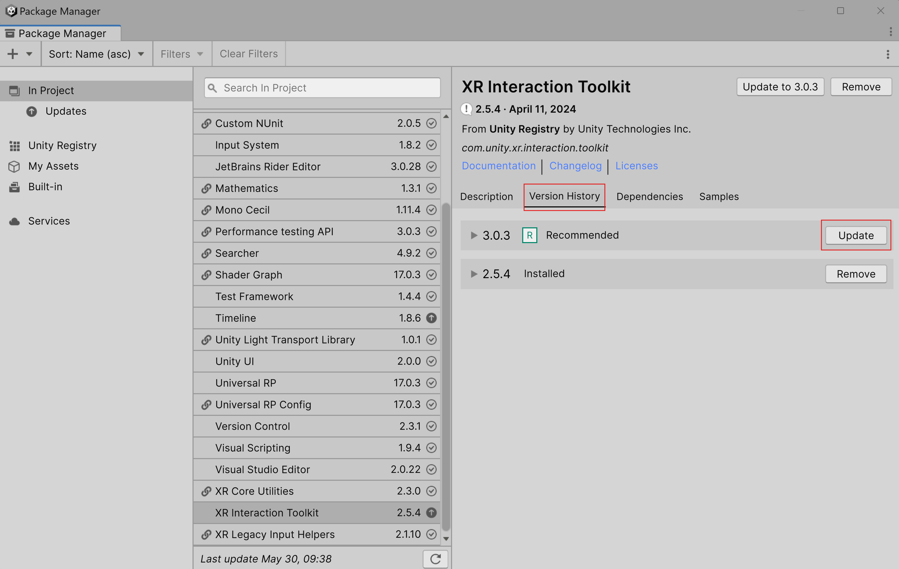
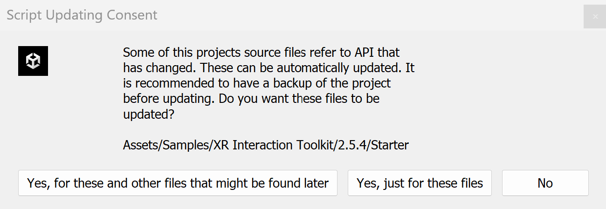
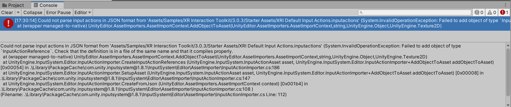
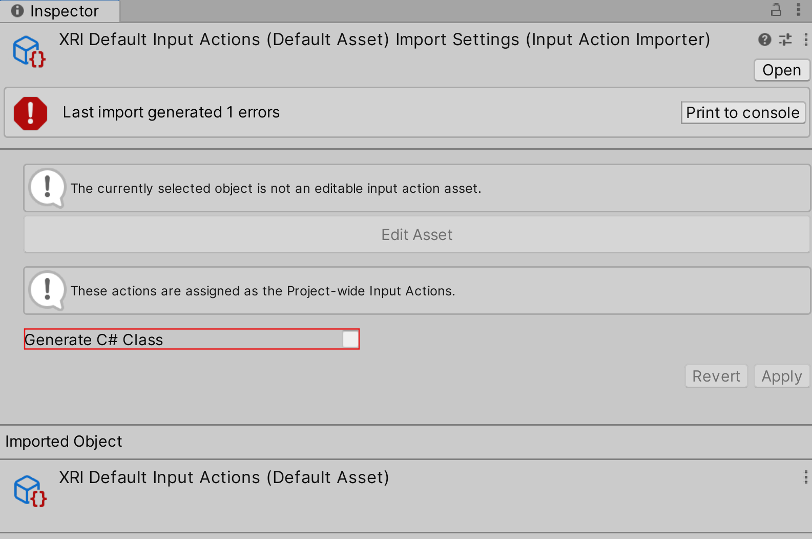

# XRI 3.0 upgrade guide

This guide is intended for users upgrading from a previous 2.x version of XRI to help integrate XRI 3.0 into existing projects by highlighting new features, potential issues, and offering solutions and guidance when upgrading.

## XRI 3.0 context

XRI 3.0 offers a variety of new features, architecture enhancements, and other various improvements to previous versions of XRI. Some of the main additions include the new Input Reader architecture, a new Near-Far interactor and multi-casting, new XR Body Transformers and Locomotion Mediators, as well as improvements to Climb teleportation.

For a detailed summary of what’s new in XRI 3.0, please refer to the [What's new in version 3.0](whats-new-3.0.md) page in the manual.

## How to upgrade

> [!NOTE]
> Before upgrading, please review this upgrade guide in full. It may be recommended to update to the latest 2.x version of the package.

In Unity 6, XRI 3.x is the recommended version. To upgrade an existing project in Unity 6, navigate to **Window** &gt; **Package Manager** and select the XR Interaction Toolkit Package in the list of project packages. In the XR Interaction Toolkit details, select the **Version History** tab. In the list of versions, press the **Update** button next to version 3.x.



In older Unity Editor versions, the version of the package can be upgraded using the **Add package by name** window in Package Manager and specifying a version before clicking **Add**. See [Installation](installation.md) for further instructions. Alternatively, the `Packages\manifest.json` file in your Unity project can be manually edited to change the version number to the desired version.

## Namespace changes

XRI 3.0 changes the namespaces of various interactable, interactor, interaction attachment, and locomotion classes, enums, structs, and interfaces. This is to better reflect their use and the organizational structure they reside in. For a full list of namespace changes, please refer to the [Changelog](../changelog/CHANGELOG.html). Most of the namespace changes can be found in the Changed section under the [3.0.0 Changelog](../changelog/CHANGELOG.html#300---2024-03-18).



When upgrading, the Editor will provide a prompt to help with these namespace changes. The prompt will provide options to have these namespace changes be automatically updated. If the prompt is used to automatically update the namespaces, the full namespace path will be placed inline. For example `XRBaseInteractable` has been moved from `UnityEngine.XR.Interaction.Toolkit` to `UnityEngine.XR.Interaction.Toolkit.Interactables`. The automatic namespace changed would change:

```csharp
XRBaseInteractable m_Interactable;
```

to:

```csharp
UnityEngine.XR.Interaction.Toolkit.Interactables.XRBaseInteractable m_Interactable;
```

This can result in lengthy namespace paths in existing scripts which may not be desired. To address this, some manual modification of the script would be necessary. Manually inserting `using` statements that reference the new namespace would allow for the class in the new namespace to be used as expected.

```csharp
using UnityEngine.XR.Interaction.Toolkit.Interactables;

...

XRBaseInteractable m_Interactable;
```

If the prompt to automatically update the namespaces is not used, the errors in the console should provide insight into the scripts that require the manual addition of the `using` statements of the new namespace or the inline addition of the new namespaces.

## XR Origin (XR Rig) changes

The XR Origin prefab in the [Starter Assets](samples-starter-assets.md) sample has been updated with the new [Near-Far Interactor](near-far-interactor.md) and the hierarchy has been updated. Prefab variants based on a 2.x version Starter Assets XR Origin will cause warnings of missing GUIDs and potentially missing scripts. These prefab variants should be updated with the new XR Origin GUID, or a new variant should be created from the XRI 3.0 XR Origin prefab.

### Tunneling vignette

In XRI 2.5.0, the Tunneling Vignette sample was moved into the Starter Assets sample. However, the XR Origin prefab does not contain the Tunneling Vignette prefab. If an existing XR Origin prefab variant utilized the Tunneling Vignette prefab, the `Locomotion Vignette Providers` on the `Tunneling Vignette Controller` will need to be reconnected to the locomotion providers on the newly imported XR Rig. These can be found at **XR Origin** / **Locomotion** in the GameObject hierarchy.

## Deprecation

### Errors and warnings

In XRI 3.0, deprecated code from XRI 2.x is deprecated with warnings and deprecated code and serialized fields from XRI 1.x are now treated as errors. As a result, projects using this deprecated code will be notified of these warnings and errors via the console.

Additionally, some serialized fields used by deprecated code were removed in XRI 3.0. To avoid potential data loss, especially if projects had warnings about using deprecated functionality, update the project to the latest 2.x version of this package (for example, 2.5.2) before updating the project to version 3.0.

### Deprecated classes

#### Controller-based classes

The controller-based classes are now obsolete and have been deprecated to reflect the new input changes. The functionality of the controller classes can be found in a combination of the standard Tracked Pose Driver component as well the input properties on the individual interactors where that input makes sense.

- `XRBaseControllerInteractor` replaced with `XRBaseInputInteractor`
- `XRBaseControllerInteractorEditor` replaced with `XRBaseInputInteractorEditor`
- `XRBaseControllerInteractorEditor.BaseControllerContents` replaced with `XRBaseInputInteractorEditor.BaseInputContents`

#### AR interactables and gesture interactor

With the introduction of `ARTransformer`, `ScreenSpaceRayInteractor`, and the associated input components for screen space interaction, the individual AR interactable classes and the `ARGestureInteractor` have been deprecated.

#### Locomotion system and controller-based providers

The `LocomotionSystem` has been deprecated and replaced by the `LocomotionMediator` component. Due to the input changes in XRI 3.0, the locomotion providers that depended on the previous input handling architecture have been deprecated and replaced with a simplified streamlined variant of each.

- `LocomotionSystem` replaced with `LocomotionMediator`
- `LocomotionPhase` replaced with `LocomotionState`
- `ActionBasedContinuousMoveProvider` and `DeviceBasedContinuousMoveProvider` replaced with `ContinuousMoveProvider`
- `ActionBasedContinuousTurnProvider` and `DeviceBasedContinuousTurnProvider` replaced with `ContinuousTurnProvider`
- `ActionBasedSnapTurnProvider` and `DeviceBasedSnapTurnProvider` replaced with `SnapTurnProvider`
- `GrabMoveProvider.grabMoveAction` replaced with `GrabMoveProvider.grabMoveInput`

#### Affordance system
The affordance system has also been deprecated in XRI 3.0. A new feedback system to handle visuals, audio, haptics and more will be coming in a future release of XRI.

> [!NOTE]
> For a full list of what has been deprecated in XRI 3.0 please refer to the Deprecated section in the [3.0.0-pre.1 Changelog](../changelog/CHANGELOG.html#300-pre1---2023-12-14).

## Input actions

When importing or upgrading the [Starter Assets](samples-starter-assets.md) sample, the XRI Default Input Actions may fail to import due to a JSON parsing error. The console will display the following error: `Could not parse input action in JSON format`.



To resolve this, select the XRI Default Input Actions asset, and in the Inspector window enable the **Generate C# Class** checkbox and click **Apply**. After this error is resolved, the generated C# class can be safely deleted and the **Generate C# Class** checkbox can be disabled.



## Missing scripts

Depending on the version of XRI 2.x a project is upgrading from, there may be some warnings regarding missing scripts. This is likely due to the removal or migration of the script in the Starter Assets sample. If this warning is on a prefab, make sure the prefab is the latest XRI 3.0 Starter Asset prefab. If the missing script has been removed from the Starter Assets sample but is still needed in the project, the script can be manually migrated out of the Starter Assets sample directory. Note, this migration needs to be done before the Starter Assets sample is upgraded to XRI 3.0 as the upgrade will completely override any existing Starter Assets sample.

## Serialized property name changes

There may be cases where serialized properties names have changed and errors may be thrown that don’t show up immediately upon upgrade in the console. This is most likely to occur with custom Editors for extended XRI classes where Serialized Properties are referenced by strings (in this example it’s likely `serializedObject.FindProperty(“propertyName")`). If this is the case, the property is likely deprecated and should be documented with the new property that should be accessed instead.
