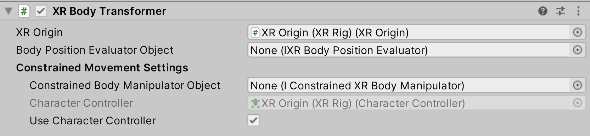

# XR Body Transformer

Interactable component that allows for basic grab functionality. When this behavior is selected (grabbed) by an Interactor, this behavior will follow it around and inherit velocity when released.

| **Property** | **Description** |
|---|---|
| **XR Origin** | The XR Origin to transform (will find one if None). |
| **Body Position Evaluator Object** | Object that determines the position of the user's body. If set to None, this behavior will estimate the position to be the camera position projected onto the XZ plane of the XR Origin. |
| **Constrained Body Manipulator Object** | Object used to perform movement that is constrained by collision (optional, may be None). |
| **Character Controller** | The optional Character Controller component on the XR Origin's base GameObject. This is a read-only reference. |
| **Add Character Controller** | Button that when clicked will add a Character Controller component to the XR Origin's base GameObject. This is only enabled if a Constrained Body Manipulator is not already assigned. |
| **Use Character Controller** | When enabled and if a Constrained Manipulator is not already assigned, this behavior will use the XR Origin's Character Controller to perform constrained movement, if one exists on the XR Origin's base GameObject. |
