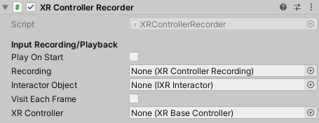

# XR Controller Recorder

`MonoBehaviour` that controls interaction recording and playback (via `XRControllerRecording` assets).

| **Property** | **Description** |
|---|---|
| **Play On Start** | Controls whether this recording will start playing when the component's `Awake` method is called. |
| **Recording** | Controller Recording asset for recording and playback of controller events. |
| **Interactor Object** | Interactor whose input will be recorded and played back. |
| **Visit Each Frame** | If true, every frame of the recording must be visited even if a larger time period has passed. |
| **XR Controller** | (Deprecated) The controller that this recording uses for recording and playback. |
