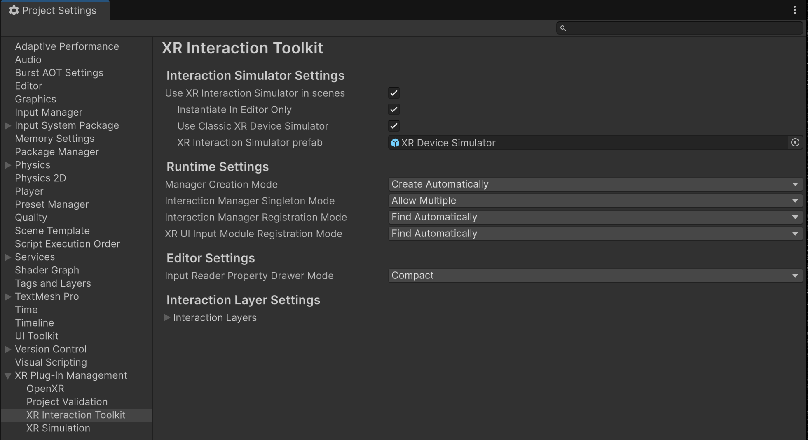
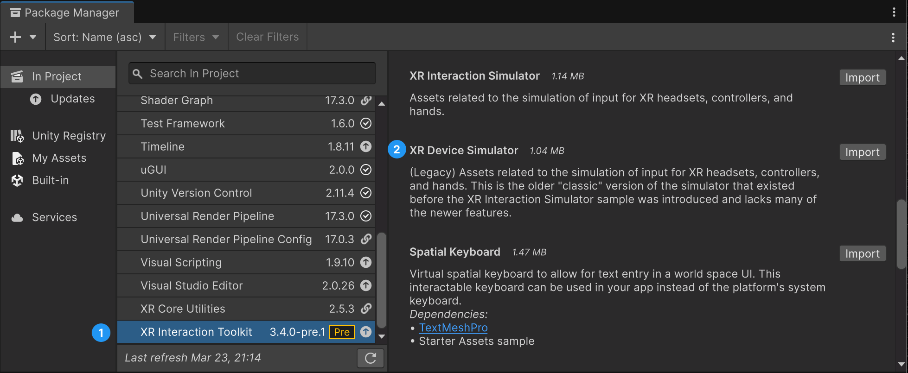
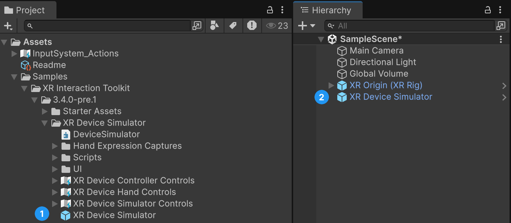
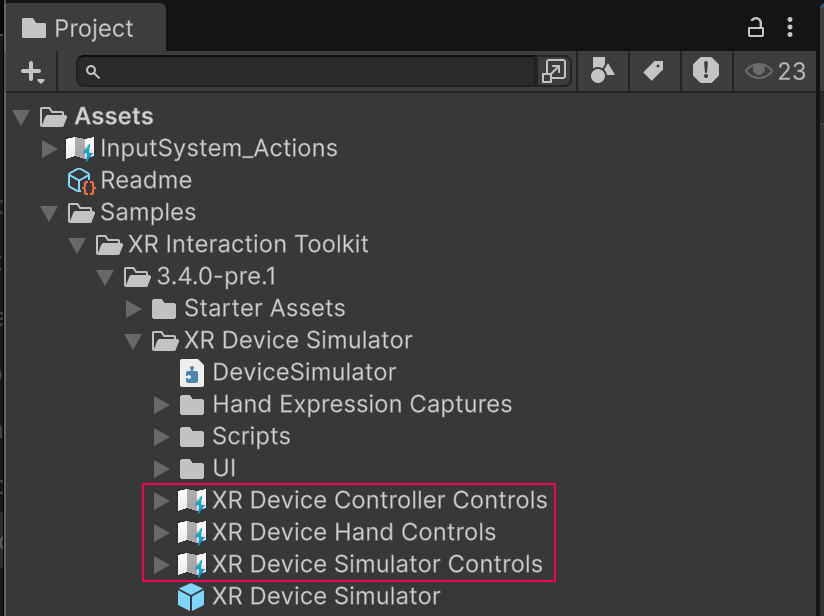
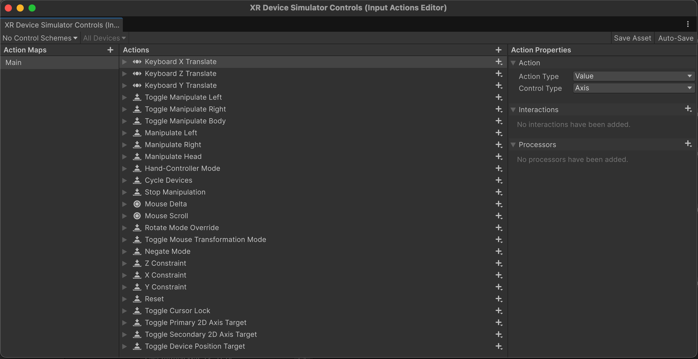
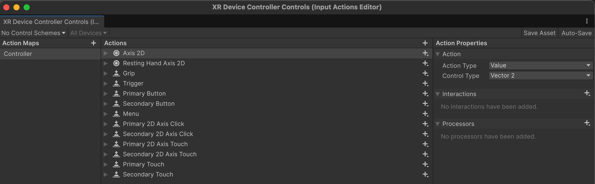
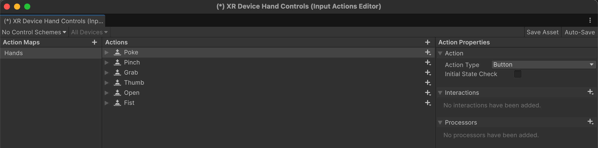

# XR Device Simulator

> [!NOTE]
> There is a newer simulator available under the name `XR Interaction Simulator`. To use `XR Interaction Simulator` instead see the [overview](xr-interaction-simulator-overview.md).

The XR Device Simulator runtime utility enables you to simulate user inputs from key presses (whether from a keyboard and mouse combo, or a controller) to drive the XR headset and controller devices in the scene.

> [!NOTE]
> The simulator doesn't directly manipulate the camera or controllers that are part of the XR Origin but instead drives them indirectly through simulated input.

This section covers topics like how to install the XR Device Simulator, how to use it, how to set it up in a new empty scene, and how to change key bindings tied to the XR Device Simulator. You are encouraged to tweak the bindings to make the simulator fit your needs.

For more information about the specifics on the XR Device Simulator component, see the [XR Device Simulator component](xr-device-simulator.md) page where you can get more info about the specific settings that are exposed for it.

## Installing the XR Device Simulator

There are two requirements for the XR Device Simulator to work in your scene.

First, it must find a pre-configured XR Origin object.  Several scenes in package samples for XR Interaction Toolkit and XR Hands already include XR Origin; the same is true for the VR Template and the MR Template.

Second, your scene needs the `XR Device Simulator` prefab which can be either automatically instantiated by XR Interaction Toolkit plug-in settings, or added manually.

### Adding the XR Origin

If your current scene lacks an XR Origin, then you can add the XR Origin prefab that is provided as part of the [Starter Assets](samples-starter-assets.md) sample. The [Create a basic scene](create-basic-scene.md) tutorial explains how to do this.

### Making the XR Device Simulator work automatically in your project

To automatically activate the XR Device Simulator across all scenes, go to **Edit** &gt; **Project Settings** &gt; **XR Plug-in Management** &gt; **XR Interaction Toolkit** and enable both the **Use XR Interaction Simulator in scenes** and **Use Classic XR Device Simulator** options to automatically instantiate the `XR Device Simulator` prefab at runtime.

> [!NOTE]
> This setting persists across all scenes in your project at runtime. The XR Device Simulator is primarily designed as an Editor-only testing tool. You probably do not want the `XR Device Simulator` in your standalone production build, but if you do then you must either include the `XR Device Simulator` prefab in your scene manually or disable **Instantiate In Editor Only**.

### Installing the XR Device Simulator prefab manually

To install the XR Device Simulator in specific scenes, go to the Package Manager (**Window** &gt; **Package Manager**), select the **XR Interaction Toolkit** package, and under the Samples tab, click **Import** (or **Reimport** to get the latest version) next to **XR Device Simulator**.

Importing this Sample adds the `Assets\Samples\XR Interaction Toolkit\<version>\XR Device Simulator` folder to the Project window. Drag the `XR Device Simulator` prefab from this folder into the scenes where you want to simulate XR input.

### Testing with the XR Device Simulator

After adding the `XR Origin (XR Rig)` and `XR Device Simulator` to your scene as prefabs, press the **Play** button and you can move around with the key bindings marked in the simulator. Press tab to cycle active control from Left Controller, Right Controller, and Head Mounted Display (HMD).

## Setting the XR Device Simulator to work with different input bindings

The XR Device Simulator can be set up to work with any type of input that is supported by Unity's [Input System package](https://docs.unity3d.com/Packages/com.unity.inputsystem@latest?subfolder=/manual/SupportedDevices.html). You are encouraged to tweak these key bindings (keystrokes mapped to each device action) to make the simulator fit your needs. Do this by editing the Input Action Assets in `Assets\Samples\XR Interaction Toolkit\<version>\XR Device Simulator`:
* `XR Device Simulator Controls` for the simulator key bindings like move, look around, etc.
* `XR Device Controller Controls` for controller key bindings like grip, primary/secondary buttons, joystick, etc.
* `XR Device Hand Controls` for controller key bindings like poke, pinch, grab, etc.

To modify the key bindings, double-click on the applicable Input Action Asset, and an Input Actions Editor window appears. Refer to [Editing Input Action Assets](https://docs.unity3d.com/Packages/com.unity.inputsystem@latest?subfolder=/manual/ActionAssets.html#editing-input-action-assets) in the Input System documentation for more information on how to set up key bindings in an Input Action asset.  When setting the key bindings in these files, not all of the new bindings reflected in the Device Simulator UI in Play mode. To avoid cluttering the Simulator UI, only the most used controls are shown.

