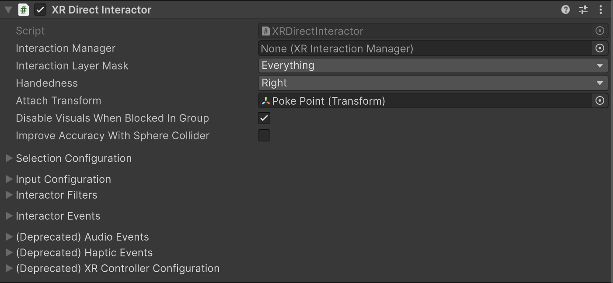

# XR Direct Interactor

Interactor used for directly interacting with Interactables that are touching. This is handled via trigger volumes that update the current set of valid targets for this interactor. This component must have a collision volume that is set to be a trigger to work.

> [!NOTE]
> The [Near-Far Interactor](xref:xri-near-far-interactor) component provides a newer, more flexible design that replaces many uses of the **XR Direct Interactor**. For example, with the **Near-Far Interactor**, you can configure both direct interaction and interaction at a distance with one component.

## Supporting components

* [Collider](xref:UnityEngine.Collider): a Collider instance set to [isTrigger](xref:UnityEngine.Collider.isTrigger) must be present on the same GameObject.

## Base properties

The XR direct interactor has many properties that you can set to modify how the interactor behaves. Some of these properties are organized into sections and don't appear in the Inspector window until you enable another property or expand a section.

| **Property** | **Description** |
| :--- | :--- |
| **Interaction Manager** | The [XRInteractionManager](xr-interaction-manager.md) that this interactor will communicate with (will find one if **None**). |
| **Interaction Layer Mask** | Allows interaction with interactables whose [Interaction Layer Mask](interaction-layers.md) contains any Layer in this Interaction Layer Mask. |
| **Handedness** | Represents which hand or controller the interactor is associated with. |
| **Attach Transform** | The `Transform` to use as the attach point for interactables. Automatically instantiated and set in `Awake` if **None**. Setting this will not automatically destroy the previous object. |
| **Ray Origin Transform** | The starting position and direction of any ray casts. Automatically instantiated and set in `Awake` if **None** and initialized with the pose of the `XRBaseInteractor.attachTransform`. Setting this will not automatically destroy the previous object. |
| **Disable Visuals When Blocked In Group** | Whether to disable visuals when this interactor is part of an [Interaction Group](xr-interaction-group.md) and is incapable of interacting due to active interaction by another interactor in the Group. |
| [Improve Accuracy With Sphere Collider](#improve-accuracy) | Generates contacts using optimized sphere cast calls every frame instead of relying on contact events on Fixed Update. Disable to force the use of trigger events.|
| [Selection Configuration](#selection-config)  | Controls selection behavior. Click the triangle icon to expand the section. Note that you configure the input controls used for selection in the [Input Configuration](#input-config) section. |
| [Input Configuration](#input-config) | Specify input bindings for the select and activate actions. Click the triangle icon to expand the section. |
| [Interactor Filters](#interactor-filters) | Identifies any filters this interactor uses to winnow detected interactables. You can create  filter classes to provide custom logic to limit which interactables an interactor can interact with. Filtering occurs after the interactor has performed a raycast to detect eligible interactables.|
| [Interactor Events](#interactor-events) | The events dispatched by this interactor. You can add event handlers in other components in the scene or prefab and they are invoked when the event occurs. |
| (Deprecated) [Audio Events](xref:xri-simple-audio-feedback)  | Assign an audio clip to play when an interactor event occurs. Replaced by the [Simple Audio Feedback](xref:xri-simple-audio-feedback) component, which provides more control over how a clip is played.|
| (Deprecated) [Haptic Events](xref:xri-simple-haptic-feedback) | Assign a haptic impulse to play when an interactor event occurs. Replaced by the [Simple Haptic Feedback](xref:xri-simple-haptic-feedback) component, which provides more options for defining a haptic impulse.|
| (Deprecated) [XR Controller Configuration](#legacy-configuration) | Provides compatibility with the deprecated action- or device-based [XR Controller](https://docs.unity3d.com/Packages/com.unity.xr.interaction.toolkit@2.6/manual/xr-controller-action-based.html) components. The properties in this section are intended to aid migration of scenes created with version 2.6 or earlier versions of the toolkit. |

## Improve Accuracy With Sphere Collider {#improve-accuracy}

Enable to use optimized [Physics.SphereCast](xref:UnityEngine.Physics.SphereCast(UnityEngine.Ray,System.Single,System.Single,System.Int32,UnityEngine.QueryTriggerInteraction)) checks instead of trigger collider events to detect interaction targets for this interactor.

Disable to use trigger events.

> [!NOTE]
> The GameObject must not have a [RigidBody](xref:um-class-rigidbody) or this setting is ignored.

| **Property** | **Description** |
|---|---|
| **Physics Layer Mask** | Physics layer mask used for limiting direct interactor overlaps when using the Improve Accuracy With Sphere Collider option. |
| **Physics Trigger Interaction** | Determines whether the direct interactor sphere overlap will hit triggers when using the Improve Accuracy With Sphere Collider option. |

## Selection Configuration {#selection-config}

[!INCLUDE [interactor-selection-config](snippets/interactor-selection-config.md)]

## Input Configuration {#input-config}

[!INCLUDE [interactor-input-config](snippets/interactor-input-config.md)]

## Interactor Filters {#interactor-filters}

[!INCLUDE [interactor-filters-config](snippets/interactor-filters-config.md)]

## Interactor Events {#interactor-events}

[!INCLUDE [interactor-events](snippets/interactor-events.md)]

## Audio Events (deprecated)

[!INCLUDE [interactor-audio-events](snippets/interactor-audio-events.md)]

## Haptic Events (deprecated)

[!INCLUDE [interactor-haptic-events](snippets/interactor-haptic-events.md)]

## XR Controller Configuration (deprecated) {#legacy-configuration}

[!INCLUDE [interactor-controller-config](snippets/interactor-controller-config.md)]
