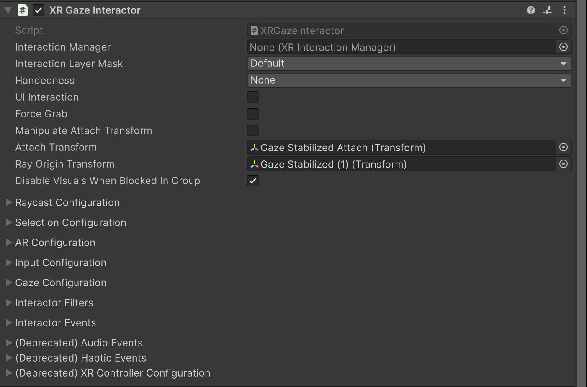
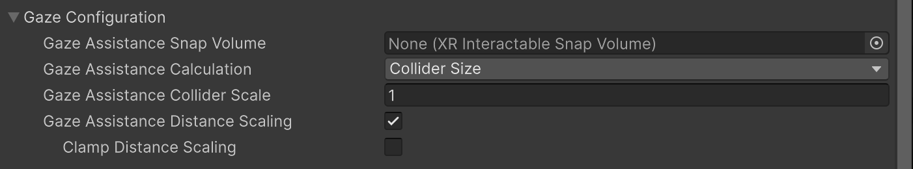
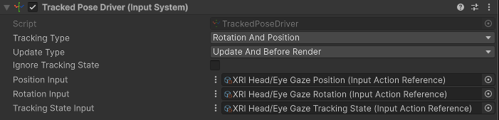
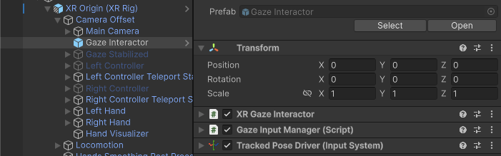

# XR Gaze Interactor

Interactor used for interacting with interactables via gaze. The gaze interactor uses a ray cast along the user's gaze direction to find valid interactable targets. You must enable gaze interaction on each interactable object for gaze interaction to occur.

You can enable gaze interaction for individual interactable objects by enabling their [Allow Gaze Interaction](xref:UnityEngine.XR.Interaction.Toolkit.Interactables.XRBaseInteractable.allowGazeInteraction) property. Both the [XR Simple Interactable](xr-simple-interactable.md) and [XR Grab Interactable](xr-grab-interactable.md) support gaze interaction.

This interactor also supports gaze assisted targeting. Gaze assisted targeting snaps other ray-based interactors, such as the [Near-Far Interactor](xref:xri-near-far-interactor) and the [Ray Interactor](xref:xri-xr-ray-interactor), to the interactable object the user is looking at. Use the [Gaze configuration](#gaze-config) settings to control how this gaze assistance works. Interactable objects have their own, additional gaze assistance properties, which allow you to modify how gaze assisted targeting effects each interactable on an individual level.

> [!IMPORTANT]
> Some XR devices, such as the Quest Pro, require your app to [request permission](#permissions) before it can access eye tracking data. Depending on the platform, additional configuration might also be needed. For example, on the OpenXR platform, you must enable the [Eye Gaze Interaction Profile](xref:openxr-eye-gaze-interaction). If permission or the expected bindings are unavailable on a user's device, you can set up the gaze interactor to use the headset direction vector as a [fallback](#fallback) for the missing gaze data.

## Supporting components

You can use the following additional components with a ray interactor:

* [Tracked Pose Driver (Input System)](xref:input-system-tracked-input-devices#tracked-pose-driver): Required to provide the origin and direction of the eye gaze ray in the scene. Refer to [Configure gaze input](#configure-gaze-input) for more information.
* [XR Interactable Snap Volume](xref:xri-xr-interactable-snap-volume): Configure the interactor and an interactable such that the gaze interactor's gaze assistance collider snaps to the interactable. Refer to [Gaze configuration](#gaze-config) for more information.
* [Simple Audio Feedback](xref:xri-simple-audio-feedback): Play audio clips when interactor events happen. (Replaces the **Audio Events** properties of the interactor.)
* [XR Interaction Group](xref:xri-xr-interaction-group): Define groups of interactors to mediate which has priority for an interaction.
* [XR Transform Stabilizer](xref:xri-xr-transform-stabilizer): Smooth changes in the eye gaze ray origin and direction.

## Base properties

The XR gaze interactor has many properties that you can set to modify how the interactor behaves. Some of these properties are organized into sections and don't appear in the Inspector window until you enable another property or expand a section.



| **Property** | **Description** |
| :--- | :--- |
| **Interaction Manager** | The [XRInteractionManager](xr-interaction-manager.md) that this interactor will communicate with (will find one if **None**). |
| **Interaction Layer Mask** | Allows interaction with interactables whose [Interaction Layer Mask](interaction-layers.md) contains any Layer in this Interaction Layer Mask. |
| **Handedness** | The **Handedness** property is ignored by the Gaze interactor. |
| [UI Interaction](#ui-interaction) | Enable to affect Unity UI GameObjects in a way that is similar to a mouse pointer. Requires the XR UI Input Module on the Event System. When enabled, the options described in [UI Interaction properties](#ui-interaction) are shown in the Inspector. |
| **Force Grab** | Force grab moves the object to your hand rather than interacting with it at a distance. |
| [Manipulate Attach Transform](#attach-transform) | Allows the user to move the Attach Transform using the thumbstick. When you enable this option, the Inspector displays [additional properties](#attach-transform) to configure the way a user can manipulate the selected object.|
| **Attach Transform** | The `Transform` to use as the attach point for interactables.<br />Automatically instantiated and set in `Awake` if **None**.<br />Setting this will not automatically destroy the previous object. |
| **Ray Origin Transform** | The starting position and direction of any ray casts.<br />Automatically instantiated and set in `Awake` if **None** and initialized with the pose of the `XRBaseInteractor.attachTransform`. Setting this will not automatically destroy the previous object. |
| **Disable Visuals When Blocked In Group** | Whether to disable visuals when this interactor is part of an [Interaction Group](xr-interaction-group.md) and is incapable of interacting due to active interaction by another interactor in the Group. |
| [Raycast Configuration](#raycast-config) | Controls how the raycast into the scene to detect eligible interactables behaves. Click the triangle icon to expand the section.|
| [Selection Configuration](#selection-config)  | Controls selection behavior. Click the triangle icon to expand the section. Note that you configure the input controls used for selection in the [Input Configuration](#input-config) section. |
| [AR Configuration](#ar-config) | Configure how the interactor behaves in an AR context. |
| [Input Configuration](#input-config) | Specify input bindings for the select and activate actions. Click the triangle icon to expand the section. |
| [Gaze Configuration](#gaze-config) | Specify how gaze assistance works for this gaze interactor.|
| [Interactor Filters](#interactor-filters) | Identifies any filters this interactor uses to winnow detected interactables. You can create  filter classes to provide custom logic to limit which interactables an interactor can interact with. Filtering occurs after the interactor has performed a raycast to detect eligible interactables.|
| [Interactor Events](#interactor-events) | The events dispatched by this interactor. You can add event handlers in other components in the scene or prefab and they are invoked when the event occurs. |
| (Deprecated) [Audio Events](xref:xri-simple-audio-feedback)  | Assign an audio clip to play when an interactor event occurs. Replaced by the [Simple Audio Feedback](xref:xri-simple-audio-feedback) component, which provides more control over how a clip is played.|
| (Deprecated) [Haptic Events](xref:xri-simple-haptic-feedback) | Assign a haptic impulse to play when an interactor event occurs. Replaced by the [Simple Haptic Feedback](xref:xri-simple-haptic-feedback) component, which provides more options for defining a haptic impulse.|
| (Deprecated) [XR Controller Configuration](#legacy-configuration) | Provides compatibility with the deprecated action- or device-based [XR Controller](https://docs.unity3d.com/Packages/com.unity.xr.interaction.toolkit@2.6/manual/xr-controller-action-based.html) components. The properties in this section are intended to aid migration of scenes created with version 2.6 or earlier versions of the toolkit. |

## UI Interaction properties {#ui-interaction}

[!INCLUDE [interactor-ui](snippets/interactor-ui.md)]

## Manipulate Attach Transform options {#attach-transform}

[!INCLUDE [interactor-attach-manipulators](snippets/interactor-attach-manipulators.md)]

## Raycast configuration {#raycast-config}

[!INCLUDE [interactor-raycast-config](snippets/interactor-raycast-config.md)]

## Selection Configuration {#selection-config}

[!INCLUDE [interactor-selection-config](snippets/interactor-selection-config.md)]

## AR Configuration {#ar-config}

[!INCLUDE [interactor-ar-config](snippets/interactor-ar-config.md)]

## Input Configuration {#input-config}

[!INCLUDE [interactor-input-config](snippets/interactor-input-config.md)]

## Gaze Configuration {#gaze-config}

Use the properties in the Gaze confirguration section to control how the gaze interactor interacts with its associated [XRInteractableSnapVolume](xr-interactable-snap-volume.md).



| **Property** | **Description** |
|---|---|
| **Gaze Assistance Snap Volume** | The [XRInteractableSnapVolume](xr-interactable-snap-volume.md) that this interactor will position on a valid target for gaze assistance. If this is left empty, one will be created. |
| **Gaze Assistance Calculation** | Defines how this interactor will size and scale the **Gaze Assistance Snap Volume**. You can use either a **Fixed Size** or the **Collider Size** of the collider that the gaze hits. |
| &emsp;Fixed Size | Uses a fixed size for the **Gaze Assistance Snap Volume**. |
| &emsp;Collider Size | Uses the size of the interactable collider it hits for the **Gaze Assistance Snap Volume**. |
| **Gaze Assistance Fixed Size** | Fixed size (in meters) used for the **Gaze Assistance Snap Volume** when **Gaze Assistance Calculation** is **Fixed Size**. |
| **Gaze Assistance Collider Scale** | Scale used for **Gaze Assistance Snap Volume**. |
| **Gaze Assistance Distance Scaling** | Enables the gaze assistance collider to scale based on the distance between the interactor and the targeted interactable. |
| **Clamp Distance Scaling** | Limits the value of distance scaling to the **Distance Scaling Clamp Value**. |
| **Distance Scaling Clamp Value** | The maximum amount of distance scaling that will be applied to the **Gaze Assistance Snap Volume**. |

## Interactor Filters {#interactor-filters}

[!INCLUDE [interactor-filters-config](snippets/interactor-filters-config.md)]

## Interactor Events {#interactor-events}

[!INCLUDE [interactor-events](snippets/interactor-events.md)]

## Audio Events (deprecated)

[!INCLUDE [interactor-audio-events](snippets/interactor-audio-events.md)]

## Haptic Events (deprecated)

[!INCLUDE [interactor-haptic-events](snippets/interactor-haptic-events.md)]

## XR Controller Configuration (deprecated) {#legacy-configuration}

[!INCLUDE [interactor-controller-config](snippets/interactor-controller-config.md)]

## Eye tracking permission {#permissions}

Some XR devices require applications to request the necessary permissions to access eye tracking data. For Quest Pro, use [`Permission.RequestUserPermission`](xref:UnityEngine.Android.Permission.RequestUserPermission(System.String)). Alternatively, the [Starter Assets](xref:xri-samples-starter-assets#prefabs) sample includes a `Permissions Manager` script with associated prefab to help request permissions and handle permission responses. This can be used to activate the gaze interactor upon user approval.

``` csharp
using UnityEngine;
using UnityEngine.Android;

public class EyeGazePermission : MonoBehaviour
{
    const string quest_gaze_permission = "com.oculus.permission.EYE_TRACKING";
    void Start()
    {
        Permission.RequestUserPermission(quest_gaze_permission);
    }
}
```

## Configure gaze input {#configure-gaze-input}

The origin and direction of the eye gaze ray are set by a [Tracked Pose Driver](xref:input-system-tracked-input-devices#tracked-pose-driver) component on the same GameObject as the gaze interactor. You must set the input properties of this component to read the eye tracking data position and rotation. The correct bindings for eye tracking can vary by platform. Proper positioning of the eye ray assumes that the **XR Gaze Interactor** GameObject is a child of the **Camera Offset** under the **XR Origin**.



> [!NOTE]
>  The **XRI Default Input Actions** asset uses the OpenXR bindings. On other platforms you must update the asset to include the correct bindings.

On OpenXR platforms, make sure that you include the [Eye Gaze Interaction Profile](xref:openxr-eye-gaze-interaction) in the **Enabled Interaction Profiles** list in your OpenXR settings. The Unity Input System needs this profile to access eye tracking data from a device.

## Fallback to head tracking {#fallback}

A simple way to fallback to head tracking when your app is running on a device that doesn't support eye tracking or the user doesn't grant permission to use eye tracking, is to leave the **XR Gaze Interactor** GameObject and component active in the scene. When placed as a child of the **Camera Offset** under the **XR Origin** the gaze ray will project from the headset in the general direction that the user is looking.



If you want to change aspects of your scene, such as graphics or behavior, depending on whether real eye-tracking is available or not, you can follow the approach used in the DemoScene provided by the toolkit's [Starter Assets](samples-starter-assets.md). The GazeInteractor GameObject in the DemoScene uses a [`GazeInputManager`](samples-starter-assets.md#scripts) script to check whether eye tracking is available or not. You can copy this script and modify it as needed for your project.

> [!TIP]
> The `ToggleComponentZone` script on the GazeActivationZone GameObject in the DemoScene activates the GazeInteractor Gameobject. If you don't want to use this script in your own scenes, you can leave the GazeInteractor GameObject active in the scene hierarchy. By default, the GazeInputManager disables the GazeInteractor when eye tracking isn't available unless you enable its **Fallback If EyeTracking Unavailable** property.
