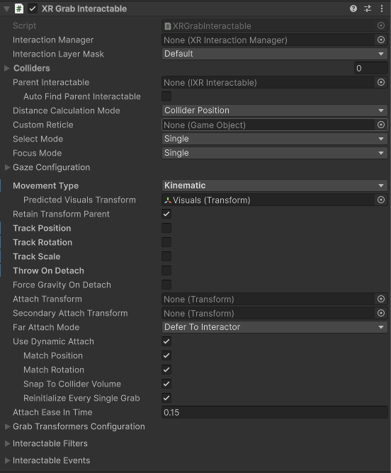
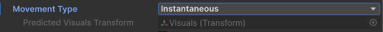
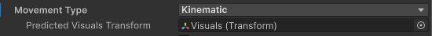
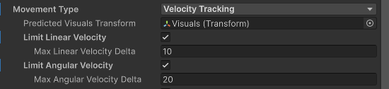
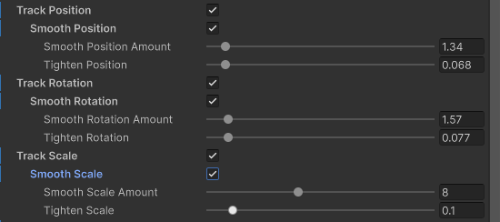
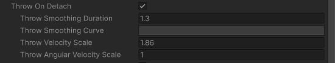
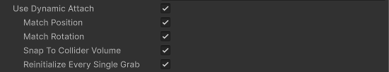
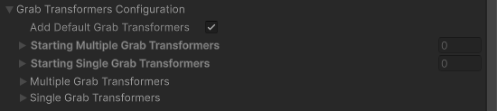

# XR Grab Interactable

Interactable component that allows for basic grab functionality. With the default settings, this interactable follows the interactor around when selected (grabbed) and can inherit velocity when released.

You can create grabbable objects with the following attributes:

* Can be picked up by only one hand or by two hands at the same time.
* Can track all of the transform properties of the interactor, or just specific aspects, such as position and rotation, or rotation and scale. You can also constrain which axes of motion are tracked. For example, you can create a knob that the user can turn, but can't reposition.
* Can be thrown.
* Can move to specific poses when picked up, such as a tool held by its handle.

## Supporting components {#supporting-components}

You can use the following additional components with a grab interactable:

* [`IXRGrabTransformer`](xref:UnityEngine.XR.Interaction.Toolkit.Transformers.IXRGrabTransformer): Calculates the target pose (position, rotation, and scale) of the interactable when held (selected). Refer to [Grab transformers](#grab-transformers) for information about configuring the grab transformers for an interactable.
* [XR Interactable Snap Volume](xref:xri-xr-interactable-snap-volume): Snaps ray-based interactors to the interactable when their ray intersects the defined volume. The interactor must be configured as described in [Supporting XR Interactable Snap Volume](xref:xri-xr-ray-interactor#support-snap-volume). Note that the [Gaze Assistance](#gaze-assist) feature temporarily adds a snap volume to an interactable if one isn't already present.
* [Rigidbody](xref:UnityEngine.Rigidbody): The fundamental Unity physics object, which tracks the properties of a GameObject required by the physics simulation. Required for all grab interactables.
* [Collider](xref:UnityEngine.Collider): A Unity physics object that defines the shape of an object for determining collisions and calculating distance between the interactable and an interactor. Mesh Colliders must be convex. Required for all interactables.

## Basic properties

The XR grab interactable has many properties that you can set to modify how the interactable behaves. Some of these properties are organized into sections and don't appear in the Inspector window until you enable another property or expand a section.

| **Property** | **Description** |
|---|---|
| **Interaction Manager** | The [XRInteractionManager](xr-interaction-manager.md) that this interactable will communicate with (will find one if **None**). |
| **Interaction Layer Mask** | Allows interaction with interactors whose [Interaction Layer Mask](interaction-layers.md) overlaps with any Layer in this **Interaction Layer Mask**. |
| **Colliders** | Colliders to use for interaction with this interactable (if empty, will use any child Colliders). |
| [Parent Interactable](#parent-interactable) | Assign a reference to another interactable object when you need it to be updated before this interactable. Parents are processed by the interaction manager before their children. |
| **Auto Find Parent Interactable** | Automatically find a [parent interactable](#parent-interactable) in this GameObject's parent or other ancestor in the scene hierarchy. Ignored if you assign an interactable object to **Parent Interactable**. |
| [Distance Calculation Mode](#distance-calculation) | Specifies how distance is calculated to interactors, from fastest to most accurate. |
| **Custom Reticle** | A reticle used when this object is interacted with. Overrides a reticle supplied by an interactor. |
| **Select Mode** | Choose whether a **Single** or **Multiple** interactors can select this interactable at the same time. |
| **Focus Mode** | Choose whether a **Single** or **Multiple** [interaction groups](xref:xri-xr-interaction-group) can focus this interactable at the same time. Set to **None** to disallow focus on this interactable. |
| [Gaze configuration](#gaze-config) | Options for gaze selection and assistance. |
| [Movement Type](#movement-type) | Specifies how this object moves when selected, either through setting the velocity of the `Rigidbody`, moving the kinematic `Rigidbody` during Fixed Update, or by directly updating the `Transform` each frame. Refer to [Movement Type](#movement-type) for information about the additional properties you can set for each movement type.|
| **Unparent Transform On Grab** | Enable to have Unity unparent this GameObject to make it a top-level GameObject in the hierarchy when this interactable is grabbed. Refer to [Reparenting Configuration](#reparenting-config) for more information about this property. |
| **Retain Transform Parent** | Enable to have Unity set the parent GameObject of this object back to its original parent this object was a child of after this object is dropped. Refer to [Reparenting Configuration](#reparenting-config) for more information about this property. |
| [Track Position](#track-transform) | Enable to have this object follow the position of the Interactor when selected. |
| [Track Rotation](#track-transform) | Enable to have this object follow the rotation of the Interactor when selected. |
| [Track Scale](#track-transform) | Enable to have this object follow the scale of the Interactor when selected. |
| [Throw On Detach](#throw-on-detach) | Enable to make it easier to throw an interactable object. The interactable's Rigidbody must not be set to **isKinematic**. Refer to [Throw On Detach](#throw-on-detach) for information on the properties you can adjust to modify the inherited velocity. |
| **Force Gravity On Detach** | When enabled, the Rigidbody's **Use Gravity** property is set to `true` when the interactable is released. Otherwise, the property value is restored to its previous, pre-grab value. |
| **Attach Transform** | The transform that defines the position of this interactable. If you do not set this value, the transform of the GameObject containing the `XRGrabInteractable` component is used. |
| **Secondary Attach Transform** | A second attachment point for two-handed interactions. If you do not set this value, the attach transform of the second interactor is used. |
| **Far Attach Mode** | Specify how the interactable behaves when selected at a distance. You can **Defer to the Interactor**, move the interactable to the **Near** attach transform, or let it stay at the **Far** point where it was selected. |
| [Use Dynamic Attach](#dynamic-attachment) | Enable to make the effective attachment point based on the pose of the interactor when the selection is made. Refer to [Dynamic attachment](#dynamic-attachment) for information about the additional properties you can set for determining the dynamic attachment pose.|
| **Attach Ease In Time** | Time in seconds to ease the interactable to the attach transform when selected. Set a value of 0 for no easing. |
| [Grab Transformers Configuration](#grab-transformers-config) | Every grabbable object must have a grab transformer, which calculates the target pose of the interactable while it is selected. |
| [Interactable Filters](#interactable-filters) | Interactable filters can override the normal hover, select, and interaction strength behavior. |
| [Interactable Events](#interactable-events) | Events dispatched by an interactable during an interaction. |

## Parent interactable {#parent-interactable}

[!INCLUDE [interactable-parent](snippets/interactable-parent.md)]

## Distance calculation {#distance-calculation}

The distance between an interactor and an interactable is one of the criteria used by the [XR Interaction Manager](xref:xri-xr-interaction-manager) to determine which interactable is selected when the user engages the interactor's select input.

The **Distance Calculation Mode** setting allows you to choose a trade-off between performance and accuracy when determining the closest interactable to an interactor. For many cases, the default value, **Collider Position** strikes a good balance. If you have many interactables and are seeing performance issues, try **Transform Position**. If you have complex object shapes and need very precise interaction targeting, try **Collider Volume**.

You can choose from the following methods for calculating distance:

| **Property** | **Description** |
|---|---|
| **Transform Position** | Calculates the distance from the interactable's transform position. This option has low performance cost, but it may have low distance calculation accuracy for some objects. |
| **Collider Position** | Calculates the distance from the closest collider in the interactable's **Colliders** list. This option has moderate performance cost and should have moderate distance calculation accuracy for most objects. |
| **Collider Volume** | Calculates the distance from the closest point on the surface or inside any of the colliders in the interactable's Colliders list. This option has high performance cost, but also high distance calculation accuracy. |

> [!IMPORTANT]
> The **Collider Volume** mode is only supported for convex mesh colliders.

## Gaze configuration {#gaze-config}

[!INCLUDE [interactable-gaze](snippets/interactable-gaze-configuration.md)]

## Movement type {#movement-type}

The **Movement Type** option determines how the grabbable object moves towards its target pose. The options, which align with the basic mechanisms for moving GameObjects in a Unity scene, include:

* [Instantaneous](#instantaneous-movement)
* [Kinematic](#kinematic-movement)
* [Velocity Tracking](#velocity-movement)

The target pose is determined by the linked [`IXRGrabTransformer`](xref:UnityEngine.XR.Interaction.Toolkit.Transformers.IXRGrabTransformer) based on the attach transforms of the interactor and the interactable. Smoothing and easing settings of the grab interactable can also modify the target pose.

Refer to [Reducing stutter from physics update rate](#stutter) for more information about the **Movement Type** and associated properties can affect the visual aspects of the interactable while it is being moved by an interactor.

> [!NOTE]
> If an interactable does not have a linked grab transformer, then it cannot be moved with an interaction. Always [configure grab transformers](#grab-transformer-config) for the interactable or enable **Add Default Grab Transformers** to use the default behavior provided by [XRGeneralGrabTransformer](xref:UnityEngine.XR.Interaction.Toolkit.Transformers.XRGeneralGrabTransformer).

### Instantaneous movement {#instantaneous-movement}

Teleports the grabbable object to the target pose every frame. Instantaneous movement minimizes latency between movement of the interactor and movement of the grabbable object.

The tradeoff with using instantaneous movement is that it doesn't take physics into account. For example, collisions with other objects might be calculated incorrectly or missed altogether.

### Kinematic movement {#kinematic-movement}

Moves the grabbable object to the target pose using kinematic physics in the [FixedUpdate](xref:um-fixed-updates) phase of the Unity frame. Refer to [Rigid body GameObjects without physics-based movement](xref:um-rigidbodiesoverview) for more information.

> [!NOTE]
> When selected, the interactable sets the `isKinematic` property of its Rigidbody to `true`. It restores the property to its previous value when deselected.

When you set the **Kinematic** **Movement Type**, you can also set the **Predicted Visuals Transform** property. The interactable predicts the pose for this transform to reduce stutter when the rendering frame rate is faster than the physics update.

The **Predicted Visuals Transform** must be the parent of any [Renderer](xref:UnityEngine.Renderer) components of the grabbable object.

### Velocity tracking movement {#velocity-movement}

Moves the grabbable object to the target pose using dynamic physics -- in other words, by adding the necessary velocity and angular velocity to the Rigidbody.

Use this type of movement if you don't want the object to be able to move through other colliders without a Rigidbody as it follows the interactor. The tradeoff with **Velocity Tracking** movement is that the interactable can appear to lag behind the user's hand and might not move as smoothly as it would with the instantaneous movement type.

When you set the **Velocity Tracking** movement type, you can set the following additional properties:

| **Property** | **Description** |
|---|---|
| **Predicted Visuals Transform** | The interactable predicts the pose for this transform to reduce stutter when the rendering frame rate is faster than the physics update.  The **Predicted Visuals Transform** must be the parent of any [Renderer](xref:UnityEngine.Renderer) components of the grabbable object.  |
| **Limit Linear Velocity** | Whether to limit the linear velocity applied to the Rigidbody. |
| **Max Linear Velocity Delta** | The maximum linear velocity that Unity will apply to the Rigidbody each physics frame (and the optional predicted visuals if used). |
| **Limit Angular Velocity** | Whether to limit the angular velocity applied to the Rigidbody. |
| **Max Angular Velocity Delta** | The maximum angular velocity in radians per second that Unity will apply to the Rigidbody each physics frame (and the optional predicted visuals if used). |

## Reparenting Configuration {#reparenting-config}

There are a couple properties which control how the GameObject is automatically reparented when grabbed and dropped. The **Unparent Transform On Grab** property controls the reparenting behavior when the interactable is grabbed. When enabled, it will automatically set the interactable to be a root GameObject when selected by an interactor. This is the default behavior. You can disable this property to keep its existing parent GameObject when selected.

The **Retain Transform Parent** property controls the reparenting behavior when the interactable is dropped, meaning no longer selected by any interactor. When enabled, it will automatically reparent the interactable back to be a child GameObject of its parent GameObject at the time it was grabbed. This is the default behavior. You can disable this property to keep the component from modifying its parent GameObject when dropped. You may want to disable this if you want to manually control the parenting or if you want to have it remain as a root GameObject from **Unparent Transform On Grab** being enabled. Note that if the interactable was originally a root GameObject when grabbed and the interactable was manually reparented to another GameObject through scripting API before being dropped, the interactable will ignore this property and remain under the new parent GameObject. The parent GameObject will also not be changed if the original parent was destroyed or is inactive in hierarchy.

## Track position, rotation, and scale {#track-transform}

Enable the **Track Position**, **Track Rotation**, and **Track Scale** properties to specify whether the interactable should be affected by the position, rotation, and scale properties of the target pose calculated by the [`IXRGrabTransformer`](xref:UnityEngine.XR.Interaction.Toolkit.Transformers.IXRGrabTransformer). For example, if you want to allow the user to pick up an interactable, enable **Track Position** and **Track Rotation**.

For each aspect of the transform that the interactable tracks, you can set smoothing and damping factors:

| **Property** | **Description** |
|---|---|
| **Smooth Position, Rotation, Scale Amount** | How much smoothing is applied while following the interactor. The larger the value, the closer this object will track the interactor. |
| **Tighten Position, Rotation, Scale** | How close the smoothed value should remain to the target value when using smoothing. The value ranges from 0, meaning no bias in the smoothed value, to 1 meaning effectively no smoothing at all. |
| **Velocity Damping** | Scale factor of how much to dampen the existing linear velocity when tracking the interactor. The smaller the value, the longer it takes for the velocity to decay. Only applies when **Movement Type** is in **Velocity Tracking** mode. |
| **Velocity Scale** | Scale factor Unity applies to the tracked linear velocity while updating the `Rigidbody` when tracking the interactor. Only applies when **Movement Type** is in **Velocity Tracking** mode. |

## Throw on detach {#throw-on-detach}

Enable **Throw On Detach** to make it easier to throw an interactable object. The interactable's Rigidbody must not be set to **isKinematic**.

When enabled, the interactable inherits the velocity of the interactor when released. You can adjust the following properties, which modify the amount of velocity that is transferred:

| **Property** | **Description** |
|---|---|
| **Throw Smoothing Duration** | The interval, in seconds, over which interactor velocity is sampled and averaged. The velocity calculation uses up to 20 frames within this duration. |
| **Throw Smoothing Curve** | The curve used to weight velocity samples when calculating the inherited velocity. The horizontal scale of the curve runs from oldest to most recent samples. By default, this curve is flat with a 1.0 value so the calculation weighs all smoothing values equally across the smoothing interval. |
| **Throw Velocity Scale** | Scale factor applied to the inherited linear velocity on release. |
| **Throw Angular Velocity Scale** | Scale factor applied to the inherited angular velocity on release. |

## Dynamic attachment {#dynamic-attachment}

Enable **Use Dynamic Attach** to determine the attachment pose based on the pose of the interactor at the time of selection.

| **Property** | **Description** |
|---|---|
| **Match Position** | Match the position of the interactor's attachment point when initializing the grab. This will override the position of Attach Transform. |
| **Match Rotation** | Match the rotation of the interactor's attachment point when initializing the grab. This will override the rotation of Attach Transform. |
| **Snap To Collider Volume** | Adjust the dynamic attachment point to keep it on or inside the Colliders that make up this object. |
| **Reinitialize Every Single Grab** | Re-initialize the dynamic attachment pose when changing from multiple grabs back to a single grab. Enable this property when you want to keep the current pose of the object after releasing a second hand rather than reverting back to the attach pose from the original grab. |

## Grab transformers {#grab-transformers}

A grab transformer calculates the target pose for a grab interactable while it is selected. The grab interactable uses this target pose when it applies its configured movement algorithm.

The grab interactable component keeps two lists of grab transformers. One list applies to single-interactor selection. The other to multiple-interactor selection. You can add more than one transformer to each of these lists. The transformers are called in order and receive the target pose calculated by the previous transformer in the list.

The XR Interaction Toolkit provides a few grab transformers. You can also implement [`IXRGrabTransformer`](xref:UnityEngine.XR.Interaction.Toolkit.Transformers.IXRGrabTransformer) or extend [`XRBaseGrabTransformer`](xref:UnityEngine.XR.Interaction.Toolkit.Transformers.XRBaseGrabTransformer) to create your own. The toolkit implementations include:

* [XRDualGrabFreeTransformer](xref:UnityEngine.XR.Interaction.Toolkit.Transformers.XRDualGrabFreeTransformer): supports moving and rotating unconstrained with multiple Interactors.
* [XRGeneralGrabTransformer](xref:UnityEngine.XR.Interaction.Toolkit.Transformers.XRGeneralGrabTransformer): supports moving and rotating with one or two interactors. If you enable **Add Default Grab Transformers**, this grab transformer component is used for both single and multiple interactor grabs when no other transformers are configured.
* [XRSingleGrabFreeTransformer](xref:UnityEngine.XR.Interaction.Toolkit.Transformers.XRSingleGrabFreeTransformer): supports moving and rotating with a single Interactor.
* [XRSocketGrabTransformer](xref:UnityEngine.XR.Interaction.Toolkit.Transformers.XRSocketGrabTransformer): snaps an interactable to a socket.

A grab interactable automatically finds any grab transformers that you add as a component to the same GameObject. If order matters or you need to override whether a transformer is used for single or multiple grab interactions, you can reference the components in the **Starting Single Grab Transformers** and **Starting Multiple Grab Transformers** lists.

> [!NOTE]
> In Play mode, the **XR General Grab Transformer** component might not update the target pose in the current frame when you manually manipulate the **Attach Transform**.

### Grab transformers configuration {#grab-transformers-config}

You can set the following properties to modify how grab transformers are linked with an interactable:

| **Property** | **Description** |
|---|---|
| **Add Default Grab Transformers** | Whether Unity will add the default set of grab transformers if either the Single or Multiple Grab Transformers lists are empty. |
| **Starting Multiple Grab Transformers** | The grab transformers that this interactable automatically links at startup for multi-interactor selection. |
| **Starting Single Grab Transformers** | The grab transformers that this interactable automatically links at startup for single-interactor selection. |
| **Multiple Grab Transformers** | The grab transformers used when there are multiple interactors selecting this object. Only shown in Play mode.|
| **Single Grab Transformers** | The grab transformers used when there is a single interactor selecting this object. Only shown in Play mode.|

> [!TIP]
> To modify the transformer lists at runtime, use the [`AddMultipleGrabTransformer`](xref:UnityEngine.XR.Interaction.Toolkit.Interactables.XRGrabInteractable.AddMultipleGrabTransformer(UnityEngine.XR.Interaction.Toolkit.Transformers.IXRGrabTransformer)), [`AddSingleGrabTransformer`](xref:UnityEngine.XR.Interaction.Toolkit.Interactables.XRGrabInteractable.AddSingleGrabTransformer(UnityEngine.XR.Interaction.Toolkit.Transformers.IXRGrabTransformer)), [`RemoveMultipleGrabTransformer`](xref:UnityEngine.XR.Interaction.Toolkit.Interactables.XRGrabInteractable.RemoveMultipleGrabTransformer(UnityEngine.XR.Interaction.Toolkit.Transformers.IXRGrabTransformer)), and [`RemoveSingleGrabTransformer`](xref:UnityEngine.XR.Interaction.Toolkit.Interactables.XRGrabInteractable.RemoveSingleGrabTransformer(UnityEngine.XR.Interaction.Toolkit.Transformers.IXRGrabTransformer)) methods.

## Interactable Filters  {#interactable-filters}

[!INCLUDE [interactable-filters-config](snippets/interactable-filters-config.md)]

## Interactable Events {#interactable-events}

[!INCLUDE [interactable-events](snippets/interactable-events.md)]

## Preventing or augmenting a grab interaction {#modify-grab}

When configuring a grab interactable for interaction with a variety of interactors, you may want to only allow certain types of interactions, such as far or ray-based grabbing. This can be done in several ways. The simplest way is to update the [Interaction Layer Mask](xref:xri-interaction-layers) to match or include the **Interaction Layer Masks** of the interactors you wish to allow interaction with.

Other approaches, which allow you to define additional conditions and augmentations of a grab interaction, include writing a custom [Interaction Filter](xref:xri-interaction-filters) or using a [Target Filter](xref:xri-target-filters) on the interactor. For example, you can script an interaction filter to only allow hovering and selecting with specific types of interactors or under certain conditions, such as distance from the grab interactable, during character dialog, only when another grab interactable is placed into a specific socket interactor, or any number of conditions you require for your application. You can configure an [XR Target Filter](xref:xri-target-filters#xr-target-filter) component to filter which interactable targets that an interactor can interact with.

## Reducing stutter from physics update rate {#stutter}

When the **Movement Type** is set to **Instantaneous**, the GameObject is moved by directly moving the transform every frame to the target pose returned by the [grab transformers](#grab-transformers). However, the other **Movement Types** cause the GameObject to only move after [FixedUpdate](xref:um-fixed-updates) which can cause the motion of the object to be much less smooth than when the object is set to **Instantaneous**.

Unity provides a way for the Rigidbody component to smooth the appearance of movement stutter due to the mismatch between the physics update rate and the application's frame rate, which you can read more about in the Unity manual page [Apply interpolation to a Rigidbody](xref:um-rigidbody-interpolation). However, setting the Rigidbody component to **Interpolate** or **Extrapolate** comes with drawbacks when an object is grabbed in an XR application. **Interpolation** smooths out motion to eliminate stutter, but the GameObject can appear to move slightly behind where it should be, which can be detrimental to immersion. This latency is amplified even more when the user is moving or turning with locomotion while grabbing the object.

### Predicted Visuals Transform {#predicted-visuals}

To reduce the detrimental effects of interpolation, the **XR Grab Interactable** supports assigning a **Predicted Visuals Transform** property which allows you to separate the Rigidbody and colliders from the visual representation of the interactable object. When this property is set and the **Movement Type** is set to **Kinematic** or **Velocity Tracking** the component updates the visuals GameObject every frame while the Rigidbody is not colliding with anything. This mechanism is required because when **Movement Type** is set to **Kinematic** or **Velocity Tracking**, the computed target pose and scale are only applied to the Rigidbody every [FixedUpdate](xref:um-fixed-updates), which typically happens at a lower rate than the application frame rate. By updating the visuals and physics separately in this way, the object appears to move smoothly every frame while still maintaining accurate and expected physics collisions.

A typical GameObject hierarchy of a prefab to make use of this feature:
* **Grab Interactable** (components: `Rigidbody`, `XRGrabInteractable`, `XRGeneralGrabTransformer`)
  * **Visuals** (one or more components of: `MeshFilter`, `MeshRenderer`, etc.)
    * Even more visual GameObjects...
  * **Collider** (one or more components of: `MeshCollider`, `BoxCollider`, etc.)
    * Even more collider GameObjects...
  * **Visual feedback or affordance** (components: `XRInteractableAffordanceStateProvider`, `MaterialPropertyBlockHelper`, `ColorMaterialPropertyAffordanceReceiver`, etc.)

In this example, note that the colliders are separated from the visuals. With this GameObject setup, the **Predicted Visuals Transform** can be set to the **Visuals** GameObject to make use of the smoother visuals while minimizing latency. The result is an interactable that uses physics-based movement with the same appearance as instantaneous movement.

You can still use the **Interpolation** setting of the Rigidbody component to reduce visual stutter while the object is colliding or when dropped. The **XR Grab Interactable** component forces **Interpolation** to **None** while it controls the visuals GameObject, and reverts it to the old **Interpolation** value when possible.

#### Limitations {#limitations}

The **Predicted Visuals Transform** does not replace physics. While the Rigidbody is colliding with something, the visuals GameObject stops being driven by the component and the movement of the object reverts to the same as if the property was not set. Thus, there may still be stutter or the object may lag behind depending on the **Interpolation** setting of the Rigidbody, even with this system.

There are several additional constraints/limitations of this system:
  * **Predicted Visuals Transform** must be a child GameObject relative to the **XR Grab Interactable**.
  * **Predicted Visuals Transform** must not have a collider component on that GameObject or any of its child GameObjects so that the colliders correctly update in step with the Rigidbody and physics.
  * **Predicted Visuals Transform** must not have any intermediate parent GameObject between it and the grab interactable itself with a Transform offset. In other words, while there can be a GameObject between the GameObjects of the grab interactable and the visual components, it must have position and rotation set to all 0.
  * The grab interactable only captures the initial local Transform data (position, rotation, and scale) of the **Predicted Visuals Transform** when the object is grabbed. It overwrites the Transform values every frame while grabbed, and restores the original Transform data when dropped.
  * The grab interactable forces the **Interpolation** setting of the Rigidbody to **None** while the **Predicted Visuals Transform** is being controlled by the component.
  * When the Rigidbody is colliding or sleeping while grabbed, and upon being dropped, the grab interactable reverts to the original **Interpolation** setting of the Rigidbody.
  * Similar to target pose, the target scale returned by the grab transformers is only applied during `FixedUpdate` for **Kinematic** and **Velocity Tracking** movement types. The grab interactable applies the effective combined scale to the **Predicted Visuals Transform** between physics steps. If the Rigidbody scale is (0, 0, 0), the visual GameObjects won't be visible until after the next `FixedUpdate` in which it has a non-zero scale.
