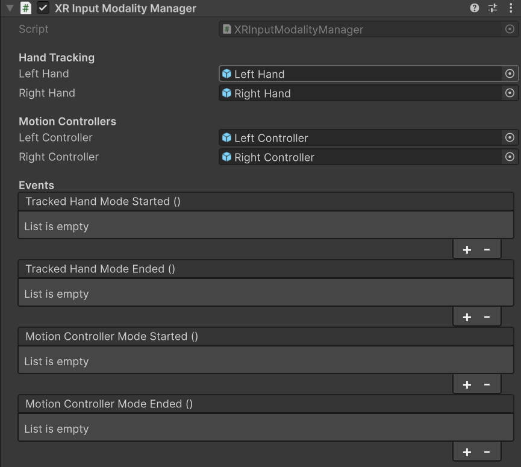

# XR Input Modality Manager

Automatically change between hand tracking and motion controllers at runtime based on which input method is currently tracked.

This component manages the transition between different input groups:

* Hand tracking: If hands begin tracking, the component activates the hand interactor GameObjects.

* Motion controllers: If the player wakes the controllers (by grabbing them, for example), the component switches to the motion controller interactor GameObjects.

The properties and events related to hand tracking require the [XR Hands package](https://docs.unity3d.com/Packages/com.unity.xr.hands@latest) to be installed in your project.

 *The XR Input Modality Manager showing all properties.*

## XR Input Modality Manager properties

The XR Input Modality Manager contains the following properties:

### Hand Tracking

The **Hand Tracking** section contains the following properties:

| **Property** | **Description** |
|---|---|
| **Left Hand** | Set to the parent GameObject of the left hand group of interactors. The component enables this object during hand tracking and disables it when motion controllers are active. |
| **Right Hand** | Set to the parent GameObject of the right hand group of interactors. The component enables this object during hand tracking and disables it when motion controllers are active. |

### Motion Controllers

> [!NOTE]
> This component only activates a controller's GameObject once the system begins tracking that specific controller.

The **Motion Controllers** section contains the following properties:

|**Property**| **Description**|
|---|---|
| **Left Controller** | Set to the parent GameObject of the left motion controller group of interactors. The component enables this object when using motion controllers and disables it during hand tracking. |
| **Right Controller** | Set to the parent GameObject of the right motion controller group of interactors. The component enables this object when using motion controllers and disables it during hand tracking. |

### Events

Use events to trigger custom logic when the input method changes.

The **Events** section contains the following properties:

| **Property** | **Description** |
|---|---|
| **Tracked Hand Mode Started** | Triggers when hand tracking begins. This event fires only when the first hand begins tracking. It doesn't fire again if the second hand enters tracking while the mode is already active. |
| **Tracked Hand Mode Ended** | Triggers when both hands stop tracking. |
| **Motion Controller Mode Started** | Triggers when motion controller input begins. This event fires only when the first controller begins tracking. It doesn't fire again if the second controller activates while the mode is already active. |
| **Motion Controller Mode Ended** | Triggers when both controllers stop tracking. |

## Additional resources

* [`XRInputModalityManager` class](xref:UnityEngine.XR.Interaction.Toolkit.Inputs.XRInputModalityManager)
* [Component index](xref:xri-components)
