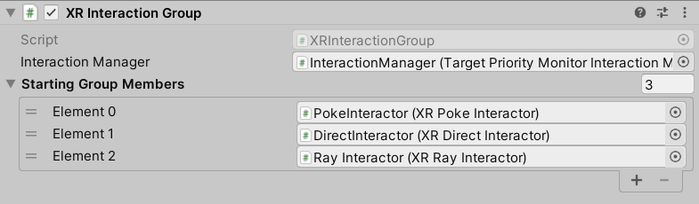

# XR Interaction Group

An Interaction Group is a mediator for Interactors. A Group contains multiple member Interactors, sorted by priority, and only allows one Interactor in the Group to interact (hover or select) at a time. Groups first prioritize continuous selection - so if a member Interactor was interacting the previous frame and can start or continue selection in the current frame, then that Interactor will be chosen for interaction even if a higher priority Interactor tries to interact.

An Interaction Group can also contain other Groups in its sorted list of members. A Group within a Group is treated like a single Interactor when it comes to how the containing Group prioritizes interactions. The Interactor chosen for interaction within a Group is bubbled up to the next containing Group, until it is ultimately either chosen for interaction in the top-level Group or skipped over just like other Interactors.

| **Property** | **Description** |
|---|---|
| **Interaction Manager** | The [XRInteractionManager](xr-interaction-manager.md) that this Interaction Group will communicate with (will find one if **None**). |
| **Starting Group Members** | Ordered list of Interactors or Interaction Groups that are registered with the Group on `Awake`. |