# XR Interaction Simulator

The XR Interaction simulator is a runtime utility that is included as part of the Samples add-on in this package. This utility lets you simulate user interaction and inputs from plain key presses (be it from a keyboard and mouse combo or a controller) to drive the XR headset, controller devices or hands in the scene.

> [!NOTE]
> The simulator doesn't directly manipulate the camera or controllers that are part of the XR Origin but instead drives them indirectly through simulated input.

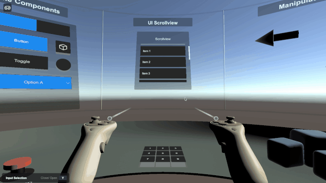

This section covers topics like how to install the XR Interaction Simulator, how to use it, how to set it up in a new empty scene, and how to change key bindings tied to the XR Interaction Simulator. You are encouraged to tweak the bindings to make the simulator fit your needs.

For more information about the specifics on the XR Interaction Simulator component, see the [XR Interaction Simulator](xr-interaction-simulator.md) page where you can get more info about the specific settings that are exposed for it.

## Installing the XR Interaction Simulator

To install the XR Interaction Simulator, go to the package manager (**Window** &gt; **Package Manager**), select the **XR Interaction Toolkit** package, and then click on the **Import** button next to **XR Device Simulator** under the samples section in the Package Manager.

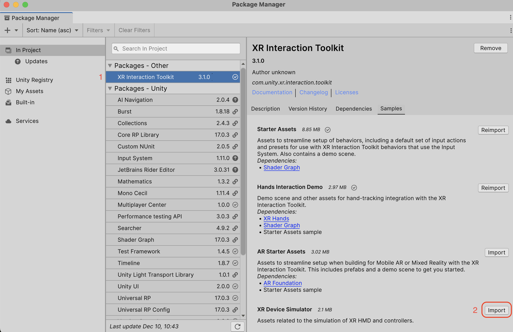

Upon clicking the **Import** Or **Update** button, you will see an `Assets\Samples\XR Interaction Toolkit\<version>\XR Device Simulator\XR Interaction Simulator` folder added to the Project window. The `XR Interaction Simulator` prefab in this folder is the asset that will be added to the scenes where you want to simulate XR input.

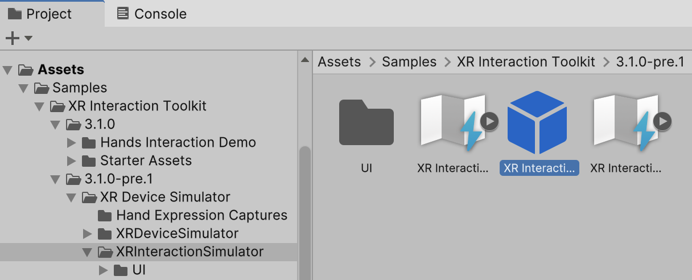

## Using the XR Interaction Simulator

As mentioned above, the XR Interaction Simulator prefab simulates user interaction from plain key presses to drive an XR System. For the XR Interaction Simulator to work in your scene, it must find a pre-configured XR Origin object.

This section will walk you through setting up a pre-configured XR Origin GameObject for use alongside the XR Interaction Simulator.

### Setting up a scene for the XR Interaction Simulator

The simplest way to add an XR Origin prefab that is pre-configured to support the XR Interaction Simulator is to use the one provided as part of the [Starter Assets](samples-starter-assets.md) sample. If you do not have the Starter Assets imported, you can do so by navigating to **Window** &gt; **Package Manager**, selecting the **XR Interaction Toolkit** package from the list, selecting the **Samples** section, and finally locating and clicking on the **Import** or **Update** button next to the **Starter Assets**.

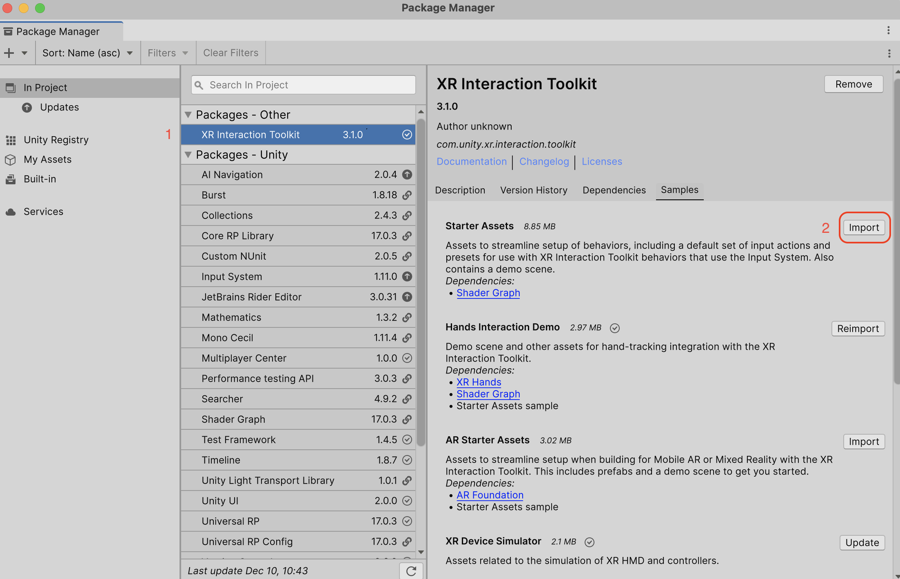

Upon importing the starter assets, drag the `XR Origin (XR Rig)` and `XR Interaction Simulator` prefabs to your scene.

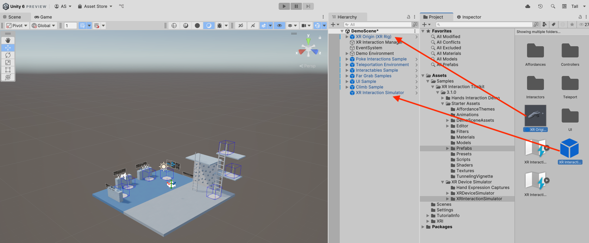

### Testing with the XR Interaction Simulator

After adding the `XR Interaction Simulator` and `XR Origin (XR Rig)` prefabs to your scene, press the **Play** button, and you will be able to move around with the key bindings marked in the simulator play menu. Press tab to cycle between FPS mode and device mode and press the bracket keys (`[`, `]`, `[]`) to activate left, right or both controllers, respectively. Pressing a bracket key twice will switch between Controller or Hand mode.

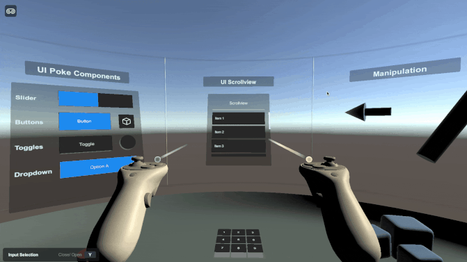

### Making the XR Interaction Simulator work automatically in your project

To automatically activate the XR Interaction Simulator across multiple scenes, go to **Edit** &gt; **Project Settings** &gt; **XR Plug-in Management** &gt; **XR Interaction Toolkit** and enable the **Use XR Interaction Simulator in scenes** option to automatically instantiate the sample's prefab at runtime.

> [!NOTE]
> The XR Interaction Simulator is primarily designed as an Editor-only testing tool. If you wish to have the XR Interaction Simulator automatically instantiate the selected prefab on a standalone production build, you will need to either include the prefab in your scene or disable **Instantiate In Editor Only**.

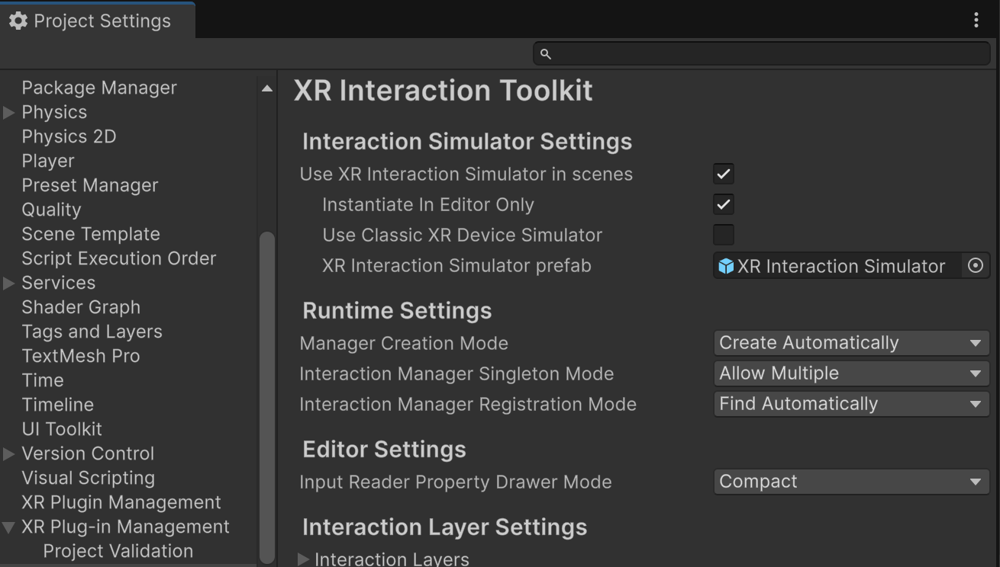

This prefab will not be destroyed when changing between scenes and will persist across your project at runtime.

### Using the XR Interaction Simulator prefab

If you want to modify the Interaction Simulator or to explicitly add it to a specific scene, you can select the `XR Interaction Simulator` prefab and drag it to your scene.

## Setting the XR Interaction simulator to work with different input bindings

The XR Interaction Simulator can be set up to work with any type of input that is supported by Unity's Input System package. To change key bindings (keystrokes mapped to each device action) there are three files that you can modify to meet your preferences.

Depending on which mapped actions you want to change in the XR Interaction Simulator, you might need to modify the `XR Interaction Controller Controls` (for controller key bindings), the `XR Interaction Simulator Controls` (for the simulator key bindings), or the `XR Device Hand Controls` (for hand key bindings).

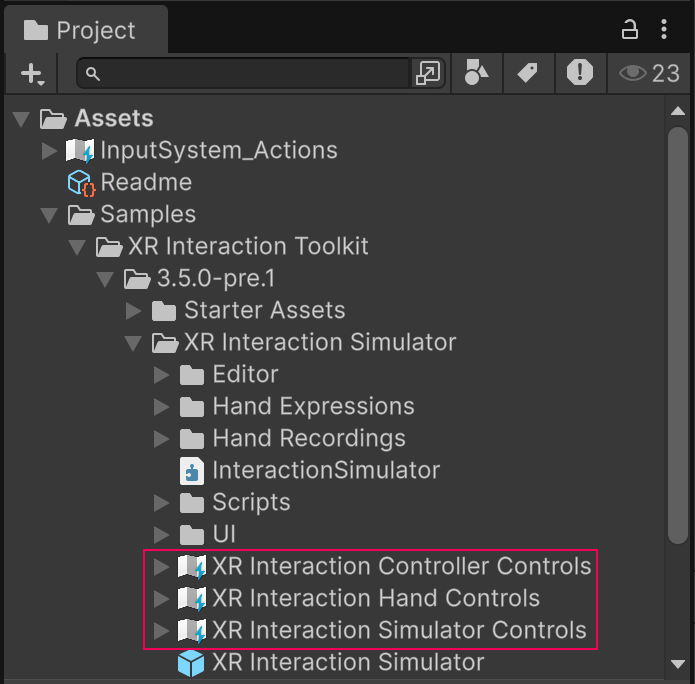

To modify the key bindings, double click on either of the asset files and you will get an Input Action window. Refer to [Editing Input Action Assets](https://docs.unity3d.com/Packages/com.unity.inputsystem@1.8/manual/ActionAssets.html#editing-input-action-assets) in the Input System documentation for more information on how to set up key bindings in an Input Action asset.

To set up the controller bindings like grip, primary / secondary buttons, joystick, etc, double click on the `XR Interaction Controller Controls`:

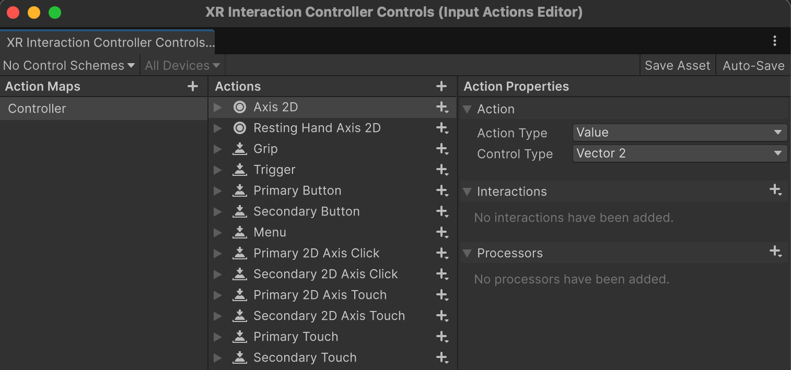

To set up the simulator bindings or headset bindings like move, look around, etc, double click on the `XR Interaction Simulator Controls`:

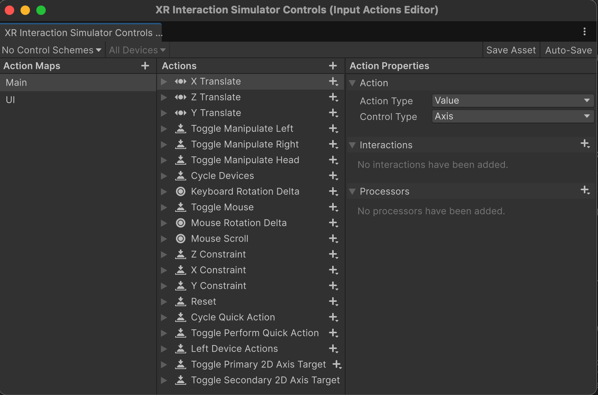

To set up the hand pose bindings like poke, pinch, grab, etc, double click on the `XR Device Hand Controls`:

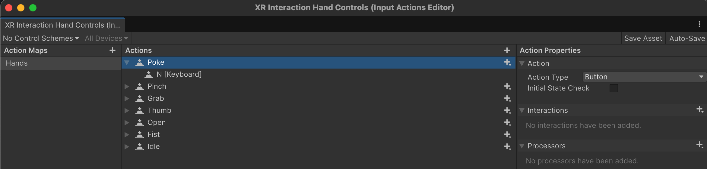

You might note that all the key bindings on each of these files are not reflected in the `XR Interaction Simulator UI` prefab. This is by design to not clutter the Simulator UI as only the most used controls are shown.
