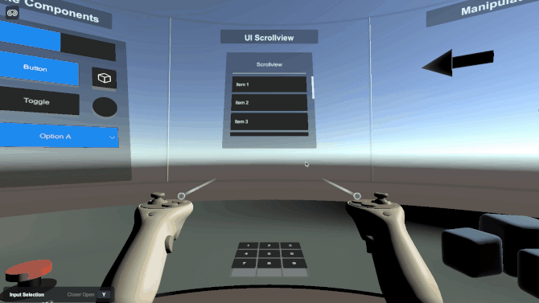
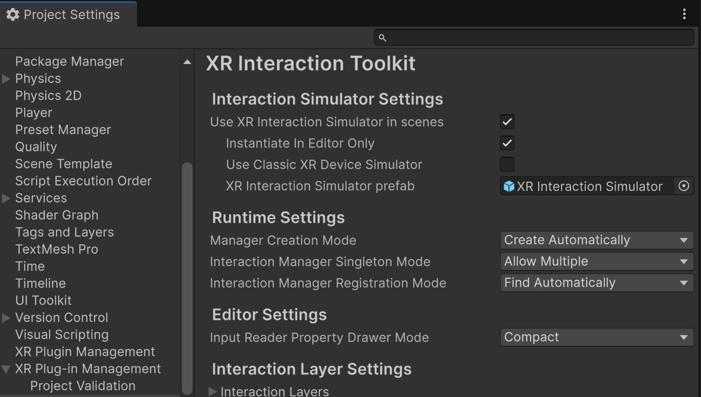
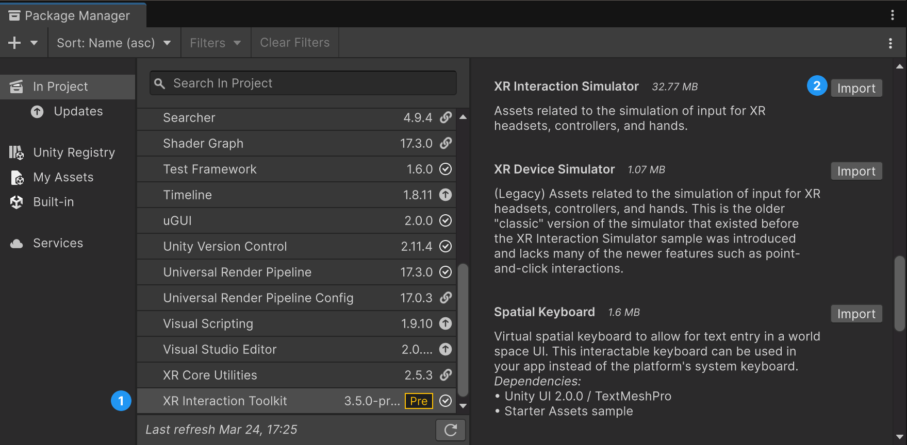
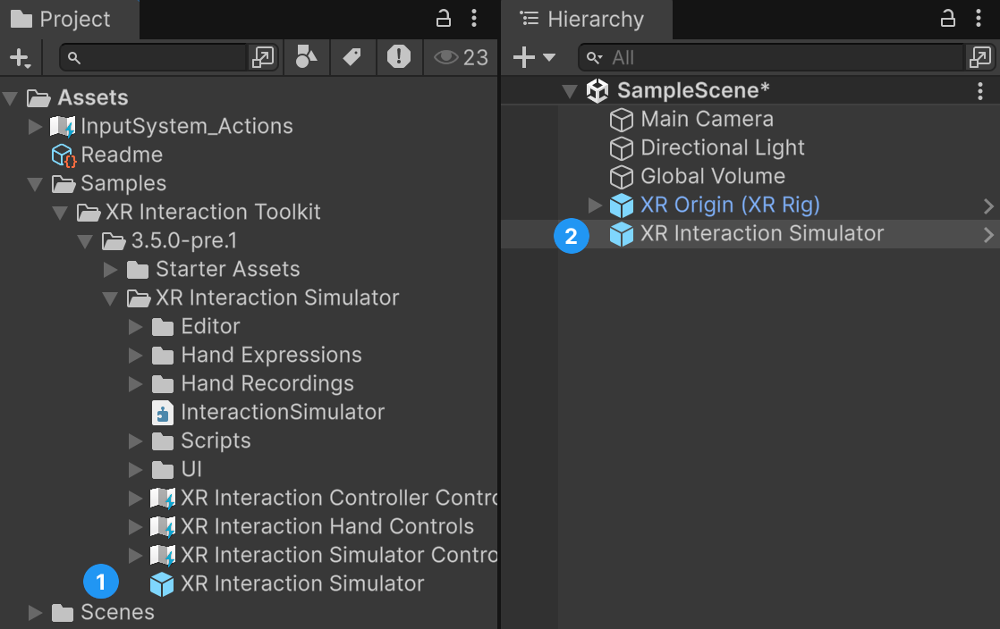
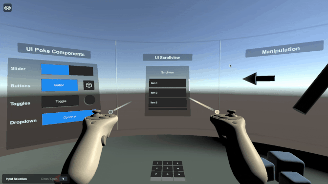
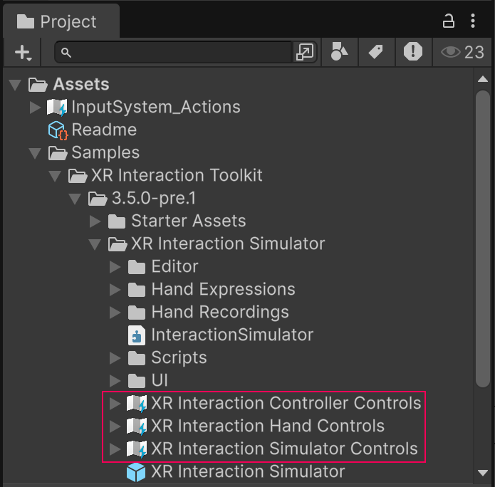
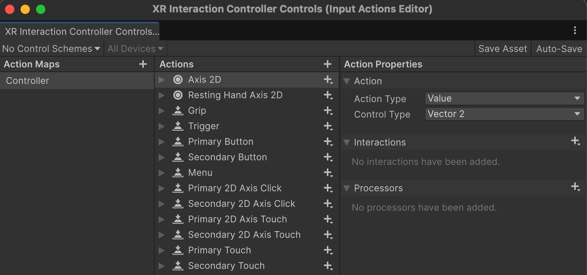
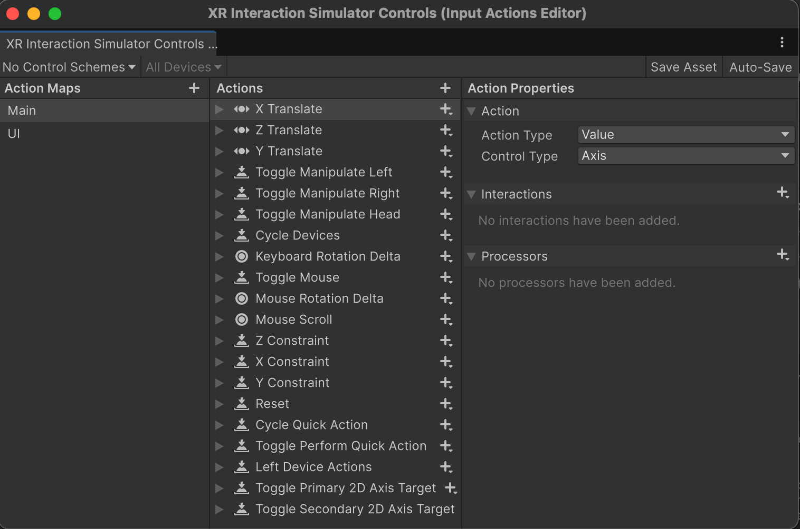
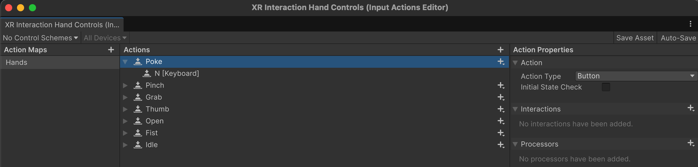

# XR Interaction Simulator

The XR Interaction simulator is a runtime utility that is included as part of the Samples add-on in this package. This utility lets you simulate user interaction and inputs from plain key presses (be it from a keyboard and mouse combo or a controller) to drive the XR headset, controller devices or hands in the scene.

> [!NOTE]
> The simulator doesn't directly manipulate the camera or controllers that are part of the XR Origin but instead drives them indirectly through simulated input.

For more information about the specifics on the XR Interaction Simulator component, see the [XR Interaction Simulator component](xr-interaction-simulator.md) page where you can get more info about the specific settings that are exposed for it.

## Installing the XR Interaction Simulator

There are two requirements for the XR Interaction Simulator to work in your scene.

First, it must find a pre-configured XR Origin object.  Several scenes in package samples for XR Interaction Toolkit and XR Hands already include XR Origin; the same is true for the VR Template and the MR Template.

Second, your scene needs the `XR Interaction Simulator` prefab which can be either automatically instantiated by XR Interaction Toolkit plug-in settings, or added manually.

### Adding the XR Origin

If your current scene lacks an XR Origin, then you can add the XR Origin prefab that is provided as part of the [Starter Assets](samples-starter-assets.md) sample. The [Create a basic scene](create-basic-scene.md) tutorial explains how to do this.

### Making the XR Interaction Simulator work automatically in your project

To automatically activate the XR Interaction Simulator across multiple scenes, go to **Edit** &gt; **Project Settings** &gt; **XR Plug-in Management** &gt; **XR Interaction Toolkit** and enable the **Use XR Interaction Simulator in scenes** option to automatically instantiate the sample's prefab at runtime.

> [!NOTE]
> This setting persists across all scenes in your project at runtime. The XR Interaction Simulator is primarily designed as an Editor-only testing tool. You probably do not want the XR Interaction Simulator in your standalone production build, but if you do then you must either include the `XR Interaction Simulator` prefab in your scene manually or disable **Instantiate In Editor Only**.

This prefab will not be destroyed when changing between scenes and will persist across your project at runtime.

### Adding the XR Interaction Simulator prefab manually

To install the XR Interaction Simulator, go to the package manager (**Window** &gt; **Package Manager**), select the **XR Interaction Toolkit** package, and then click on the **Import** button next to **XR Interaction Simulator** under the samples section in the Package Manager.

Upon clicking the **Import** Or **Update** button, you will see an `Assets\Samples\XR Interaction Toolkit\<version>\XR Interaction Simulator` folder added to the Project window. You must copy the `XR Interaction Simulator` prefab from this folder into any scene where you want to simulate XR input.  You should remove the `XR Interaction Simulator` prefab from your scene prior to building for an XR device.

### Testing with the XR Interaction Simulator

With the `XR Interaction Simulator` and `XR Origin (XR Rig)` prefabs in your scene, press the **Play** button. In Play you can move around using the key bindings shown in the simulator play menu.  To not clutter the Simulator UI, only the most used controls are shown.  All default key bindings are listed on the [XR Interaction Simulator component](xr-interaction-simulator.md) page, but here are a few to get you started:
* Press tab to cycle between FPS mode and device mode.
* Press the bracket keys (`[`, `]`, `[]`) to activate left, right or both controllers, respectively.
* Pressing a bracket key twice will switch between Controller and Hand mode.

## Setting the XR Interaction simulator to work with different input bindings

The XR Interaction Simulator can be set up to work with any type of input that is supported by Unity's [Input System package](https://docs.unity3d.com/Packages/com.unity.inputsystem@latest?subfolder=/manual/SupportedDevices.html). You are encouraged to tweak these key bindings (keystrokes mapped to each device action) to make the simulator fit your needs. Do this by editing the Input Action Assets in `Assets\Samples\XR Interaction Toolkit\<version>\XR Interaction Simulator`:
* `XR Interaction Controller Controls` for controller key bindings like grip, primary / secondary buttons, joystick, etc.
* `XR Interaction Simulator Controls` for the simulator key bindings or headset bindings like move, look around, etc.
* `XR Interaction Hand Controls` for hand key bindings like poke, pinch, grab, etc.

To modify the key bindings, double-click the applicable Input Action Asset to invoke its Input Action window. Refer to [Editing Input Action Assets](https://docs.unity3d.com/Packages/com.unity.inputsystem@latest?subfolder=/manual/ActionAssets.html#editing-input-action-assets) in the Input System documentation for more information on how to set up key bindings in an Input Action Asset.

