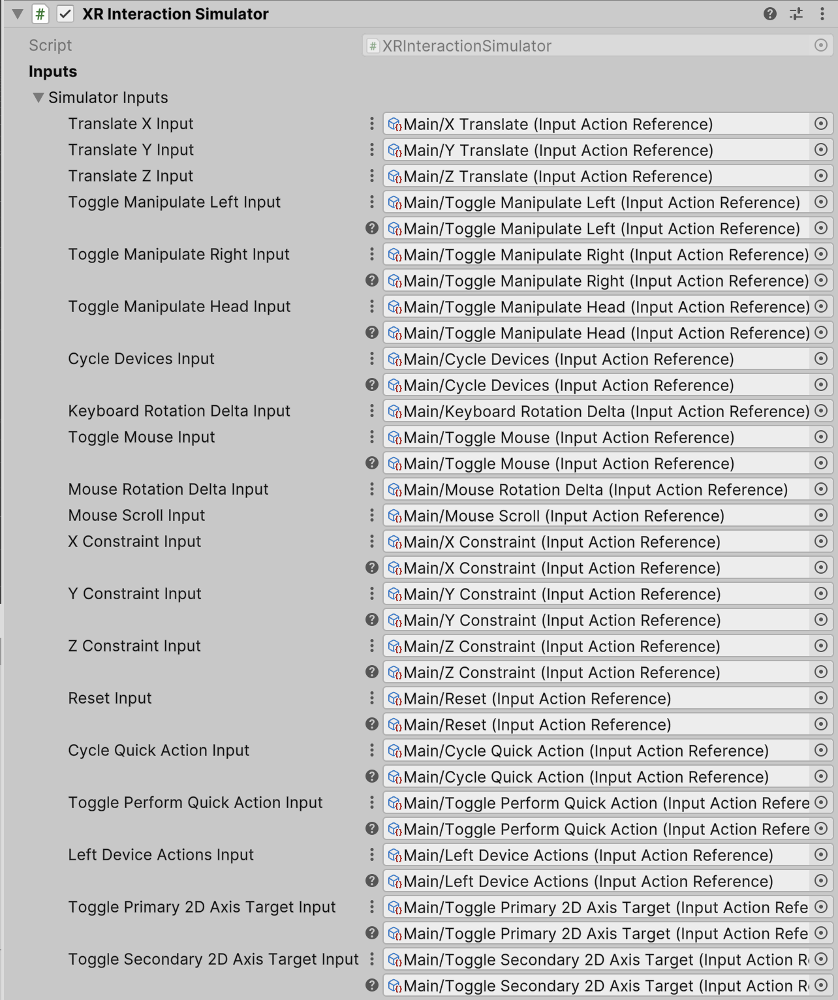
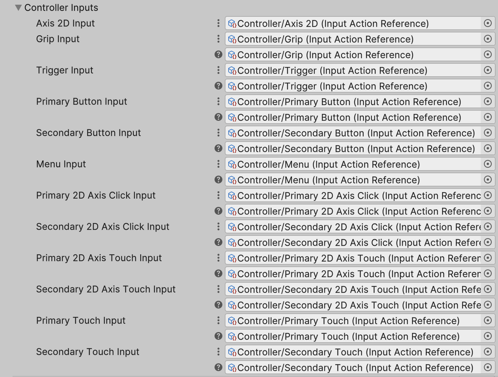
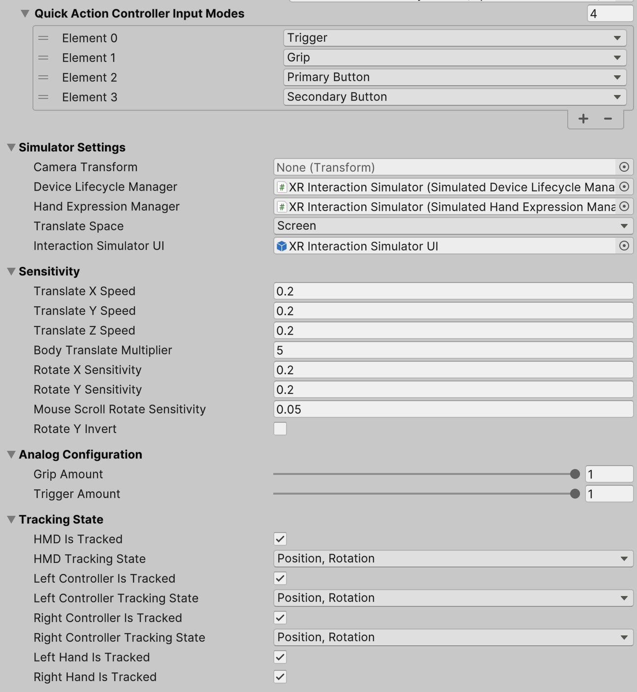

# XR Interaction Simulator

The XR Interaction Simulator is a component which handles mouse and keyboard input from the user and uses it to drive simulated XR controllers and an XR head mounted display (HMD).

This class does not directly manipulate the camera or controllers which are part of the XR Origin, but rather moves them indirectly through simulated input devices.

Use the Package Manager window to install the **XR Device Simulator** sample into your project to get sample mouse and keyboard bindings for [Input System](https://docs.unity3d.com/Packages/com.unity.inputsystem@latest/index.html) actions that this component expects. The sample also includes a prefab of a `GameObject` with this component attached that has references to those sample actions already set. To make use of this simulator, add the prefab to your scene.

For more information about how to install and how to set it up in a scene, refer to the [XR Interaction Simulator overview](xr-interaction-simulator-overview.md).

> [!NOTE]
> The XR Origin must read the position and rotation of the HMD and controllers by using [Input System](https://docs.unity3d.com/Manual/com.unity.inputsystem.html) actions (such as by using `ActionBasedController` and `TrackedPoseDriver`) for this simulator to work as expected. Attempting to use XR input subsystem device methods (such as by using `XRController` and `SpatialTracking.TrackedPoseDriver`) will not work as expected since this simulator depends on the Input System to drive the simulated devices.

| **Property** | **Description** |
|---|---|
| **Simulator Inputs** | |
| **Translate X Input** | The input used to translate in the x-axis (left/right) while held. |
| **Translate Y Input** | The input used to translate in the y-axis (up/down) while held. |
| **Translate Z Input** | The input used to translate in the z-axis (forward/back) while held. |
| **Toggle Manipulate Left Input** | The input used to toggle enable manipulation of the left-hand controller when pressed. |
| **Toggle Manipulate Right Input** | The input used to toggle enable manipulation of the right-hand controller when pressed. |
| **Toggle Left Actions Device Input** | The input used for toggling the left-hand device's actions for buttons or hand expressions. |
| **Toggle Manipulate Head Input** | The input used to toggle manipulation of only the head pose. |
| **Cycle Devices Input** | The input used to cycle between the different available devices. |
| **Keyboard Rotation Delta Input** | The keyboard input used to rotate by a scaled amount along or about the x- and y-axes. |
| **Toggle Mouse Input** | The input used to toggle associated inputs from a mouse device. |
| **Mouse Rotation Delta Input** | The mouse input used to rotate by a scaled amount along or about the x- and y-axes. Typically bound to the screen-space motion delta of the mouse in pixels. |
| **Mouse Scroll Input** | The input used to translate or rotate by a scaled amount along or about the z-axis. Typically bound to the horizontal and vertical scroll wheels, though only the vertical is used. |
| **X Constraint Input** | The input used to constrain the translation or rotation to the x-axis when moving the mouse or resetting. May be combined with another axis constraint to constrain to a plane. |
| **Y Constraint Input** | The input used to constrain the translation or rotation to the y-axis when moving the mouse or resetting. May be combined with another axis constraint to constrain to a plane. |
| **Z Constraint Input** | The input used to constrain the translation or rotation to the z-axis when moving the mouse or resetting. May be combined with another axis constraint to constrain to a plane. |
| **Reset Input** | The input used to cause the manipulated device(s) to reset position or rotation. |
| **Cycle Quick Action Input** | The input used to toggle between input modes and hand expressions. |
| **Toggle Perform Quick Action Input** | The input used to perform the currently active quick-action controller input mode or hand expression. |
| **Toggle Primary Axis 2D Target Input** | The input used to toggle manipulation of the `Axis2DTargets.Primary2DAxis` of the controllers when pressed. |
| ***Toggle Secondary Axis 2D Target Input** | The input used to toggle enable manipulation of the `Axis2DTargets.Secondary2DAxis` of the controllers when pressed. |
| **Controller Inputs** | |
| **Axis 2D Input** | The input used to control the value of one or more 2D Axis controls on the manipulated controller device(s). Typically bound to IJKL on a keyboard, and controls the primary and/or secondary 2D Axis controls on them. |
| **Grip Input** | The input used to control the Grip control of the manipulated controller device(s). |
| **Trigger Input** | The input used to control the Trigger control of the manipulated controller device(s). |
| **Primary Button Input** | The input used to control the PrimaryButton control of the manipulated controller device(s). |
| **Secondary Button Input** | The input used to control the SecondaryButton control of the manipulated controller device(s). |
| **Menu Input** | The input used to control the Menu control of the manipulated controller device(s). |
| **Primary 2D Axis Click Input** | The input used to control the Primary2DAxisClick control of the manipulated controller device(s). |
| **Secondary 2D Axis Click Input** | The input used to control the Secondary2DAxisClick control of the manipulated controller device(s). |
| **Primary 2D Axis Touch Input** | The input used to control the Primary2DAxisTouch control of the manipulated controller device(s).|
| **Secondary 2D Axis Touch Input** | The input used to control the Secondary2DAxisTouch control of the manipulated controller device(s). |
| **Primary Touch Input** | The input used to control the PrimaryTouch control of the manipulated controller device(s). |
| **Secondary Touch Input** | The input used to control the SecondaryTouch control of the manipulated controller device(s). |
| **Quick Action Controller Input Modes** | The subset of quick-action controller buttons/inputs that a user can shift through in the simulator. |
| **Simulator Settings** | |
| **Camera Transform** | The `Transform` that contains the `Camera`. This is usually the "Head" of XR Origins. Automatically set to `Camera.main` if unset. |
| **Device Lifecycle Manager** | The corresponding manager for this simulator that handles the lifecycle of the simulated devices. If this value is not set, the simulator will either find a lifecycle manager in the scene or create one. |
| **Hand Expression Manager** | The corresponding manager for this simulator that handles the hand expressions. If this value is not set, the simulator will either find a hand expression manager in the scene or create one. |
| **Translate Space** | The coordinate space in which translation should operate. |
| &emsp;Local | Set **Translate Space** to **Local** to apply translations of a controller or HMD relative to its own coordinate space, considering its own rotations. Will translate a controller relative to itself, independent of the camera. |
| &emsp;Parent | Set **Translate Space** to **Parent** to apply translations of a controller or HMD relative to its parent. If the object does not have a parent, meaning it is a root object, the parent coordinate space is the same as the world coordinate space. This is the same as **Local** but without considering its own rotations. |
| &emsp;Screen | Set **Translate Space** to **Screen** to apply translations of a controller or HMD relative to the screen. Will translate a controller relative to the camera, independent of the controller's orientation. |
| **Interaction Simulator UI** | The optional Interaction Simulator UI prefab to use along with the XR Interaction Simulator. |
| **Sensitivity** | |
| **Translate X Speed** | Speed of translation in the x-axis (left/right) when triggered by input. |
| **Translate Y Speed** | Speed of translation in the y-axis (up/down) when triggered by input. |
| **Translate Z Speed** | Speed of translation in the z-axis (forward/back) when triggered by input. |
| **Body Translate Multiplier** | Speed multiplier applied for body translation when triggered by input. |
| **Rotate X Sensitivity** | Sensitivity of rotation along the x-axis (pitch) when triggered by input. |
| **Rotate Y Sensitivity** | Sensitivity of rotation along the y-axis (pitch) when triggered by input. |
| **Mouse Scroll Rotate Sensitivity** | Sensitivity of rotation along the z-axis (roll) when triggered by mouse scroll input. |
| **Rotate Y Invert** | A boolean value of whether to invert the y-axis of mouse input when rotating. A `false` value (default) means typical FPS style where moving up/down pitches up/down. A `true` value means flight control style where moving up/down pitches down/up. |
| **Analog Configuration** | |
| **Grip Amount** | The amount of the simulated grip on the controller when the Grip control is pressed. |
| **Trigger Amount** | The amount of the simulated trigger pull on the controller when the Trigger control is pressed. |
| **Tracking State** | |
| **HMD Is Tracked** | Whether the HMD should report the pose as fully tracked or unavailable/inferred. |
| **HMD Tracking State** | Which tracking values the HMD should report as being valid or meaningful to use, which could mean either tracked or inferred. |
| **Left Controller Is Tracked** | Whether the left-hand controller should report the pose as fully tracked or unavailable/inferred. |
| **Left Controller Tracking State** | Which tracking values the left-hand controller should report as being valid or meaningful to use, which could mean either tracked or inferred. |
| **Right Controller Is Tracked** | Whether the right-hand controller should report the pose as fully tracked or unavailable/inferred. |
| **Right Controller Tracking State** | Which tracking values the right-hand controller should report as being valid or meaningful to use, which could mean either tracked or inferred. |
| **Left Hand Is Tracked** | Whether the left hand should report the pose as fully tracked or unavailable/inferred. |
| **Right Hand Is Tracked** | Whether the right hand should report the pose as fully tracked or unavailable/inferred. |

## Sample Controls

Each simulated XR HMD, XR Controller or XR Hand must be manipulated before controls/values will be modified. If controls on a manipulated controller are actuated or pressed when you stop manipulating the controller or toggle to another controller, those controls will continue to remain actuated or pressed. This is to allow for multi-hand interactions without needing to have dedicated bindings for manipulating each controller separately and concurrently.

* WASD [Hold]
  - Forward/Left/Backward/Right translation of the currently active device.
* ↑ ↓ → ← [Hold]
  - Roll/Pitch/Yaw rotation of the currently active device.
* IJKL [Hold]
  - Forward/Left/Backward/Right push of the Controller Primary/Secondary 2D Axis
* [ [Toggle]
  - Toggles the left device. When pressed twice in a row, it cycles between device modes (e.g. Controllers and Hands).
* ] [Toggle]
  - Toggles the right device. When pressed twice in a row, it cycles between device modes (e.g. Controllers and Hands).
* [] [Toggle]
  - Toggles both left and right devices. When pressed twice in a row, it cycles between device modes (e.g. Controllers and Hands).
* Tab [Toggle]
  - Cycles between FPS (HMD + Controllers) mode and Controller or Hand mode.
* H [Toggle]
  - Toggles only the HMD.
* Backtick (`) [Toggle]
  - Allows users to cycle through the list of quick-action buttons or hand poses for the currently active device mode.
* Space [Toggle]
  - Allows users to perform the currently active quick-action button or hand pose.
* Z [Hold]
  - Constrain translation/rotation/reset to z-axis
* V [Hold]
  - Constrain translation/rotation/reset to x-axis
* C [Hold]
  - Constrain translation/rotation/reset to y-axis
* R [Press]
  - Reset position of currently active device.
* / [Toggle]
  - Toggle primary 2D axis target.
* \ [Toggle]
  - Toggle secondary 2D axis target.

When **Mouse Right Button** is pressed:
* Mouse Movement [Hold]
  - Roll/Pitch/Yaw rotation of the currently active device.
* Mouse Scroll Wheel [Hold]
  - Translate forward/backward.

When manipulating **Controllers** or **Hands**:
* Shift [Hold]
  - When held, hand or controller hotkeys now activate the buttons/poses for the left device.

When manipulating **Controllers**:
* T [Toggle]
  - Trigger
* G [Toggle]
  - Grip
* 1 [Toggle]
  - Primary Button
* 2 [Toggle]
  - Secondary Button
* M [Toggle]
  - Menu
* 3 [Toggle]
  - Primary Axis 2D Click
* 4 [Toggle]
  - Secondary Axis 2D Click
* 5 [Toggle]
  - Primary Axis 2D Touch
* 6 [Toggle]
  - Secondary Axis 2D Touch
* 7 [Toggle]
  - Primary Touch
* 8 [Toggle]
  - Secondary Touch

When manipulating **Hands**:
* N [Toggle]
  - Poke
* M [Toggle]
  - Pinch
* K [Toggle]
  - Grab
* L [Toggle]
  - Thumb
* O [Toggle]
  - Open
* P [Toggle]
  - Fist
