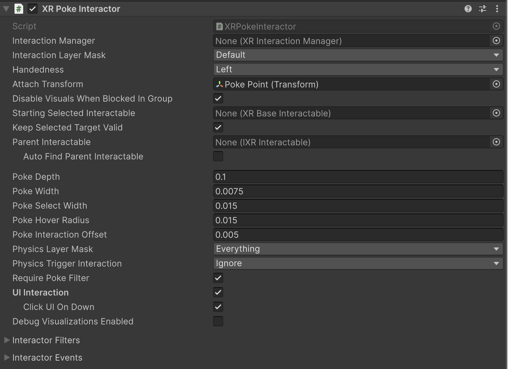

# XR Poke Interactor

Interactor used for interacting with interactables through poking, typically with a point in front of a handheld XR controller or a fingertip.

## Base properties {#base}

| **Property** | **Description** |
| :--- | :--- |
| **Interaction Manager** | The [XRInteractionManager](xr-interaction-manager.md) that this interactor will communicate with (will find one if **None**). |
| **Interaction Layer Mask** | Allows interaction with interactables whose [Interaction Layer Mask](interaction-layers.md) contains any Layer in this Interaction Layer Mask. |
| **Handedness** | Represents which hand or controller the interactor is associated with. |
| **Attach Transform** | The `Transform` to use as the attach point for interactables. Automatically instantiated and set in `Awake` if **None**. Setting this will not automatically destroy the previous object. |
| **Disable Visuals When Blocked In Group** | Whether to disable visuals when this interactor is part of an [Interaction Group](xr-interaction-group.md) and is incapable of interacting due to active interaction by another interactor in the Group. |
| **Starting Selected Interactable** | The interactable that this interactor automatically selects at startup (optional, may be **None**). |
| **Keep Selected Target Valid** | Whether to keep selecting an interactable after initially selecting it even when it is no longer a valid target. Enable to make the `XRInteractionManager` retain the selection even if the interactable is not contained within the list of valid targets. Disable to make the Interaction Manager clear the selection if it isn't within the list of valid targets. A common use for disabling this is for Ray Interactors used for teleportation to make the teleportation interactable no longer selected when not currently pointing at it. |
| **Parent Interactable** | An optional reference to a parent interactable dependency for determining processing order of interactables. Refer to [Processing interactables](xref:xri-update-loop#processing-interactables) for more information. |
| **Auto Find Parent Interactable** | Automatically find a parent interactable up the GameObject hierarchy when registered with the interaction manager. Disable to manually set the object reference for improved startup performance. |
| **Poke Depth** | The depth threshold within which an interaction can begin to be evaluated as a poke. |
| **Poke Width** | The width threshold within which an interaction can begin to be evaluated as a poke. |
| **Poke Select Width** | The width threshold within which an interaction can be evaluated as a poke select. |
| **Poke Hover Radius** | The radius threshold within which an interaction can be evaluated as a poke hover. |
| **Poke Interaction Offset** | Distance along the poke interactable interaction axis that allows for a poke to be triggered sooner/with less precision. |
| **Physics Layer Mask** | Physics layer mask used for limiting poke sphere overlap. |
| **Physics Trigger Interaction** | Determines whether the poke sphere overlap will hit triggers. |
| **Snap Volume Interaction** | Whether physics cast should include or ignore hits on trigger colliders that are snap volume colliders, even if the physics cast is set to ignore triggers. |
| **UI Document Trigger Interaction** | Whether physics cast should include or ignore hits on trigger colliders that are UI Toolkit UI Document colliders, even if the physics cast is set to ignore triggers. |
| **Require Poke Filter** | Denotes whether or not valid targets will only include objects with a poke filter. |
| **UI Interaction** | When enabled, this allows the poke interactor to hover and select UI elements. |
| **Click UI On Down** | When enabled, this will invoke click events on press down instead of on release for buttons, toggles, input fields, and dropdowns. |
| **Debug Visualizations Enabled** | Whether to display the debug visuals for the poke interaction. The visuals include a sphere that changes to green when hover is triggered, and a smaller sphere behind it that turns green when select is triggered. |
| [Interactor Filters](#interactor-filters) | Identifies any filters this interactor uses to winnow detected interactables. You can create  filter classes to provide custom logic to limit which interactables an interactor can interact with. Filtering occurs after the interactor has performed a raycast to detect eligible interactables.|
| [Interactor Events](#interactor-events) | The events dispatched by this interactor. You can add event handlers in other components in the scene or prefab and they are invoked when the event occurs. |

## Interactor Filters {#interactor-filters}

[!INCLUDE [interactor-filters-config](snippets/interactor-filters-config.md)]

## Interactor Events {#interactor-events}

[!INCLUDE [interactor-events](snippets/interactor-events.md)]
