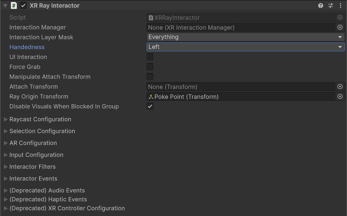

# XR Ray Interactor

Interactor used for interacting with interactables at a distance. This interactor uses ray casts to detect eligible interactable targets. You can configure the ray interactor to use straight or curved ray casts. In the [starter assets](xref:xri-samples-starter-assets) and demo scene, an **XR Ray Interactor** component is used for locomotion as part of the [Teleport Interactor Prefab](xref:xri-samples-starter-assets#prefabs).

> [!NOTE]
> The [Near-Far Interactor](xref:xri-near-far-interactor) component provides a newer, more flexible design that replaces many uses of the **XR Ray Interactor**. For example, with the **Near-Far Interactor**, you can configure both direct interaction and interaction at a distance with one component.

## Supporting components

You can use the following additional components with a ray interactor:

* [XR Interactor Line Visual](xref:xri-xr-interactor-line-visual), [Line Renderer](xref:um-class-line-renderer), and [Sorting Group](xref:um-class-sorting-group): draw a visual line along the ray cast path.
* [XR Interactable Snap Volume](xref:xri-xr-interactable-snap-volume): Configure the interactor and an interactable such that the ray interactor's visual line and ray cast snap to the interactable. Refer to [Supporting XR Interactable Snap Volume](#support-snap-volume) for more information.
* [Simple Audio Feedback](xref:xri-simple-audio-feedback): Play audio clips when interactor events happen. (Replaces the **Audio Events** properties of the interactor.)
* [Simple Haptic Feedback](xref:xri-simple-haptic-feedback): Play haptic impulses when interactor events happen. (Replaces the **Haptic Events** properties of the interactor.)
* [XR Interaction Group](xref:xri-xr-interaction-group): Define groups of interactors to mediate which has priority for an interaction.

## Base properties

The XR ray interactor has many properties that you can set to modify how the interactor behaves. Some of these properties are organized into sections and don't appear in the Inspector window until you enable another property or expand a section.

| **Property** | **Description** |
| :--- | :--- |
| **Interaction Manager** | The [XRInteractionManager](xr-interaction-manager.md) that this interactor will communicate with (will find one if **None**). |
| **Interaction Layer Mask** | Allows interaction with interactables whose [Interaction Layer Mask](interaction-layers.md) contains any Layer in this Interaction Layer Mask. |
| **Handedness** | Represents which hand or controller the interactor is associated with. |
| [UI Interaction](#ui-interaction) | Enable to affect Unity UI GameObjects in a way that is similar to a mouse pointer. Requires the XR UI Input Module on the Event System. When enabled, the options described in [UI Interaction properties](#ui-interaction) are shown in the Inspector. |
| **Force Grab** | Force grab moves the object to your hand rather than interacting with it at a distance. |
| [Manipulate Attach Transform](#attach-transform) | Allows the user to move the Attach Transform using the thumbstick. When you enable this option, the Inspector displays [additional properties](#attach-transform) to configure the way a user can manipulate the selected object.|
| **Attach Transform** | The `Transform` to use as the attach point for interactables. Automatically instantiated and set in `Awake` if **None**. Setting this will not automatically destroy the previous object. |
| **Ray Origin Transform** | The starting position and direction of any ray casts. Automatically instantiated and set in `Awake` if **None** and initialized with the pose of the `XRBaseInteractor.attachTransform`. Setting this will not automatically destroy the previous object. |
| **Disable Visuals When Blocked In Group** | Whether to disable visuals when this interactor is part of an [Interaction Group](xr-interaction-group.md) and is incapable of interacting due to active interaction by another interactor in the Group. |
| [Raycast Configuration](#raycast-config) | Controls how the raycast into the scene to detect eligible interactables behaves. Click the triangle icon to expand the section.|
| [Selection Configuration](#selection-config)  | Controls selection behavior. Click the triangle icon to expand the section. Note that you configure the input controls used for selection in the [Input Configuration](#input-config) section. |
| [AR Configuration](#ar-config) | Configure how the interactor behaves in an AR context. |
| [Input Configuration](#input-config) | Specify input bindings for the select and activate actions. Click the triangle icon to expand the section. |
| [Interactor Filters](#interactor-filters) | Identifies any filters this interactor uses to winnow detected interactables. You can create  filter classes to provide custom logic to limit which interactables an interactor can interact with. Filtering occurs after the interactor has performed a raycast to detect eligible interactables.|
| [Interactor Events](#interactor-events) | The events dispatched by this interactor. You can add event handlers in other components in the scene or prefab and they are invoked when the event occurs. |
| (Deprecated) [Audio Events](xref:xri-simple-audio-feedback)  | Assign an audio clip to play when an interactor event occurs. Replaced by the [Simple Audio Feedback](xref:xri-simple-audio-feedback) component, which provides more control over how a clip is played.|
| (Deprecated) [Haptic Events](xref:xri-simple-haptic-feedback) | Assign a haptic impulse to play when an interactor event occurs. Replaced by the [Simple Haptic Feedback](xref:xri-simple-haptic-feedback) component, which provides more options for defining a haptic impulse.|
| (Deprecated) [XR Controller Configuration](#legacy-configuration) | Provides compatibility with the deprecated action- or device-based [XR Controller](https://docs.unity3d.com/Packages/com.unity.xr.interaction.toolkit@2.6/manual/xr-controller-action-based.html) components. The properties in this section are intended to aid migration of scenes created with version 2.6 or earlier versions of the toolkit. |

## UI Interaction properties {#ui-interaction}

[!INCLUDE [interactor-ui](snippets/interactor-ui.md)]

## Manipulate Attach Transform options {#attach-transform}

[!INCLUDE [interactor-attach-manipulators](snippets/interactor-attach-manipulators.md)]

## Raycast configuration {#raycast-config}

[!INCLUDE [interactor-raycast-config](snippets/interactor-raycast-config.md)]

## Selection Configuration {#selection-config}

[!INCLUDE [interactor-selection-config](snippets/interactor-selection-config.md)]

## AR Configuration {#ar-config}

[!INCLUDE [interactor-ar-config](snippets/interactor-ar-config.md)]

## Input Configuration {#input-config}

[!INCLUDE [interactor-input-config](snippets/interactor-input-config.md)]

## Interactor Filters {#interactor-filters}

[!INCLUDE [interactor-filters-config](snippets/interactor-filters-config.md)]

## Interactor Events {#interactor-events}

[!INCLUDE [interactor-events](snippets/interactor-events.md)]

## Audio Events (deprecated)

[!INCLUDE [interactor-audio-events](snippets/interactor-audio-events.md)]

## Haptic Events (deprecated)

[!INCLUDE [interactor-haptic-events](snippets/interactor-haptic-events.md)]

## XR Controller Configuration (deprecated) {#legacy-configuration}

[!INCLUDE [interactor-controller-config](snippets/interactor-controller-config.md)]

## Supporting XR Interactable Snap Volume {#support-snap-volume}

For an XR Ray Interactor to snap to an [XR Interactable Snap Volume](xr-interactable-snap-volume.md), the ray interactor must be properly configured. The **Raycast Snap Volume Interaction** property of the XR Ray Interactor must be set to **Collide**. Additionally, the XR Ray Interactor GameObject must have an [XR Interactor Line Visual](xr-interactor-line-visual.md) component with the **Snap Endpoint If Available** property enabled.
