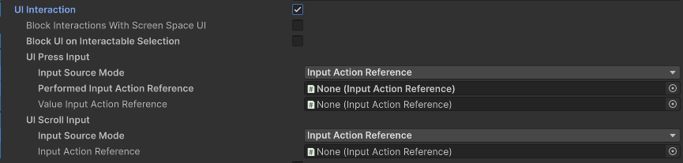
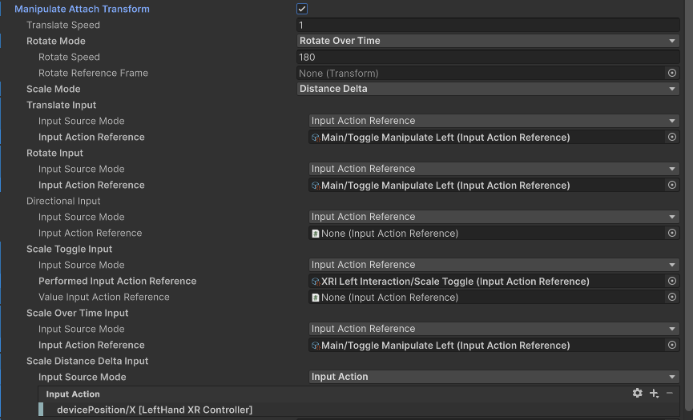
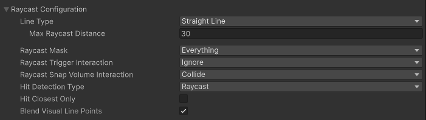
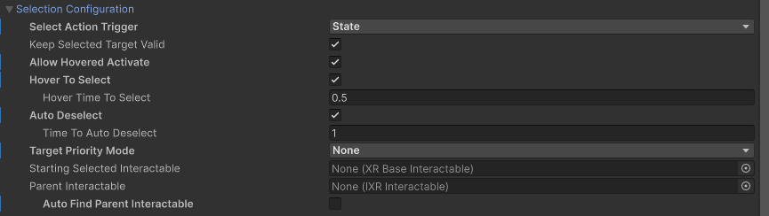
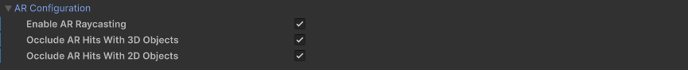
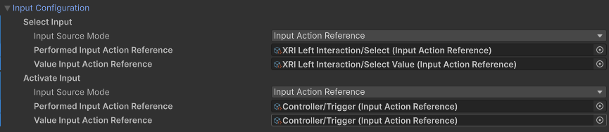
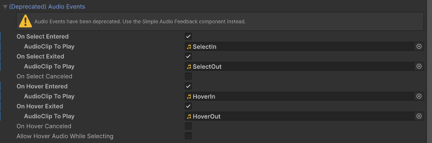
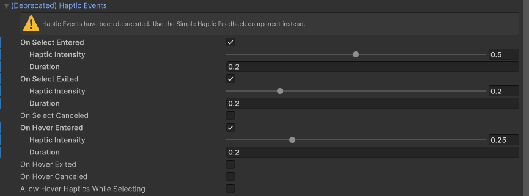
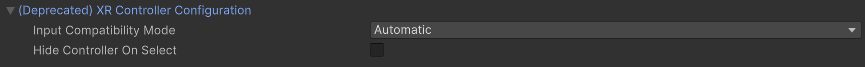

# XR Ray Interactor

Interactor used for interacting with interactables at a distance. This interactor uses ray casts to detect eligible interactable targets. You can configure the ray interactor to use straight or curved ray casts. In the [starter assets](xref:xri-samples-starter-assets) and demo scene, an **XR Ray Interactor** component is used for locomotion as part of the [Teleport Interactor Prefab](xref:xri-samples-starter-assets#prefabs).

> [!NOTE]
> The [Near-Far Interactor](xref:xri-near-far-interactor) component provides a newer, more flexible design that replaces many uses of the **XR Ray Interactor**. For example, with the **Near-Far Interactor**, you can configure both direct interaction and interaction at a distance with one component.

| **Property** | **Description** |
| :--- | :--- |
| **Interaction Manager** | The [XRInteractionManager](xr-interaction-manager.md) that this interactor will communicate with (will find one if **None**). |
| **Interaction Layer Mask** | Allows interaction with interactables whose [Interaction Layer Mask](interaction-layers.md) contains any Layer in this Interaction Layer Mask. |
| **Handedness** | Represents which hand or controller the interactor is associated with. |
| **UI Interaction** | Enable to affect Unity UI GameObjects in a way that is similar to a mouse pointer. Requires the XR UI Input Module on the Event System. When enabled, the options described in [UI Interaction properties|(#ui-interaction) are shown in the Inspector.
| **Force Grab** | Force grab moves the object to your hand rather than interacting with it at a distance. |
| **Manipulate Attach Transform** | Allows the user to move the Attach Transform using the thumbstick. When you enable this option, the Inspector displays additional properties to configure the way a user can manipulate the selected object. Refer to [Manipulate Attach Transform options](#attach-transform) for information about these properties. |
| **Attach Transform** | The `Transform` to use as the attach point for interactables. Automatically instantiated and set in `Awake` if **None**. Setting this will not automatically destroy the previous object. |
| **Ray Origin Transform** | The starting position and direction of any ray casts. Automatically instantiated and set in `Awake` if **None** and initialized with the pose of the `XRBaseInteractor.attachTransform`. Setting this will not automatically destroy the previous object. |
| **Disable Visuals When Blocked In Group** | Whether to disable visuals when this interactor is part of an [Interaction Group](xr-interaction-group.md) and is incapable of interacting due to active interaction by another interactor in the Group. |
| **Raycast Configuration** section | Controls how the raycast into the scene to detect eligible interactables behaves. Click the triangle icon to expand the section. Refer to [Raycast Configuration](#raycast-config) for information about the options in this section. |
| **Selection Configuration** section | Controls selection behavior. Click the triangle icon to expand the section. Refer to [Selection Configuration](#selection-config) for information about the options in this section. Note that you configure the input controls used for selection in the [Input Configuration](#input-config) section. |
| **Input Configuration** section | Controls selection behavior. Click the triangle icon to expand the section. Refer to [Selection Configuration](#selection-config) for information about the options in this section. Note that you configure the input controls used for selection in the [Input Configuration](#input-config) section. |
| **Interactor Filters** | Identifies any filters this interactor uses to winnow detected interactables. You can create  filter classes to provide custom logic to limit which interactables an interactor can interact with. Filtering occurs after the interactor has performed a raycast to detect eligible interactables. Refer to [Interaction filters](xref:xri-interaction-filters) for more information. |
| **Interactor Events** | The events dispatched by this interactor. You can add event handlers in other components in the scene or prefab and they are invoked when the event occurs. Refer to [Interactor Events](xref:xri-interactor-events) for more information. |
| (Deprecated) **Audio Events** | Assign an audio clip to play when an interactor event occurs. Replaced by the [Simple Audio Feedback](xref:xri-simple-audio-feedback) component, which provides more control over how a clip is played.|
| (Deprecated) **Haptic Events** | Assign a haptic impulse to play when an interactor event occurs. Replaced by the [Simple Haptic Feedback](xref:xri-simple-haptic-feedback) component, which provides more options for defining a haptic impulse.|
| (Deprecated) **XR Controller Configuration** | Provides compatibility with the deprecated action- or device-based [XR Controller](https://docs.unity3d.com/Packages/com.unity.xr.interaction.toolkit@2.6/manual/xr-controller-action-based.html) components. The properties in this section are intended to aid migration of scenes created with version 2.6 or earlier versions of the toolkit.

You can use the following additional components with a ray interactor:

* [XR Interactor Line Visual](xref:xri-xr-interactor-line-visual), [Line Renderer](xref:um-class-line-renderer), and [Sorting Group](xref:um-class-sorting-group): draw a visual line along the ray cast path.
* [XR Interactable Snap Volume](xref:xri-xr-interactable-snap-volume): Configure the interactor and an interactable such that the ray interactor's visual line and ray cast snap to the interactable. Refer to [Supporting XR Interactable Snap Volume](#support-snap-volume) for more information.
* [Simple Audio Feedback](xref:xri-simple-audio-feedback): Play audio clips when interactor events happen. (Replaces the **Audio Events** properties of the interactor.)
* [Simple Haptic Feedback](xref:xri-simple-haptic-feedback): Play haptic impulses when interactor events happen. (Replaces the **Haptic Events** properties of the interactor.)
* [XR Interaction Group](xref:xri-xr-interaction-group): Define groups of interactors to mediate which has priority for an interaction.

## UI Interaction properties {#ui-interaction}

Use the options in the **UI Interaction** section to configure how the interactor operates with UI elements on a canvas.

| **Property** | **Description** |
| :--- | :--- |
| **Block Interactions With Screen Space UI** | Enable this to make the XR Ray Interactor ignore interactions when occluded by a screen space canvas. |
| **Block UI on Interactable Selection** | Enabling this option will block UI interaction when selecting interactables. |
| **UI Press Input** | The input used to press or select UI elements. Equivalent to a mouse button. |
| **UI Scroll Input** | The input to use to scroll UI elements. Equivalent to a mouse scroll wheel. |

## Manipulate Attach Transform options {#attach-transform}

The following options become available when you enable the **Manipulate Attach Transform** property. Use these options to configure how the user can manipulate the transform to which a selected interactable is attached. For example, you can set the controller input used to rotate an object in this section.

| **Property** | **Description** |
| :--- | :--- |
| **Translate Speed** | Speed that the Attach Transform is translated along the ray. Only used and displayed when **Manipulate Attach Transform** is enabled. |
| **Rotate Reference Frame** | The optional reference frame to define the up axis when rotating the Attach Transform. When not set, rotates about the local up axis of the attach transform. Only used and displayed when **Manipulate Attach Transform** is enabled. |
| **Rotate Mode** | Specifies how the Attach Transform rotation manipulation is controlled. Only used and displayed when **Manipulate Attach Transform** is enabled. |
| &emsp;Rotate Over Time | Set **Rotation Mode** to **Rotate Over Time** to control attach rotation over time while rotation input is active. |
| &emsp;Match Direction | Set **Rotation Mode** to **Match Direction** to match the attach rotation to the direction of the 2-dimensional rotation input. |
| **Rotate Speed** | Speed that the Attach Transform is rotated. Only used and displayed when **Manipulate Attach Transform** is enabled and **Rotation Mode** is set to **Rotate Over Time**. |
| **Scale Mode** | Determines how the Scale Value should be used by the interactable objects requesting it. |

## Raycast Configuration {#raycast-config}

Use the options in the **Raycast Configuration** section to specify how the ray casts used to detect eligible interactables should behave. For example, you can specify whether the ray cast follows a straight or a curved path with these properties.

| **Property** | **Description** |
| :--- | :--- |
| **Line Type** | The type of ray cast. |
| &emsp;Straight Line | Set **Line Type** to **Straight Line** to perform a single ray cast into the scene with a set ray length. |
| &emsp;Projectile Curve | Set **Line Type** to **Projectile Curve** to sample the trajectory of a projectile to generate a projectile curve. |
| &emsp;Bezier Curve | Set **Line Type** to **Bezier Curve** to use a control point and an end point to create a quadratic Bezier curve. |
| &emsp;Max Raycast Distance| Only used and displayed if **Line Type** is **Straight Line**. Increasing this value will make the line reach further. |
| **Reference Frame** | Only used and displayed if **Line Type** is either **Projectile Curve** or **Bezier Curve**. The reference frame of the curve to define the ground plane and up. If not set at startup it will try to find the `XROrigin.Origin` `GameObject`, and if that does not exist it will use global up and origin by default. |
| **Velocity** | Only used and displayed if **Line Type** is **Projectile Curve**. Initial velocity of the projectile. Increasing this value will make the curve reach further. |
| **Acceleration** | Only used and displayed if **Line Type** is **Projectile Curve**. Gravity of the projectile in the reference frame. |
| **Additional Ground Height** | Only used and displayed if **Line Type** is **Projectile Curve**. Additional height below ground level that the projectile will continue to. Increasing this value will make the end point drop lower in height. |
| **Additional Flight Time** | Only used and displayed if **Line Type** is **Projectile Curve**. Additional flight time after the projectile lands at the adjusted ground level. Increasing this value will make the end point drop lower in height. |
| **Sample Frequency** | Only used and displayed if **Line Type** is **Projectile Curve** or **Bezier Curve**. The number of sample points Unity uses to approximate curved paths. Larger values produce a better quality approximate at the cost of reduced performance due to the number of ray casts. A value of `n` will result in `n - 1` line segments for ray casting. This property is not used when using a **Line Type** of **Straight Line** since the effective value would always be 2. |
| **End Point Distance** | Only used and displayed if **Line Type** is **Bezier Curve**. Increase this value distance to make the end of the curve further from the start point. |
| **End Point Height** | Only used and displayed if **Line Type** is **Bezier Curve**. Decrease this value to make the end of the curve drop lower relative to the start point. |
| **Control Point Distance** | Only used and displayed if **Line Type** is **Bezier Curve**. Increase this value to make the peak of the curve further from the start point. |
| **Control Point Height** | Only used and displayed if **Line Type** is **Bezier Curve**. Increase this value to make the peak of the curve higher relative to the start point. |
| **Raycast Mask** | The layer mask used for limiting ray cast targets. The interactor can interact with interactables included in any of the layers in the mask. A mask setting of **Everything** includes all interactables. A mask setting of **Nothing** includes no interactables. |
| **Raycast Trigger Interaction** | The type of interaction with trigger colliders via ray cast. |
| **Raycast Snap Volume Interaction** | Whether ray cast should include or ignore hits on trigger colliders that are snap volume colliders, even if the ray cast is set to ignore triggers. If you are not using gaze assistance or XR Interactable Snap Volume components, you should set this property to Ignore to avoid the performance cost. |
| **Raycast UI Document Trigger Interaction** | Whether ray cast should include or ignore hits on trigger colliders that are UI Toolkit UI Document colliders, even if the ray cast is set to ignore triggers. |
| **Hit Detection Type** | Which type of hit detection to use for the ray cast. |
| &emsp;Raycast | Set **Hit Detection Type** to **Raycast** to use `Physics` Raycast to detect collisions. |
| &emsp;Sphere Cast | Set **Hit Detection Type** to **Sphere Cast** to use `Physics` Sphere Cast to detect collisions. |
| &emsp;Cone Cast | Set **Hit Detection Type** to **Cone Cast** to use cone casting to detect collisions. |
| **Hit Closest Only** | Whether Unity considers only the closest interactable as a valid target for interaction. Enable this to make only the closest interactable receive hover events. Otherwise, all hit interactables will be considered valid and this interactor will multi-hover. |
| **Blend Visual Line Points** | Blend the line sample points Unity uses for ray casting with the current pose of the controller. Use this to make the line visual stay connected with the controller instead of lagging behind. When the controller is configured to sample tracking input directly before rendering to reduce input latency, the controller may be in a new position or rotation relative to the starting point of the sample curve used for ray casting. A value of `false` will make the line visual stay at a fixed reference frame rather than bending or curving towards the end of the ray cast line. |

## Selection Configuration {#selection-config}

Use the options in the **Selection Configuration** section to configure selection-related behavior. For example, you can specify whether the user must hold a button continuously to maintain selection or just press a button to toggle selection on and off.

> [!NOTE]
> Configure the input for selection with the **Select Input** property in the [Input Configuration](#input-config) section of the Inspector.

| **Property** | **Description** |
| :--- | :--- |
| **Select Action Trigger** | Choose how Unity interprets the select input action from the controller. Controls between different input styles for determining if this interactor can select, such as whether the button is currently pressed or just toggles the active state. When this is set to `State` and multiple interactors select an interactable set to `InteractableSelectMode.Single`, you may experience undesired behavior where the selection of the interactable is passed back and forth between the interactors each frame. This can also cause the select interaction events to fire each frame. This can be resolved by setting this to `State Change` which is the default and recommended option. |
| &emsp;State | Unity will consider the input active while the button is pressed. A user can hold the button before the interaction is possible and still trigger the interaction when it is possible. |
| &emsp;State Change | Unity will consider the input active only on the frame the button is pressed, and if successful remain engaged until the input is released. A user must press the button while the interaction is possible to trigger the interaction. They will not trigger the interaction if they started pressing the button before the interaction was possible. |
| &emsp;Toggle | The interaction starts on the frame the input is pressed and remains engaged until the second time the input is pressed. |
| &emsp;Sticky | The interaction starts on the frame the input is pressed and remains engaged until the second time the input is released. |
| **Keep Selected Target Valid** | Whether to keep selecting an interactable after initially selecting it even when it is no longer a valid target. Enable to make the `XRInteractionManager` retain the selection even if the interactable is not contained within the list of valid targets. Disable to make the Interaction Manager clear the selection if it isn't within the list of valid targets. A common use for disabling this is for ray interactors used for teleportation to make the teleportation interactable no longer selected when not currently pointing at it. |
| **Hide Controller On Select** | Controls whether this interactor should hide the controller model on selection. |
| **Allow Hovered Activate** | Controls whether to send activate and deactivate events to interactables that this interactor is hovered over but not selected when there is no current selection. By default, the interactor will only send activate and deactivate events to interactables that it's selected. |
| **Target Priority Mode** | Specifies how many interactables that should be tracked in the Targets For Selection property, useful for custom feedback. The options are in order of best performance. |
| **Hover To Select** | Enable to have interactor automatically select an interactable after hovering over it for a period of time. Will also select UI if UI Interaction is also enabled. |
| **Hover Time To Select** | Number of seconds an interactor must hover over an interactable to select it. |
| **Auto Deselect** | Enable to have interactor automatically deselect an interactable after selecting it for a period of time. |
| **Time To Auto Deselect** | Number of seconds an interactor must select an interactable before it is automatically deselected when **Auto Deselect** is true. |
| **Starting Selected Interactable** | The interactable that this interactor automatically selects at startup (optional, may be **None**). |
| **Parent Interactable** | An optional reference to a parent interactable dependency for determining processing order of interactables. See [Processing interactables](xref:xri-architecture#processing-interactables) in the Interaction overview manual page for more information. |
| **Auto Find Parent Interactable** | Automatically find a parent interactable up the GameObject hierarchy when registered with the interaction manager. Disable to manually set the object reference for improved startup performance. |

## AR Configuration {#ar-config}

Use the options in the **AR Configuration** section to control how the interactor behaves in an Augmented Reality context.

| **Property** | **Description** |
| :--- | :--- |
| **Enable AR Raycasting** | Allow the interactor to detect AR interactables in a scene. |
| **Occlude AR Hits With 3D Objects** | When enabled 3D objects in the scene block the ray cast and prevent AR interactables behind them from being detected. |
| **Occlude AR Hits With 2D Object** | When enabled 2D objects in the scene block the ray cast and prevent AR interactables behind them from being detected.|

## Input Configuration {#input-config}

Configure [Input Reader](xref:xri-input-readers) properties to specify what kinds of input trigger select and activate interactions.

| **Property** | **Description** |
| :--- | :--- |
| **Select Input** | Choose what kinds of input trigger selection of a hovered interactable. |
| **Activate Input** | Choose what kinds of input trigger activation of a selected interactable. |

Refer to the [Input](xref:xri-input) section for information on how to configure input options.

> [!NOTE]
> You can change how the Inspector shows [Input Reader](xref:xri-input-readers) properties with the [Editor Settings: Input Reader Property Drawer Mode](xref:xri-settings#editor-settings) property on the XR Interaction Toolkit setting page. You can find this settings page in the **Project Settings** under the **XR Plug-in Management** section.

## Audio Events (deprecated)

The **Audio Events** section is deprecated and might be removed in a future release. Use the [Simple Audio Feedback component](xref:xri-simple-audio-feedback) instead.

| **Property** | **Description** |
| :--- | :--- |
| **On Select Entered** | If enabled, the Unity editor will display UI for supplying the audio clip to play when this interactor begins selecting an interactable. |
| **On Select Exited** | If enabled, the Unity editor will display UI for supplying the audio clip to play when this interactor successfully exits selection of an interactable. |
| **On Select Canceled** | If enabled, the Unity editor will display UI for supplying the audio clip to play when this interactor cancels selection of an interactable. |
| **On Hover Entered** | If enabled, the Unity editor will display UI for supplying the audio clip to play when this interactor begins hovering over an interactable. |
| **On Hover Exited** | If enabled, the Unity editor will display UI for supplying the audio clip to play when this interactor successfully ends hovering over an interactable. |
| **On Hover Canceled** | If enabled, the Unity editor will display UI for supplying the audio clip to play when this interactor cancels hovering over an interactable. |
| **Allow Hover Audio While Selecting** | Whether to allow playing audio from hover events if the hovered interactable is currently selected by this interactor. This is enabled by default. |

## Haptic Events (deprecated)

The **Haptic Events** section is deprecated and might be removed in a future release. Use the [Simple Haptic Feedback component](xref:xri-simple-haptic-feedback) instead.

| **Property** | **Description** |
| :--- | :--- |
| **On Select Entered** | If enabled, the Unity editor will display UI for supplying the duration (in seconds) and intensity (normalized) to play in haptic feedback when this interactor begins selecting an interactable. |
| **On Select Exited** | If enabled, the Unity editor will display UI for supplying the duration (in seconds) and intensity (normalized) to play in haptic feedback when this interactor successfully exits selection of an interactable. |
| **On Select Canceled** | If enabled, the Unity editor will display UI for supplying the duration (in seconds) and intensity (normalized) to play in haptic feedback when this interactor cancels selection of an interactable. |
| **On Hover Entered** | If enabled, the Unity editor will display UI for supplying the duration (in seconds) and intensity (normalized) to play in haptic feedback when this interactor begins hovering over an interactable. |
| **On Hover Exited** | If enabled, the Unity editor will display UI for supplying the duration (in seconds) and intensity (normalized) to play in haptic feedback when this interactor successfully ends hovering over an interactable. |
| **On Hover Canceled** | If enabled, the Unity editor will display UI for supplying the duration (in seconds) and intensity (normalized) to play in haptic feedback when this interactor cancels hovering over an interactable. |
| **Allow Hover Haptics While Selecting** | Whether to allow playing haptics from hover events if the hovered interactable is currently selected by this interactor. This is enabled by default. |

## XR Controller Configuration (deprecated)

Use the **XR Controller Configuration** options when you are upgrading a Unity project that used an earlier version of the XR Interaction Toolkit package, but don't have time to immediately redo all of your input configuration. Version 3 of the toolkit introduced [Input Readers](xref:xri-input-readers) as the primary way to configure interactor input and deprecated the [XR Controller](https://docs.unity3d.com/Packages/com.unity.xr.interaction.toolkit@2.6/manual/xr-controller-action-based.html) components. You can set the **Input Compatibility Mode** property to one of the following options to control how an interactor receives input:

* **Automatic**: Chooses the **Force Deprecated Input** mode if it finds an action- or device-based [XR Controller](https://docs.unity3d.com/Packages/com.unity.xr.interaction.toolkit@2.6/manual/xr-controller-action-based.html) component in the GameObject hierarchy. Otherwise, it chooses the **Force Input Readers** mode.
* **Force Deprecated Input**: Always use the older input method. An action- or device-based [XR Controller](https://docs.unity3d.com/Packages/com.unity.xr.interaction.toolkit@2.6/manual/xr-controller-action-based.html) component must exist in the GameObject hierarchy.
* **Force Input Readers**: Always use the input readers configured for the interactor instance. The interactor does not receive input for unconfigured input reader properties.

> [!TIP]
> You can choose different options for different interactor components as you update them to use the newer input reader system.

| **Property** | **Description** |
| :--- | :--- |
| **Input Compatibility Mode** | Choose how an interactor instance receives input.|
| **Hide Controller On Select** | Controls whether this Interactor should hide the controller model on selection. This behavior was supported by earlier versions of the toolkit, but is deprecated and might be removed in a future version. |

## Supporting XR Interactable Snap Volume {#support-snap-volume}

For an XR Ray Interactor to snap to an [XR Interactable Snap Volume](xr-interactable-snap-volume.md), the ray interactor must be properly configured. The **Raycast Snap Volume Interaction** property of the XR Ray Interactor must be set to **Collide**. Additionally, the XR Ray Interactor GameObject must have an [XR Interactor Line Visual](xr-interactor-line-visual.md) component with the **Snap Endpoint If Available** property enabled.
