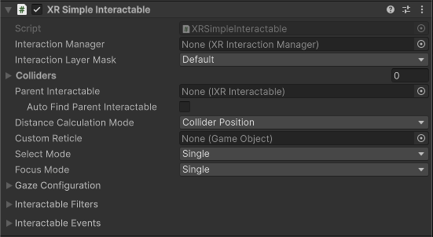

# XR Simple Interactable

An **XR Simple Interactable** dispatches the appropriate [Interactable Events](#interactable-events) when hovered, selected, activated, and focused by an interactor, but takes no other action in response.

> [!TIP]
> Use [XR Grab Interactable](xref:xri-xr-grab-interactable) to create interactables that the user can pick up and move.

## Supporting components {#supporting-components}

You can use the following additional components with a simple interactable:

* [XR Interactable Snap Volume](xref:xri-xr-interactable-snap-volume): Snaps ray-based interactors to the interactable when their ray intersects the defined volume. The interactor must be configured as described in [Supporting XR Interactable Snap Volume](xref:xri-xr-ray-interactor#support-snap-volume). Note that the [Gaze Assistance](#gaze-assist) feature temporarily adds a snap volume to an interactable if one isn't already present.
* [Collider](xref:UnityEngine.Collider): A Unity physics object that defines the shape of an object for determining collisions and calculating distance between the interactable and an interactor. Mesh Colliders must be convex. Required for all interactables.

## Base properties

The XR simple interactable has many properties that you can set to modify how the interactable behaves. Some of these properties are organized into sections and don't appear in the Inspector window until you enable another property or expand a section.

| **Property** | **Description** |
|---|---|
| **Interaction Manager** | The [XRInteractionManager](xr-interaction-manager.md) that this interactable will communicate with (will find one if **None**). |
| **Interaction Layer Mask** | Allows interaction with interactors whose [Interaction Layer Mask](interaction-layers.md) overlaps with any Layer in this **Interaction Layer Mask**. |
| **Colliders** | Colliders to use for interaction with this interactable (if empty, will use any child Colliders). |
| [Parent Interactable](#parent-interactable) | Assign a reference to another interactable object when you need it to be updated before this interactable. Parents are processed by the interaction manager before their children. |
| **Auto Find Parent Interactable** | Automatically find a [parent interactable](#parent-interactable) in this GameObject's parent or other ancestor in the scene hierarchy. Ignored if you assign an interactable object to **Parent Interactable**. |
| **Custom Reticle** | A reticle used when this object is interacted with. Overrides a reticle supplied by an interactor. |
| **Select Mode** | How many interactors can select this interactable. |
| **Focus Mode** | How many [interaction groups](xref:xri-xr-interaction-group) can focus this interactable. Set to **None** to disallow focus on this interactable. |
| [Gaze configuration](#gaze-config) | Options for gaze selection and assistance. |
| [Interactable Filters](#interactable-filters) | Interactable filters can override the normal hover, select, and interaction strength behavior. |
| [Interactable Events](#interactable-events) | Events dispatched by an interactable during an interaction. |

## Parent interactable {#parent-interactable}

[!INCLUDE [interactable-parent](snippets/interactable-parent.md)]

## Gaze configuration {#gaze-config}

[!INCLUDE [interactable-gaze](snippets/interactable-gaze-configuration.md)]

## Interactable Filters  {#interactable-filters}

[!INCLUDE [interactable-filters-config](snippets/interactable-filters-config.md)]

## Interactable Events {#interactable-events}

[!INCLUDE [interactable-events](snippets/interactable-events.md)]
