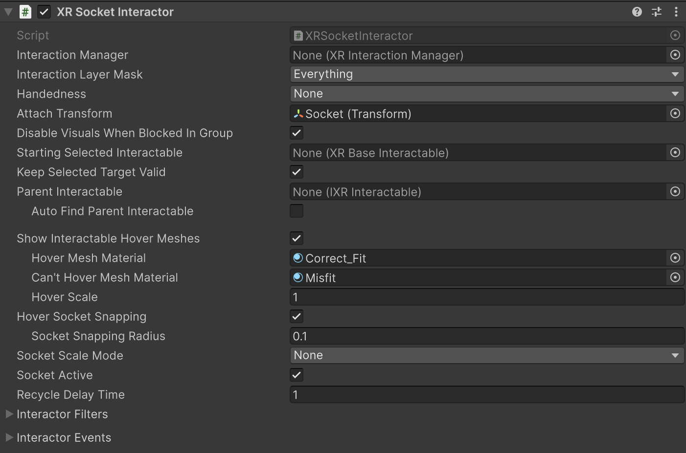

# XR Socket Interactor

Interactor that automatically selects any interactable that it hovers.

You can use this interactor to recieve interactables that the user moves into its hover range. For example, as a keyhole in which the user can insert a key or as a pedestal on which the user can place objects.

By default, a socket will select any interactable. You can use [Interaction Layer Masks](interaction-layers.md) and [Interactor Filters](#interactor-filters) to limit interaction to specific interactables.

## Supporting components

* [Collider](xref:UnityEngine.Collider): a Collider instance set to [isTrigger](xref:UnityEngine.Collider.isTrigger) must be present on the same GameObject.

## Base properties

Use the **XR Socket Interactor** properties

| **Property** | **Description** |
|---|---|
| **Interaction Manager** | The [XRInteractionManager](xr-interaction-manager.md) that this Interactor will communicate with (will find one if **None**). |
| **Interaction Layer Mask** | Allows interaction with interactables whose [Interaction Layer Mask](interaction-layers.md) overlaps with any Layer in this Interaction Layer Mask. |
| **Handedness** | Set to **None** (unless mounted on a hand or controller). |
| **Attach Transform** | The `Transform` that is used as the attach point for interactables. Automatically instantiated and set in `Awake` if **None**. If you assign a new transform to this property, the previously assigned object is not automatically destroyed. |
| **Disable Visuals When Blocked In Group** | Whether to disable visuals when this interactor is part of an [Interaction Group](xr-interaction-group.md) and is incapable of interacting due to active interaction by another Interactor in the Group. |
| **Starting Selected Interactable** | The interactable that this interactor automatically selects at startup (optional, can be **None**). |
| **Keep Selected Target Valid** | Whether to keep selecting an interactable after initially selecting it even when it is no longer a valid target. Enable to make the `XRInteractionManager` retain the selection even if the interactable is not contained within the list of valid targets. Disable to make the Interaction Manager clear the selection if it isn't within the list of valid targets. |
| **Parent Interactable** | An optional reference to a parent interactable dependency for determining processing order of interactables. Refer to [Processing interactables](xref:xri-update-loop#processing-interactables) for more information. |
| **Auto Find Parent Interactable** | Automatically find a parent interactable up the GameObject hierarchy when registered with the interaction manager. Disable to manually set the object reference for improved startup performance. |
| **Show Interactable Hover Meshes** | Whether this socket should show a mesh at socket's attach point for interactables in the hover state. |
| **Hover Mesh Material** | Material used for rendering interactable meshes on hover (a default material will be created if none is supplied). |
| **Can't Hover Mesh Material** | Material used for rendering interactable meshes on hover when there is already a selected object in the socket (a default material will be created if none is supplied). |
| **Hover Scale** | Scale at which to render the hover mesh displayed at the socket's attach point. |
| **Hover Socket Snapping** | Determines if the interactable should snap to the socket's attach transform when hovering. Note this will cause z-fighting with the hover mesh visuals, not recommended to use both options at the same time. If enabled, hover recycle delay functionality is disabled. |
| **Socket Snapping Radius** | When socket snapping is enabled, this is the distance at which the interactable will snap into or out of the socket's attach transform. The distance is affected by the scale of the interactable.|
| **Socket Scale Mode** | Scale mode used to calculate the scale factor applied to the interactable when selected. |
| **Fixed Scale** | Scale factor applied to the interactable when scale mode is set to Fixed. |
| **Target Bounds Size** | Bounds size used to calculate the scale factor applied to the interactable when scale mode is set to Stretched To Fit Size. |
| **Socket Active** | Whether socket interaction is enabled. |
| **Recycle Delay Time** | Sets the amount of time the socket will refuse hovers after an object is removed. This property does nothing if Hover Socket Snapping is enabled. |
| [Interactor Filters](#interactor-filters) | Identifies any filters this interactor uses to winnow detected interactables. You can create  filter classes to provide custom logic to limit which interactables an interactor can interact with. Filtering occurs after the interactor has performed a raycast to detect eligible interactables.|
| [Interactor Events](#interactor-events) | The events dispatched by this interactor. You can add event handlers in other components in the scene or prefab and they are invoked when the event occurs. |

> [!TIP]
> You can assign set various scale factors using the **Attach Transform**, **Hover Scale**, and **Socket Scale Mode** properties. These scale properties can interact with each other and behave differently depending on whether the target interactable is hovering or selected.

## Interactor Filters {#interactor-filters}

[!INCLUDE [interactor-filters-config](snippets/interactor-filters-config.md)]

## Interactor Events {#interactor-events}

[!INCLUDE [interactor-events](snippets/interactor-events.md)]
